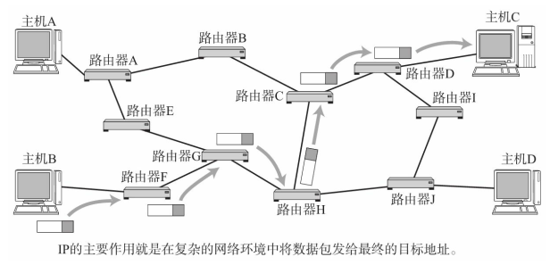
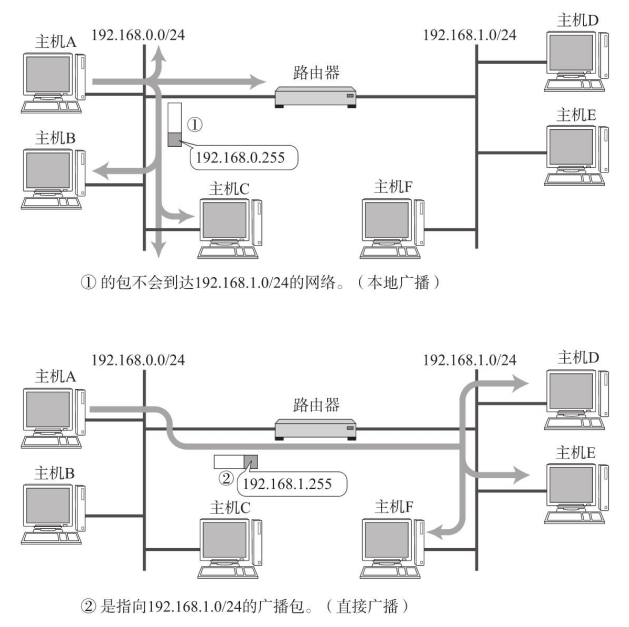

# IP 相当于OSI参考模型的第3层

网络层的主要作用是“实现终端节点之间的通信”。 这种终端节点之间的通信也叫“点对点（end-to-end）通信”。  

数据链路层的主要作用是在互连同一种数据链路的节点之间进行包传递。 而一旦跨越多种数据链路， 就需要借助网络层。 网络层可以跨越不同的数据链路， 即使是在不同的数据链路上也能实现两端节点之间的数据包传输。  



## 主机与节点  

在互联网世界中， 将那些配有IP地址的设备叫做“主机”。然而， 准确地说， 主机的定义应该是指“配置有IP地址， 但是不进行路由控制的设备”。   

既配有IP地址又具有路由控制能力的设备叫做“路由器”， 跟主机有所区别。   

节点则是主机和路由器的统称。 

在IPv4的规范RFC791中， 将具有路由控制功能的设备叫做“ 网关” ， 然而现在都普遍叫做路由器（或3层交换机） 。 ） 。    

## 网络层与数据链路层的关系  

数据链路层提供直连两个设备之间的通信功能。 与之相比， 作为网络层的IP则负责在没有直连的两个网络之间进行通信传输。   


# IP基础知识  

IP大致分为三大作用模块， 它们是IP寻址、 路由（最终节点为止的转发） 以及IP分包与组包。  

## IP地址属于网络层地址  

在计算机通信中， 为了识别通信对端， 必须要有一个类似于地址的识别码进行标识。MAC地址正是用来标识同一个链路中不同计算机的一种识别码。作为网络层的IP， 也有这种地址信息。 一般叫做IP地址。 IP地址用于在“连接到网络中的所有主机中识别出进行通信的目标地址”。 因此， 在TCP/IP通信中所有主机或路由器必须设定自己的IP地址。


 不论一台主机与哪种数据链路连接， 其IP地址的形式都保持不变。 以太网、 无线局域网、 PPP等， 都不会改变IP地址的形式（数据链路的MAC地址的形式不一定必须一致。 ） 。

另外， 在网桥或交换集线器等物理层或数据链路层数据包转发设备中， 不需要设置IP地址。 因为这些设备只负责将IP包转化为0、 1比特流转发或对数据链路帧的数据部分进行转发， 而不需要应对IP协议（反之， 这些设备既可以在IPv4环境中使用， 也可以在IPv6环境中使用。 ） 。    

## 路由控制  

路由控制（Routing） 是指将分组数据发送到最终目标地址的功能。 即使网络非常复杂， 也可以通过路由控制确定到达目标地址的通路。 一旦这个路由控制的运行出现异常， 分组数据极有可能“迷失”， 无法到达目标地址。 因此， 一个数据包之所以能够成功地到达最终的目标地址， 全靠路由控制。  


### 发送数据至最终目标地址  

Hop译为中文叫“跳”。 它是指网络中的一个区间。 IP包正是在网络中一个个跳间被转发。 因此IP路由也叫做多跳路由。 在每一个区间内决定着包在下一跳被转发的路径。  


一跳（1 Hop） 是指利用数据链路层以下分层的功能传输数据帧的一个区间。  

以太网等数据链路中使用MAC地址传输数据帧。 此时的一跳是指从源MAC地址到目标MAC地址之间传输帧的区间。 也就是说它是主机或路由器网卡不经其他路由器而能直接到达的相邻主机或路由器网卡之间的一个区间。 在一跳的这个区间内， 电缆可以通过网桥或交换集线器相连， 不会通过路由器或网关相连。  

多跳路由是指路由器或主机在转发IP数据包时只指定下一个路由器或主机， 而不是将到最终目标地址为止的所有通路全都指定出来。 因为每一个区间（跳） 在转发IP数据包时会分别指定下一跳的操作， 直至包达到最终的目标地址。    


### 路由控制表  

为了将数据包发给目标主机， 所有主机都维护着一张路由控制表（Routing Table） 。 该表记录IP数据在下一步应该发给哪个路由器。 IP包将根据这个路由表在各个数据链路上传输。  


## 数据链路的抽象化  

IP是实现多个数据链路之间通信的协议。 数据链路根据种类的不同各有特点。 对这些不同数据链路的相异特性进行抽象化也是IP的重要作用之一。  数据链路的地址可以被抽象化为IP地址。因此， 对IP的上一层来说， 不论底层数据链路使用以太网还是无线LAN亦或是PPP， 都将被一视同仁。  

不同数据链路有个最大的区别， 就是它们各自的最大传输单位（MTU： Maximum Transmission Unit） 不同。

   

MTU的值在以太网中是1500字节， 在FDDI中是4352字节， 而ATM则为9180字节。 IP的上一层可能会要求传送比这些MTU更多字节的数据， 因此必须在线路上传送比包长还要小的MTU。  

为了解决这个问题， IP进行分片处理（IP Fragmentation） 。 顾名思义， 所谓分片处理是指， 将较大的IP包分成多个较小的IP包。 分片的包到了对端目标地址以后会再被组合起来传给上一层。 即从IP的上次层看， 它完全可以忽略数据包在途中的各个数据链路上的MTU，而只需要按照源地址发送的长度接收数据包。 IP就是以这种方式抽象化了数据链路层， 使得从上层更不容易看到底层网络构造的细节。  

## IP属于面向无连接型  

IP面向无连接。 即在发包之前， 不需要建立与对端目标地址之间的连接。 上层如果遇到需要发送给IP的数据， 该数据会立即被压缩成IP包发送出去。  

即使对端主机关机或不存在， 数据包还是会被发送出去。 反之， 对于一台主机来说， 它会何时从哪里收到数据也是不得而知的。 通常应该进行网络监控， 让主机只接收发给自己的数据包。 若没有做好准备很有可能会错过一些该收的包。 因此， 在面向无连接的方式下可能会有很多冗余的通信。  

### 为什么IP要采用面向无连接呢？  

主要有两点原因：

- 一是为了简化，面向连接比起面向无连接处理相对复杂。 甚至管理每个连接本身就是一个相当繁琐的事情
- 二是为了提速，此外， 每次通信之前都要事先建立连接， 又会降低处理速度。 需要有连接时， 可以委托上一层提供此项服务。 因此， IP为了实现简单化与高速化采用面向无连接的方式

# IP地址的基础知识  

在用TCP/IP通信时， 用IP地址识别主机和路由器。 为了保证正常通信， 有必要为每个设备配置正确的IP地址。 在互联网通信中， 全世界都必须设定正确的IP地址。 否则， 根本无法实现正常的通信。因此， IP地址就像是TCP/IP通信的一块基石。  

## IP地址的定义  

IP地址（IPv4地址） 由32位正整数来表示。 TCP/IP通信要求将这样的IP地址分配给每一个参与通信的主机。 IP地址在计算机内部以二进制（二进制是指用0、 1表示数字的方法。 ） 方式被处理。但是习惯上使用 “ 十进制点符号”  表示。

   

因此，对于 IPV4 最多可以允许43亿台计算机连接到网络。

实际上， IP地址并非是根据主机台数来配置的， 而是每一台主机上的每一块网卡（NIC） 都得设置IP地址。 通常一块网卡只设置一个IP地址， 其实一块网卡也可以配置多个IP地址。 此外， 一台路由器通常都会配置两个以上的网卡， 因此可以设置两个以上的IP地址。    


## IP地址由网络和主机两部分标识组成  

IP地址由“网络标识（网络地址） ”和“主机标识（主机地址） ”两部分组成。


网络标识在数据链路的每个段配置不同的值。 网络标识必须保证相互连接的每个段的地址不相重复。 而相同段内相连的主机必须有相同的网络地址。 IP地址的“主机标识”则不允许在同一个网段内重复出现。  

## IP地址的分类  

IP地址分为四个级别， 分别为A类、 B类、 C类、 D类（还有一个一直未使用的E类。 ） 。 它根据IP地址中从第1位到第4位的比特列对其网络标识和主机标识进行区分。  


### A类地址  

A类IP地址是首位以“0”开头的地址。 从第1位到第8位（去掉分类位剩下7位。 ） 是它的网络标识。 用十进制表示的话， 0.0.0.0～127.0.0.0是A类的网络地址。 A类地址的后24位相当于主机标识。 因此， 一个网段内可容纳的主机地址上限为16， 777， 214个。

### B类地址  

B类IP地址是前两位为“10”的地址。 从第1位到第16位（去掉分类位剩下14位。 ） 是它的网络标识。 用十进制表示的话， 128.0.0.1～191.255.0.0是B类的网络地址。 B类地址的后16位相当于主机标识。 因此， 一个网段内可容纳的主机地址上限为65， 534个。  

### C类地址
C类IP地址是前三位为“110”的地址。 从第1位到第24位（去掉分类位剩下21位。 ） 是它的网络标识。 用十进制表示的话， 192.168.0.0～239.255.255.0是C类的网络地址。 C类地址的后8位相当于主机标识。 因此，一个网段内可容纳的主机地址上限为254个。  

### D类地址
D类IP地址是前四位为“1110”的地址。 从第1位到第32位（去掉分类位剩下28位。 ） 是它的网络标识。用十进制表示的话， 224.0.0.0～239.255.255.255是D类的网络地址。 D类地址没有主机标识， 常被用于多播。    

### 关于分配IP主机地址的注意事项  

在分配IP地址时关于主机标识有一点需要注意。 即要用比特位表示主机地址时， 不可以全部为0或全部为1。 因为全部为只有0在表示对应的网络地址或IP地址不可获知的情况下才使用。 而全部为1的主机地址通常作为广播地址。因此， 在分配过程中， 应该去掉这两种情况。     

## 广播地址  

广播地址用于在同一个链路中相互连接的主机之间发送数据包。 将IP地址中的主机地址部分全部设置为1， 就成为了广播地址。 例如把172.20.0.0/16用二进制表示如下：  

```
10101100.00010100.00000000.00000000
```

将这个地址的主机部分全部改为1， 则形成广播地址：  

```
10101100.00010100.11111111.11111111
```

再将这个地址用十进制表示， 则为 172.20.255.255。  

### 两种广播  

广播分为本地广播和直接广播两种。

在本网络内的广播叫做本地广播。 例如网络地址为192.168.0.0/24的情况下， 广播地址是192.168.0.255。因为这个广播地址的IP包会被路由器屏蔽， 所以不会到达192.168.0.0/24以外的其他链路上。  

在不同网络之间的广播叫做直接广播。 例如网络地址为192.168.0.0/24的主机向192.168.1.255/24的目标地址发送IP包。 收到这个包的路由器， 将数据转发给192.168.1.0/24， 从而使得所有192.168.1.1～192.168.1.254的主机都能收到这个包（由于直接广播有一定的安全问题， 多数情况下会在路由器上设置为不转发。 ） 。  



## IP多播  

多播用于将包发送给特定组内的所有主机。 由于其直接使用IP协议， 因此也不存在可靠传输。  

由于广播无法穿透路由， 若想给其他网段发送同样的包， 就不得不采取另一种机制。 因此， 多播这种既可以穿透路由器， 又可以实现只给那些必要的组发送数据包的技术就成为必选之路了。  


### IP多播与地址  

多播使用D类地址。 因此， 如果从首位开始到第4位是“1110”， 就可以认为是多播地址。 而剩下的28位可以成为多播的组编号。  


从224.0.0.0到239.255.255.255都是多播地址的可用范围。 其中从224.0.0.0到224.0.0.255的范围不需要路由控制， 在同一个链路内也能实现多播。 而在这个范围之外设置多播地址会给全网所有组内成员发送多播的包（可以利用生存时间（TTL， Time To Live） 限制包的到达范围。 ） 。  

此外， 对于多播， 所有的主机（路由器以外的主机和终端主机） 必须属于224.0.0.1的组， 所有的路由器必须属于224.0.0.2的组。 类似地， 多播地址中有众多已知的地址， 它们中具有代表性的部分：


## 子网掩码  

一个IP地址只要确定了其分类， 也就确定了它的网络标识和主机标识。 例如A类地址前8位（除首位“0”还有7位） 、 B类地址前16位（除首位“10”还有14位） 、 C类地址前24位（除首位“110”还有21位） 分别是它们各自的网络标识部分。  


网络标识相同的计算机必须同属于同一个链路。  例如， 架构B类IP网络时， 理论上一个链路内允许6万5千多台计算机连接。 然而， 在实际网络架构当中， 一般不会有在同一个链路上连接6万5千多台计算机的情况。 因此， 这种网络结构实际上是不存在的。因此， 直接使用A类或B类地址， 确实有些浪费。      

### 子网与子网掩码  

现在， 一个IP地址的网络标识和主机标识已不再受限于该地址的类别， 而是由一个叫做“子网掩码”的识别码通过子网网络地址细分出比A类、 B类、 C类更小粒度的网络。 这种方式实际上就是将原来A类、 B类C类等分类中的主机地址部分用作子网地址， 可以将原网络分为多个物理网络的一种机制。  

自从引入了子网以后， 一个IP地址就有了两种识别码。 一是IP地址本身， 另一个是表示网络部的子网掩码。 子网掩码用二进制方式表示的话， 也是一个32位的数字。 它对应IP地址网络标识部分的位全部为“1”，对应IP地址主机标识的部分则全部为“0”。 由此， 一个IP地址可以不再受限于自己的类别， 而是可以用这样的子网掩码自由地定位自己的网络标识长度。 当然， 子网掩码必须是IP地址的首位开始连续的“1”。

对于子网掩码， 目前有两种表示方式。 以172.20.100.52的前26位是网络地址的情况为例， 以下是其中一种表示方法， 它将IP地址与子网掩码的地址分别用两行来表示。  


另一种表示方式如下所示。 它在每个IP地址后面追加网络地址的位数（这种方式也叫“ 后缀” 表示法。 ） 用“/”隔开。  


不难看出， 在第二种方式下记述网络地址时可以省略后面的“0”。 例如172.20.0.0/16跟172.20/16其实是一个意思。  


## CIDR与VLSM  

采用任意长度分割IP地址的网络标识和主机标识。 这种方式叫做CIDR，根据CIDR， 连续多个C类地址（CIDR汇总的C类地址以2的幂次（4， 8， 16， 32， ……） 划分， 因此必须有一个能够按位分割的边界。 ） 就可以划分到一个较大的网络内。   

应用CIDR技术将203.183.224.1到203.183.225.254的地址合为同一个网络（它们本来是2个C类地址） 。  


将202.244.160.1到202.244.167.254的地址合并为一个网络的情形。 该例子中实际上是将8个C类地址合并为一个网络。  


VLSM（可变长子网掩码）（Variable Length Subnet Mask） 。 它可以通过域间路由协议转换为RIP2 以及OSPF实现。 根据VLSM可以将网络地址划分为主机数为500个时子网掩码长度为/23， 主机数为50个时子网掩码长度为/26。 从而在理论上可以将IP地址的利用率提高至50％。  

## 全局地址与私有地址  

随着互联网的迅速普及， IP地址不足的问题日趋显著。 如果一直按照现行的方法采用唯一地址的话， 会有IP地址耗尽的危险。于是就出现了一种新技术。 它不要求为每一台主机或路由器分配一个固定的IP地址， 而是在必要的时候只为相应数量的设备分配唯一的IP地址。  

尤其对于那些没有连接互联网的独立网络中的主机， 只要保证在这个网络内地址唯一， 可以不用考虑互联网即可配置相应的IP地址。 不过， 即使让每个独立的网络各自随意地设置IP地址， 也可能会有问题。 于是又出现了私有网络的IP地址。 它的地址范围如下：


包含在这个范围内的IP地址都属于私有IP， 而在此之外（A类～C类范围中除去0/8、 127/8。 ） 的IP地址称为全局IP（也叫公网IP。 ） 。  

私有IP最早没有计划连接互联网， 而只用于互联网之外的独立网络。 然而， 当一种能够互换私有IP与全局IP的NAT技术诞生以后， 配有私有地址的主机与配有全局地址的互联网主机实现了通信。  

全局IP地址基本上要在整个互联网范围内保持唯一， 但私有地址不需要。 只要在同一个域里保证唯一即可。 在不同的域里出现相同的私有IP不会影响使用。  


## 全局地址由谁决定  

在世界范围内， 全局IP由ICANN（Internet Corporation for Assigned Names and Numbers， 中文叫“ 互联网名称与数字地址分配机构” ， 负责管理全世界的IP地址和域名。 ） 进行管理。     

对于FTTH和ADSL的服务， 网络提供商直接给用户分配全局IP地址， 并且用户每次重连该IP地址都可能会发生变化。 这时的IP地址由提供商维护， 不需要用户亲自申请全局IP地址。

一般只有在需要固定IP的情况下才会申请全局IP地址。 例如， 如果要让多台主机接入互联网， 就需要为每一台主机申请一个IP地址。  

# 路由控制  

发送数据包时所使用的地址是网络层的地址， 即IP地址。 然而仅仅有IP地址还不足以实现将数据包发送到对端目标地址， 在数据发送过程中还需要类似于“指明路由器或主机”的信息， 以便真正发往目标地址。 保存这种信息的就是路由控制表（Routing Table） 。 实现IP通信的主机和路由器都必须持有一张这样的表。 它们也正是在这个表格的基础上才得以进行数据包发送的。  

该路由控制表的形成方式有两种： 一种是管理员手动设置， 另一种是路由器与其他路由器相互交换信息时自动刷新。 前者也叫静态路由控制， 而后者叫做动态路由控制。 为了让动态路由及时刷新路由表， 在网络上互连的路由器之间必须设置好路由协议， 保证正常读取路由控制信息。  

## IP地址与路由控制  

IP地址的网络地址部分用于进行路由控制。  


路由控制表中记录着网络地址与下一步应该发送至路由器的地址。 在发送IP包时， 首先要确定IP包首部中的目标地址， 再从路由控制表中找到与该地址具有相同网络地址的记录， 根据该记录将IP包转发给相应的下一个路由器。 如果路由控制表中存在多条相同网络地址的记录， 就选择一个最为吻合的网络地址。 所谓最为吻合是指相同位数最多的意思（也叫最长匹配。 ） 。例如172.20.100.52的网络地址与172.20/16和172.20.100/24两项都匹配。 此时， 应该选择匹配度最长的
172.20.100/24。       

### 默认路由  

如果一张路由表中包含所有的网络及其子网的信息， 将会造成无端的浪费。 这时， 默认路由（Default Route） 是不错的选择。 默认路由是指路由表中任何一个地址都能与之匹配的记录。  

默认路由一般标记为0.0.0.0/0或default（表示子网掩码时， IP地址为0.0.0.0， 子网掩码也是0.0.0.0。 ） 。 这里的0.0.0.0/0并不是指IP地址是0.0.0.0。 由于后面是“/0”， 所以并没有标识IP地址（0.0.0.0 的IP地址应该记述为0.0.0.0/32。 ） 。 它只是为了避免人们误以为0.0.0.0是IP地址。 有时默认路由也被标记为default， 但是在计算机内部和路由协议的发送过程中还是以0.0.0.0/0进行处理。    

### 主机路由  

“IP地址/32”也被称为主机路由（Host Route） 。 例如， 192.168.153.15/32（表示子网掩码时， 若IP地址为192.168.153.15， 其对应的子网掩码为255.255.255.255。 ） 就是一种主机路由。 它的意思是整个IP地址的所有位都将参与路由。 进行主机路由， 意味着要基于主机上网卡上配置的IP地址本身， 而不是基于该地址的网络地址部分进行路由。  

### 环回地址
环回地址是在同一台计算机上的程序之间进行网络通信时所使用的一个默认地址。 计算机使用一个特殊的IP地址127.0.0.1作为环回地址。 与该地址具有相同意义的是一个叫做localhost的主机名。 使用这个IP或主机名时， 数据包不会流向网络。  

## 路由控制表的聚合  

利用网络地址的比特分布可以有效地进行分层配置。 对内即使有多个子网掩码， 对外呈现出的也是同一个网络地址。 这样可以更好地构建网络， 通过路由信息的聚合可以有效地减少路由表的条目（路由表的聚合也叫路由汇总（Aggregation） 。 ） 。  

将已知192.168.2.0/24与192.168.3.0/24的网络这一信息聚合成为对“192.168.2.0/23的网络也已知”， 从而进行公示：


# IP分割处理与再构成处理  

## 数据链路不同， MTU则相异  

每种数据链路的最大传输单元（MTU） 都不尽相同。每种数据链路的MTU之所以不同， 是因为每个不同类型的数据链路的使用目的不同。 使用目的不同， 可承载的MTU也就不同。     


## IP报文的分片与重组  

任何一台主机都有必要对IP分片（IP Fragmentation） 进行相应的处理。 分片往往在网络上遇到比较大的报文无法一下子发送出去时才会进行处理。  

经过分片之后的IP数据报在被重组的时候， 只能由目标主机进行。 路由器虽然做分片但不会进行重组。  


## 路径MTU发现  

分片机制也有它的不足。 首先， 路由器的处理负荷加重。  其次， 在分片处理中， 一旦某个分片丢失， 则会造成整个IP数据报作废。   

为了应对以上问题， 产生了一种新的技术“路径MTU发现”（Path MTU Discovery（也可以缩写为PMTUD。 ） ） 。 所谓路径MTU（Path MTU） 是指从发送端主机到接收端主机之间不需要分片时最大MTU的大小。 即路径中存在的所有数据链路中最小的MTU。 而路径MTU发现从发送主机按照路径MTU的大小将数据报分片后进行发送。 进行路径MTU发现， 就可以避免在中途的路由器上进行分片处理， 也可以在TCP中发送更大的包。   


首先在发送端主机发送IP数据报时将其首部的分片禁止标志位设置为1。 根据这个标志位， 途中的路由器即使遇到需要分片才能处理的大包， 也不会去分片， 而是将包丢弃。 随后， 通过一个ICMP的不可达消息将数据链路上MTU的值给发送主机。下一次， 从发送给同一个目标主机的IP数据报获得ICMP所通知的MTU值以后， 将它设置为当前MTU。发送主机根据这个MTU对数据报进行分片处理。 如此反复， 直到数据报被发送到目标主机为止没有再收到任何ICMP， 就认为最后一次ICMP所通知的MTU即是一个合适的MTU值。    

那么， 当MTU的值比较多时， 最少可以缓存约10分钟。 在这10分钟内使用刚刚求得的MTU， 但过了这10分钟以后则重新根据链路上的MTU做一次路径MTU发现。    


# IPv6  

## IPv6的必要性  

IPv6（IP version 6） 是为了根本解决IPv4地址耗尽的问题而被标准化的网际协议。 IPv4的地址长度为4个8位字节， 即32比特。 而IPv6的地址长度则是原来的4倍， 即128比特。

从IPv4切换到IPv6极其耗时， 需要将网络中所有主机和路由器的IP地址进行重新设置。   

## IPv6的特点  

- IP地址的扩大与路由控制表的聚合：IP地址依然适应互联网分层构造。 分配与其地址结构相适应的IP地址， 尽可能避免路由表膨大
- 性能提升：包首部长度采用固定的值（40字节） ， 不再采用首部检验码。 简化首部结构， 减轻路由器负荷。 路由器不再做分片处理（通过路径MTU发现只由发送端主机进行分片处理）
- 支持即插即用功能：即使没有DHCP服务器也可以实现自动分配IP地址  
- 采用认证与加密功能：应对伪造IP地址的网络安全功能以及防止线路窃听的功能（IPsec）  
- 多播、 Mobile IP成为扩展功能：多播和Mobile IP被定义为IPv6的扩展功能  

## IPv6中IP地址的标记方法  

一般人们将128比特IP地址以每16比特为一组， 每组用冒号（“： ”） 隔开进行标记。 而且如果出现连续的0时还可以将这些0省略， 并用两个冒号（“： ： ”） 隔开。 但是， 一个IP地址中只允许出现一次两个连续的冒号。  

IPv6的IP地址标记举例：

- 用二进制数表示  

```
1111111011011100： 1011101010011000： 0111011001010100：
0011001000010000： 1111111011011100： 1011101010011000：
0111011001010100： 0011001000010000
```

- 用十六进制数表示  

```
FEDC： BA98： 7654： 3210： FEDC： BA98： 7654： 3210
```

IPv6的IP地址省略举例：

- 用二进制数表示
```
0001000010000000： 0000000000000000： 0000000000000000：
0000000000000000： 0000000000000000： 0000100000000000：
0010000000001100： 0100000101111010  
```

- 用十六进制数表示  


## IPv6地址的结构  

IPv6类似IPv4， 也是通过IP地址的前几位标识IP地址的种类。

在互联网通信中， 使用一种全局的单播地址。 它是互联网中唯一的一个地址， 不需要正式分配IP地址。

限制型网络， 即那些不与互联网直接接入的私有网络， 可以使用唯一本地地址。 该地址根据一定的算法生成随机数并融合到地址当中， 可以像IPv4的私有地址一样自由使用。

在不使用路由器或者在同一个以太网网段内进行通信时， 可以使用链路本地单播地址。

而在构建允许多种类型IP地址的网络时， 在同一个链路上也可以使用全局单播地址以及唯一本地地址进行通信。

在IPv6的环境下， 可以同时将这些IP地址全都配置在同1个NIC上， 按需灵活使用。  


## 全局单播地址  

全局单播地址是指世界上唯一的一个地址。 它是互联网通信以及各个域内部通信中最为常用的一个IPv6地址。  

现在IPv6的网络中所使用的格式为， n=48， m=16以及128-n-m=64。即前64比特为网络标识， 后64比特为主机标识。  


## 链路本地单播地址  

链路本地单播地址是指在同一个数据链路内唯一的地址。 它用于不经过路由器， 在同一个链路中的通信。 通常接口ID保存64比特版的MAC地址。  


## 唯一本地地址  


唯一本地地址是不进行互联网通信时所使用的地址。

设备控制的限制型网络以及金融机关的核心网等会与互联网隔离。 为了提高安全性， 企业内部的网络与互联网通信时通常会通过NAT或网关（代理） 进行。 而唯一本地地址正是在这种不联网或通过NAT以及代理联网的环境下使用的。  

## IPv6分段处理  

IPv6的分片处理只在作为起点的发送端主机上进行， 路由器不参与分片。 这也是为了减少路由器的负荷， 提高网速。 因此， IPv6中的“路径MTU发现”功能必不可少。 不过IPv6中最小MTU为1280字节。 因此，在嵌入式系统中对于那些有一定系统资源限制（CPU处理能力或内存限制等。 ） 的设备来说， 不需要进行“路径MTU发现”， 而是在发送IP包时直接以1280字节为单位分片送出。  

# IPv4首部  


- 版本（ Version）

由4比特构成， 表示标识IP首部的版本号。 IPv4的版本号即为4，关于IP的所有版本在以下表列出：


- 首部长度（IHL： Internet Header Length）  

由4比特构成， 表明IP首部的大小， 单位为4字节（32比特） 。 对于没有可选项的IP包， 首部长度则设置为“5”。 也就是说， 当没有可选项时， IP首部的长度为20字节（4×5=20） 。  

- 区分服务（TOS： Type Of Service）  

由8比特构成， 用来表明服务质量。 每一位的具体含义：


- DSCP段与ECN段  


DSCP（Differential Services Codepoint， 差分服务代码点） 是TOS（Type Of Service） 的一部分。用来进行质量控制。   

如果3～5位的值为0， 0～2位则被称作类别选择代码点。 这样就可以像TOS的优先度那样提供8种类型的质量控级别。  为了与TOS保持一致， 值越大优先度也越高。 如果第5位为1， 表示实验或本地使用的意思。ECN（Explicit Congestion Notification， 显式拥塞通告） 用来报告网络拥堵情况， 由两个比特构成。   


第6位的ECT用以通告上层TCP层协议是否处理ECN。 当路由器在转发ECN为1的包的过程中， 如果出现网络拥堵的情况， 就将CE位设置为1。  

- 总长度（Total Length）

表示IP首部与数据部分合起来的总字节数。 该字段长16比特。 因此IP包的最大长度为65535字节。    

目前还不存在能够传输最大长度为65535字节的IP包的数据链路。 不过， 由于有IP分片处理， 从IP的上一层的角度看， 不论底层采用何种数据链路， 都可以认为能够以IP的最大包长传输数据。  

- 标识（ID： Identification）  

由16比特构成， 用于分片重组。 同一个分片的标识值相同， 不同分片的标识值不同。 通常， 每发送一个IP包， 它的值也逐渐递增。 此外， 即使ID相同， 如果目标地址、 源地址或协议不同的话， 也会被认为是不同的分片。  

- 标志（Flags）  

由3比特构成， 表示包被分片的相关信息：


- 片偏移（FO： Fragment Offset）  

由13比特构成， 用来标识被分片的每一个分段相对于原始数据的位置。 第一个分片对应的值为0。 由于FO域占13位， 因此最多可以表示8192个相对位置。 单位为8字节， 因此最大可表示原始数据8×8192=65536字节的位置。

- 生存时间（TTL： Time To Live）  

由8比特构成， 它最初的意思是以秒为单位记录当前包在网络上应该生存的期限。 然而， 在实际中它是指可以中转多少个路由器的意思。 每经过一个路由器， TTL会减少1， 直到变成0则丢弃该包。因此一个包的中转路由的次数不会超过256个。 由此可以避免IP包在网络内无限传递的问题。       

- 协议（Protocol）  

由8比特构成， 表示IP首部的下一个首部隶属于哪个协议。   


- 首部校验和（Header Checksum）  

由16比特（2个字节） 构成， 也叫IP首部校验和。 该字段只校验数据报的首部， 不校验数据部分。 它主要用来确保IP数据报不被破坏。 校验和的计算过程， 首先要将该校验和的所有位置设置为0， 然后以16比特为单位划分IP首部， 并用1补数计算所有16位字的和。 最后将所得到这个和的1补数赋给首部校验和字段。    

- 源地址（Source Address）   

由32比特（4个字节） 构成， 表示发送端IP地址。  

- 目标地址（Destination Address）  

由32比特（4个字节） 构成， 表示接收端IP地址。  

- 可选项（Options）  

长度可变， 通常只在进行实验或诊断时使用。 该字段包含如下几点信息：安全级别，源路径，路径记录，时间戳。

- 填充（Padding）   

也称作填补物。 在有可选项的情况下， 首部长度可能不是32比特的整数倍。 为此， 通过向字段填充0，  调整为32比特的整数倍。   

- 数据（Data）

存入数据。 将IP上层协议的首部也作为数据进行处理。
