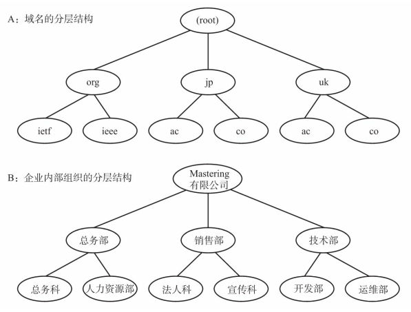
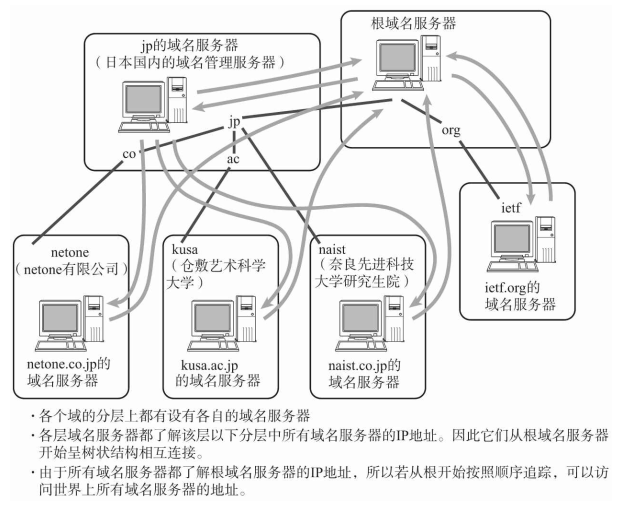
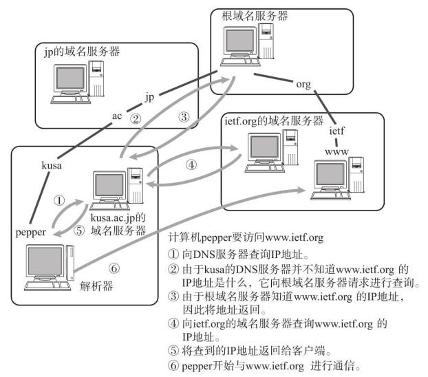

# DNS  

DNS（Domain Name System） 可以将那串字符串自动转换为具体的IP地址。这种DNS不仅适用于IPv4， 还适用于IPv6。  

## IP地址不便记忆  

TCP/IP网络中要求每一个互连的计算机都具有其唯一的IP地址， 并基于这个IP地址进行通信。 然而， 直接使用IP地址有很多不便之处。  

## DNS的产生  

在应用中， 当用户输入主机名（域名） 时， DNS会自动检索那个注册了主机名和IP地址的数据库， 并迅速定位对应的IP地址。 而且， 如果主机名和IP地址需要进行变更时， 也只需要在组织机构内部进行处理即可， 而没必要再向其他机构进行申请或报告。    

## 域名的构成  

域名是指为了识别主机名称和组织机构名称的一种具有分层的名称。   

DNS的分层结构叫做树形结构。   

### 域名服务器  

域名服务器是指管理域名的主机和相应的软件， 它可以管理所在分层的域的相关信息。 其所管理的分层叫做ZONE。每层都设有一个域名服务器。  

根部所设置的DNS叫做根域名服务器。  在根域名服务器的下一层域名服务器中注册了再往下一层域名服务器的IP地址。 根据每个域名服务器所管理的域名， 如果下面再没有其他分层， 就可以自由地指定主机名称或子网名称。 不过， 如果想修改该分层的域名或重新设置域名服务器的IP地址， 还必须得在其上层的域名服务器中进行追加或修改。  

域名和域名服务器需要按照分层进行设置。 如果域名服务器宕机， 那么针对该域的DNS查询也就无法正常工作。 因此， 为了提高容灾能力， 一般会设置至少两个以上的域名服务器。 一旦第一个域名服务器无法提供查询时， 就会自动转到第二个甚至第三个域名服务器上进行， 以此可以按照顺序进行灾备处理。  

### 解析器（Resolver）  

进行DNS查询的主机和软件叫做DNS解析器。 用户所使用的工作站或个人电脑都属于解析器。 一个解析器至少要注册一个以上域名服务器的IP地址。 通常， 它至少包括组织内部的域名服务器的IP地址。  

## DNS查询  

解析器为了调查IP地址， 向域名服务器进行查询处理。 接收这个查询请求的域名服务器首先会在自己的数据库进行查找。如果有该域名所对应的IP地址就返回。 如果没有， 则域名服务器再向上一层根域名服务器进行查询处理。 因此， 如图所示， 从根开始对这棵树按照顺序进行遍历， 直到找到指定的域名服务器， 并由这个域名服务器返回想要的数据。

解析器和域名服务器将最新了解到的信息暂时保存在缓存里（缓存的时限可以在提供信息的域名服务上进行设置。 ） 。 这样， 可以减少每次查询时的性能消耗。  

## DNS如同互联网中的分布式数据库  

前面提到DNS是一种通过主机名检索IP地址的系统。 然而， 它所管理的信息不仅仅是这些主机名跟IP地址之间的映射关系。 它还要管理众多其他信息。

  