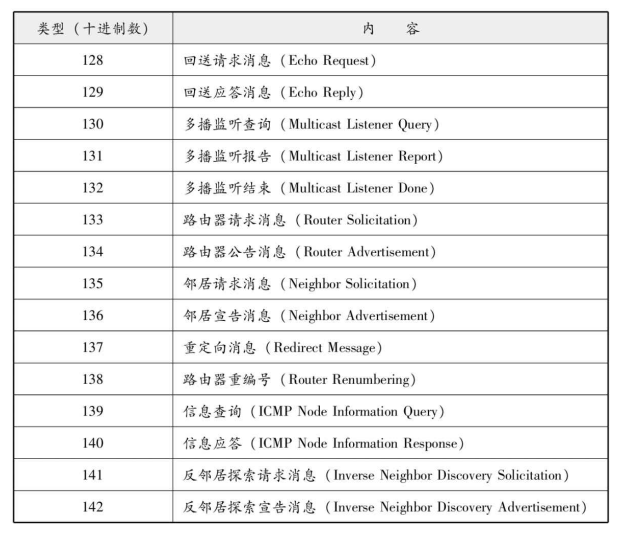
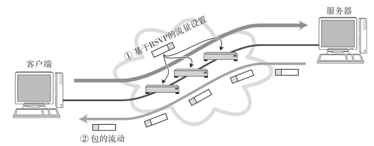

# DNS  

DNS（Domain Name System） 可以将那串字符串自动转换为具体的IP地址。这种DNS不仅适用于IPv4， 还适用于IPv6。  

## IP地址不便记忆  

TCP/IP网络中要求每一个互连的计算机都具有其唯一的IP地址， 并基于这个IP地址进行通信。 然而， 直接使用IP地址有很多不便之处。  

## DNS的产生  

在应用中， 当用户输入主机名（域名） 时， DNS会自动检索那个注册了主机名和IP地址的数据库， 并迅速定位对应的IP地址。 而且， 如果主机名和IP地址需要进行变更时， 也只需要在组织机构内部进行处理即可， 而没必要再向其他机构进行申请或报告。    

## 域名的构成  

域名是指为了识别主机名称和组织机构名称的一种具有分层的名称。   

DNS的分层结构叫做树形结构。   

### 域名服务器  

域名服务器是指管理域名的主机和相应的软件， 它可以管理所在分层的域的相关信息。 其所管理的分层叫做ZONE。每层都设有一个域名服务器。  

根部所设置的DNS叫做根域名服务器。  在根域名服务器的下一层域名服务器中注册了再往下一层域名服务器的IP地址。 根据每个域名服务器所管理的域名， 如果下面再没有其他分层， 就可以自由地指定主机名称或子网名称。 不过， 如果想修改该分层的域名或重新设置域名服务器的IP地址， 还必须得在其上层的域名服务器中进行追加或修改。  

域名和域名服务器需要按照分层进行设置。 如果域名服务器宕机， 那么针对该域的DNS查询也就无法正常工作。 因此， 为了提高容灾能力， 一般会设置至少两个以上的域名服务器。 一旦第一个域名服务器无法提供查询时， 就会自动转到第二个甚至第三个域名服务器上进行， 以此可以按照顺序进行灾备处理。  

### 解析器（Resolver）  

进行DNS查询的主机和软件叫做DNS解析器。 用户所使用的工作站或个人电脑都属于解析器。 一个解析器至少要注册一个以上域名服务器的IP地址。 通常， 它至少包括组织内部的域名服务器的IP地址。  

## DNS查询  

解析器为了调查IP地址， 向域名服务器进行查询处理。 接收这个查询请求的域名服务器首先会在自己的数据库进行查找。如果有该域名所对应的IP地址就返回。 如果没有， 则域名服务器再向上一层根域名服务器进行查询处理。 因此， 如图所示， 从根开始对这棵树按照顺序进行遍历， 直到找到指定的域名服务器， 并由这个域名服务器返回想要的数据。

解析器和域名服务器将最新了解到的信息暂时保存在缓存里（缓存的时限可以在提供信息的域名服务上进行设置。 ） 。 这样， 可以减少每次查询时的性能消耗。  

## DNS如同互联网中的分布式数据库  

前面提到DNS是一种通过主机名检索IP地址的系统。 然而， 它所管理的信息不仅仅是这些主机名跟IP地址之间的映射关系。 它还要管理众多其他信息。

# ARP  

ARP（Address Resolution Protocol） 是一种解决地址问题的协议。 以目标IP地址为线索， 用来定位下一个应该接收数据分包的网络设备对应的MAC地址。 如果目标主机不在同一个链路上时， 可以通过ARP查找下一跳路由器的MAC地址。 不过ARP只适用于IPv4， 不能用于IPv6。 IPv6中可以用ICMPv6替代ARP发送邻居探索消息。

##　ARP的工作机制  

ARP是借助ARP请求与ARP响应两种类型的包确定MAC地址的。  

主机A为了获得主机B的MAC地址， 起初要通过广播发送一个ARP请求包。 这个包中包含了想要了解其MAC地址的主机IP地址。 也就是说， ARP请求包中已经包含了主机B的IP地址172.20.1.2。 由于广播的包可以被同一个链路上所有的主机或路由器接收， 因此ARP的请求包也就会被这同一个链路上所有的主机和路由器进行解析。 如果ARP请求包中的目标IP地址与自己的IP地址一致， 那么这个节点就将自己的MAC地址塞入ARP响应包返回给主机A。  

如果每发送一个IP数据报都要进行一次ARP请求以此确定MAC地址， 那将会造成不必要的网络流量，因此， 通常的做法是把获取到的MAC地址缓存到一个ARP缓存表中， 下一次再向这个IP地址发送数据报时不需再重新发送ARP请求， 而是直接使用这个缓存表当中的MAC地址进行数据报的发送。 每执行一次ARP， 其对应的缓存内容都会被清除。不过在清除之前都可以不需要执行ARP就可以获取想要的MAC地址。  

不过， MAC地址的缓存是有一定期限的。 超过这个期限， 缓存的内容将被清除。 这使得MAC地址与IP地址对应关系即使发生了变化（尤其是在换网卡， 或移动笔记本电脑、 智能终端时。 ） ， 也依然能够将数据包正确地发送给目标地址。    

## IP地址和MAC地址缺一不可？  

主机A想要发送IP数据报给主机B时必须得经过路由器C。 即使知道了主机B的MAC地址， 由于路由器C会隔断两个网络， 还是无法实现直接从主机A发送数据报给主机B。 此时， 主机A必须得先将数据报发送给路由器C的MAC地址C1。  在以太网上发送IP包时， “下次要经由哪个路由器发送数据报”这一信息非常重要。 而这里的“下一个路由器”就是相应的MAC地址。  

## RARP  

RARP（Reverse Address Resolution Protocol） 是将ARP反过来， 从MAC地址定位IP地址的一种协议。   

需要架设一台RARP服务器， 从而在这个服务器上注册设备的MAC地址及其IP地址。

## 代理ARP  

通常ARP包会被路由器隔离， 但是采用代理ARP（Proxy ARP） 的路由器可以将ARP请求转发给邻近的网段。 由此， 两个以上网段的节点之间可以像在同一个网段中一样进行通信。  

# ICMP  

## 辅助IP的ICMP  

架构IP网络时需要特别注意两点： 确认网络是否正常工作， 以及遇到异常时进行问题诊断。  

ICMP的主要功能包括， 确认IP包是否成功送达目标地址， 通知在发送过程当中IP包被废弃的具体原因， 改善网络设置等。  

在IP通信中如果某个IP包因为某种原因未能达到目标地址， 那么这个具体的原因将由ICMP负责通知。ICMP的这种通知消息会使用IP进行发送。 收到该ICMP包的主机A则分解ICMP的首部和数据域以后得知具体发生问题的原因。    

 

ICMP的消息大致可以分为两类： 一类是通知出错原因的错误消息， 另一类是用于诊断的查询消息。  

## 主要的ICMP消息  

### ICMP目标不可达消息（类型3）  

IP路由器无法将IP数据包发送给目标地址时， 会给发送端主机返回一个目标不可达（Destination Unreachable Message） 的ICMP消息， 并在这个消息中显示不可达的具体原因：

### ICMP重定向消息（类型5）  

如果路由器发现发送端主机使用了次优的路径发送数据， 那么它会返回一个ICMP重定向（ICMP Redirect Message） 的消息给这个主机。 在这个消息中包含了最合适的路由信息和源数据。 这主要发生在路由器持有更好的路由信息的情况下。 路由器会通过这样的ICMP消息给发送端主机一个更合适的发送路由。  

  

### ICMP超时消息（类型11）  

IP包中有一个字段叫做TTL（Time To Live， 生存周期） ， 它的值随着每经过一次路由器就会减1， 直到减到0时该IP包会被丢弃。 此时， IP路由器将会发送一个ICMP超时的消息（ICMP Time Exceeded Message， 错误号0（错误号1表示将被拆分包做重构处理时超时。 ） ） 给发送端主机， 并通知该包已被丢弃。    

设置IP包生存周期的主要目的， 是为了在路由控制遇到问题发生循环状况时， 避免IP包无休止地在网络上被转发。 此外， 有时可以用TTL控制包的到达范围， 例如设置一个较小的TTL值。  

### ICMP回送消息（类型0、 8）  

用于进行通信的主机或路由器之间， 判断所发送的数据包是否已经成功到达对端的一种消息。 可以向对端主机发送回送请求的消息（ICMP Echo Request Message， 类型8） ， 也可以接收对端主机发回来的回送应答消息（ICMP Echo Reply Message， 类型0） 。 网络上最常用的ping命令（Packet InterNetwork Groper，判断对端主机是否可达的一种命令。 ） 就是利用这个消息实现的。    

## 其他ICMP消息  

### ICMP原点抑制消息（类型4）  

在使用低速广域线路的情况下， 连接WAN的路由器可能会遇到网络拥堵的问题。 ICMP原点抑制消息的目的就是为了缓和这种拥堵情况。 当路由器向低速线路发送数据时， 其发送队列的残存变为零而无法发送出去时， 可以向IP包的源地址发送一个ICMP原点抑制（ICMP Source Quench Message） 消息。 收到这个消息的主机借此了解在整个线路的某一处发生了拥堵的情况， 从而打开IP包的传输间隔。 然而， 由于这种ICMP可能会引起不公平的网络通信， 一般不被使用。  

### ICMP路由器探索消息（类型9、 10）  

主要用于发现与自己相连网络中的路由器。 当一台主机发出ICMP路由器请求（Router Solicitaion， 类型10） 时， 路由器则返回ICMP路由器公告消息（Router Advertisement， 类型9） 给主机。  

### ICMP地址掩码消息（类型17、 18）  

主要用于主机或路由器想要了解子网掩码的情况。 可以向那些目标主机或路由器发送ICMP地址掩码请求消息（ICMP Address Mask Request， 类型17） ， 然后通过接收ICMP地址掩码应答消息（ICMP Address Mask Reply， 类型18） 获取子网掩码的信息。  

## ICMPv6  

### ICMPv6的作用  

IPv4中ICMP仅作为一个辅助作用支持IPv4。 也就是说， 在IPv4时期， 即使没有ICMP， 仍然可以实现IP通信。 然而， 在IPv6中， ICMP的作用被扩大， 如果没有ICMPv6， IPv6就无法进行正常通信。  

尤其在IPv6中， 从IP地址定位MAC地址的协议从ARP转为ICMP的邻居探索消息（Neighbor Discovery） 。 这种邻居探索消息融合了IPv4的ARP、 ICMP重定向以及ICMP路由器选择消息等功能于一体，甚至还提供自动设置IP地址的功能（ICMPv6中没有DNS服务器的通知功能， 因此实际上需要与DHCPv6组合起来才能实现自动设置IP地址。 ） 。  

ICMPv6中将ICMP大致分为两类： 一类是错误消息， 另一类是信息消息。 类型0～127属于错误消息，128～255属于信息消息。  

### 邻居探索  

ICMPv6中从类型133至类型137的消息叫做邻居探索消息。 这种邻居探索消息对于IPv6通信起着举足轻重的作用。 邻居请求消息用于查询IPv6的地址与MAC地址的对应关系， 并由邻居宣告消息得知MAC地址。 邻居请求消息利用IPv6的多播地址实现传输。  

    

此外， 由于IPv6中实现了即插即用的功能， 所以在没有DHCP服务器的环境下也能实现IP地址的自动获取。 如果是一个没有路由器的网络， 就使用MAC地址作为链路本地单播地址。 而在一个有路由器的网络环境中， 可以从路由器获得IPv6地址的前面部分， 后面部分则由MAC地址进行设置。 此时可以利用路由器请求消息和路由器宣告消息进行设置。    

# DHCP  

## DHCP实现即插即用  

为了实现自动设置IP地址、 统一管理IP地址分配， 就产生了DHCP（Dynamic Host Configuration Protocol） 协议。 有了DHCP， 计算机只要连接到网络， 就可以进行TCP/IP通信。 也就是说， DHCP让即插即用（指只要物理上一连通， 无需专门设置就可以直接使用这个物理设备。 ） 变得可能。 而DHCP不仅在IPv4
中， 在IPv6中也可以使用。  

使用DHCP之前， 首先要架设一台DHCP服务器（很多时候用该网段的路由器充当DHCP服务器。 ） 。 然后将DHCP所要分配的IP地址设置到服务器上。 此外， 还需要将相应的子网掩码、 路由控制信息以及DNS服务器的地址等设置到服务器上。  

DHCP在分配IP地址有两种方法。 一种是由DHCP服务器在特定的IP地址中自动选出一个进行分配。 另一种方法是针对MAC地址分配一个固定的IP地址。 而且这两种方法可以并用。  

为了检查所要分配的IP地址以及已经分配了的IP地址是否可用， DHCP服务器或DHCP客户端必须具备以下功能：

- DHCP服务器：在分配IP地址前发送ICMP回送请求包， 确认没有返回应答
- DHCP客户端：针对从DHCP那里获得的IP地址发送ARP请求包， 确认没有返回应答

##　DHCP中继代理  

有了DHCP中继代理以后， 对不同网段的IP地址分配也可以由一个DHCP服务器统一进行管理和运维。  

这种方法使得在每个网段架设一个DHCP服务器被取代， 只需在每个网段设置一个DHCP中继代理即可（DHCP中继代理多数为路由器， 不过也有在主机中安装某些软件得以实现的情况。 ） 。 它可以设置DHCP服务器的IP地址， 从而可以在DHCP服务器上为每个网段注册IP地址的分配范围。  

DHCP客户端会向DHCP中继代理发送DHCP请求包， 而DHCP中继代理在收到这个广播包以后再以单播的形式发给DHCP服务器。 服务器端收到该包以后再向DHCP中继代理返回应答， 并由DHCP中继代理将此包转发给DHCP客户端。 由此， DHCP服务器即使不在同一个链路上也可以实现统一分配和管理IP地址。

 

# NAT  

## NAT定义
NAT（Network Address Translator） 是用于在本地网络中使用私有地址， 在连接互联网时转而使用全局IP地址的技术。 除转换IP地址外， 还出现了可以转换TCP、 UDP端口号的NAPT（Network Address Ports Translator） 技术， 由此可以实现用一个全局IP地址与多个主机的通信（通常人们提到的NAT， 多半是指 NAPT。 NAPT也叫做IP伪装或Multi NAT。 ） 。    

NAT（NAPT） 实际上是为正在面临地址枯竭的IPv4而开发的技术。 不过， 在IPv6中为了提高网络安全也在使用NAT， 在IPv4和IPv6之间的相互通信当中常常使用NAT-PT。

## NAT的工作机制  

在NAT（NAPT） 路由器的内部， 有一张自动生成的用来转换地址的表。 当10.0.0.10向163.221.120.9发送第一个包时生成这张表， 并按照表中的映射关系进行处理。
当私有网络内的多台机器同时都要与外部进行通信时， 仅仅转换IP地址， 人们不免担心全局IP地址是否不够用。 这时采用包含端口号一起转换的方式（NAPT） 可以解决这个问题。  

## NAT-PT（NAPT-PT）  

NAT-PT（NAPT-PT） （PT是Protocol Translatio的缩写)  NAT-PT是将IPv6的首部转换为IPv4的首部的一种技术。 有了这种技术， 那些只有IPv6地址的主机也就能够与IPv4地址的其他主机进行通信了。  

NAT-PT有很多形式， 其中最让人们期待的当属结合DNS和IP首部替换的DNS-ALG（ALG是Application Level Gateway的缩写。 ） 。   

## NAT的潜在问题  

由于NAT（NAPT） 都依赖于自己的转换表， 因此会有如下几点限制：

- 无法从NAT的外部向内部服务器建立连接（虽然可以指定端口号允许向内部访问， 但是数量要受限于全局IP地址的个数。 ） 
- 转换表的生成与转换操作都会产生一定的开销
- 通信过程中一旦NAT遇到异常需重新启动时， 所有的TCP连接都将被重置
- 即使备置两台NAT做容灾备份， TCP连接还是会被断开

## 解决NAT的潜在问题与NAT穿越  

解决NAT上述潜在的问题有两种方法：  

- 第一种方法就是改用IPv6。 在IPv6环境下可用的IP地址范围有了极大的扩展， 以至于公司或家庭当中所有设备都可以配置一个全局IP地址
- 另一种方法是， 即使是在一个没有NAT的环境里， 根据所制作的应用， 用户可以完全忽略NAT的存在而进行通信。  NAT外侧与内侧可以进行通信， 这种现象叫做“NAT穿越”。 于是NAT那个“无法从NAT的外部向内部服务器建立连接”的问题也就迎刃而解了。 而且这种方法与已有的IPv4环境的兼容性非常好， 即使
  不迁移到IPv6也能通信自如    

# IP隧道  

网络A、 B使用IPv6， 如果处于中间位置的网络C支持使用IPv4的话， 网络A与网络B之间将无法直接进行通信。 为了让它们之间正常通信， 这时必须得采用IP隧道的功能。  

IP隧道中可以将那些从网络A发过来的IPv6的包统和为一个数据， 再为之追加一个IPv4的首部以后转发给网络C。  

由于现在很多路由器上没有多播包的路由控制信息， 多播消息也就无法穿越路由器发送信息。 那么在这类环境当中， 如果使用IP隧道， 就可以使路由器用单
播的形式发包， 也就能够向距离较远的链路转发多播消息。  

# 其他IP相关技术  

## IP多播相关技术  

在多播通信中， 确认接收端是否存在非常重要。 如果没有接收端， 发送多播消息将会造成网络流量的浪费。  

而确认是否有接收端， 要通过MLD（Multicast Listener Discovery。 多播监听发现。 ICMPv6的类型130、 131、 132。 ） 实现。 它是IPv4中IGMP（Internet Group Management Protocol） 和IPv6中ICMPv6的重要功能之一。  

IGMP（MLD） 主要有两大作用：  

- 向路由器表明想要接收多播消息（并通知想接收多播的地址）  
- 向交换集线器通知想要接收多播的地址 

首先， 路由器会根据第1个作用， 了解到想要接收多播的主机， 并将这个信息告知给其他的路由器， 准备接收多播消息。 而多播消息的发送路径则由PIM-SM、 PIM-DM、 DVMRP、 DOSPF等多播路由协议决定。

 其次， 第2个作用也被称作IGMP（MLD） 探听。 通常交换集线器只会习得单播地址。 而多播帧则跟广播帧一样不经过滤就会全部被拷贝到端口上。 这会导致网络负荷加重， 甚至给那些通过多播实现高质量图像传播的广播电视带来严重影响。 为了解决此类问题， 可以采用作为第二个作用的IGMP（MLD） 探听。 支持IGMP（MLD） 探听的交换集线器可以过滤多播帧， 从而也能降低网络的负荷。     

## IP任播  

IP任播是指为那些提供同一种服务的服务器配置同一个IP地址， 并与最近的服务器进行通信的一种方法。 它可适用于IPv4和IPv6。    

在IP任播的应用当中最为有名的当属DNS根域名服务器。 DNS根域名服务器， 出于历史原因， 对IP地址的分类限制为13种类型。 从负载均衡与灾备应对的角度来看， 全世界根域名服务器不可能只设置13处。 为此， 使用IP任播可以让更多的DNS根域名服务器散布到世界的各个角落。 因此， 当发送一个请求包给DNS根域名服务器时， 一个适当区域的IP地址也将被发送出去， 从而可以从这个服务器获得应答。      

IP任播机制虽然听起来非常方便， 实际上也有不少限制。 例如， 它无法保证将第一个包和第二个包发送给同一个主机。 这在面向非连接的UDP发出请求而无需应答的情况下没有问题， 但是对于面向连接的TCP通信或在UDP中要求通过连续的多个包进行通信的情况， 就显得力不从心了。  

## 通信质量控制  

### 通信质量的定义  

通信线路上的拥塞也叫做收敛。 当网络发生收敛时， 路由器和集线器（交换集线器） 的队列（queue。等待队列。 ） （Buffer） 溢出， 会出现大量的丢包现象， 从而极端影响通信性能。   

随着音频和视频服务对实时性要求的逐渐提高， 在使用IP通信过程当中能够保证服务质量（QoS： Quality of Service） 的技术受到了前所未有的追捧。  

### 控制通信质量的机制  

通信质量包括带宽、 延迟、 时延波动等内容。 路由器在内部的队列（缓存） 中可以优先处理这些要求保证通信质量的包， 有时甚至不得不丢弃那些没有优先级的包以保证通信质量。

为了控制通信质量， 人们提出了RSVP（Resolution Reservation Protocol） 技术， 它包括两个内容， 一是提供点对点的详细优先控制（IntServ） 另一个是提供相对较粗粒度的优先控制（DiffServ） 。    

#### IntServ  

IntServ是针对特定应用之间的通信进行质量控制的一种机制。 这里的“特定的应用”是指源IP地址、 目标IP地址、 源端口、 目标端口以及协议号五项完全内容一致。

IntServ所涉及的通信并非一直进行， 只是在必要的时候进行。 因此IntServ也只有在必要的时候才要求在路由器上进行设置， 这也叫“流量设置”。 实现这种流量控制的协议正是RSVP。 RSVP中在接收端针对发送端传送控制包， 并在它们之间所有的路由器上进行有质量控制的设定。 路由器随后就根据这些设置对包进行有针对性的处理。      

不过RSVP的机制相对复杂， 在大规模的网络中实施和应用比较困难。 此外， 如果流量设置要求过高，超过现有网络资源上限时， 不仅会影响后续的使用， 还会带来一定的不便。 因此， 出现了灵活性更强的DiffServ。  

#### DiffServ  

IntServ针对应用的连接进行详细的通信质量控制。 相比之下， DiffServ则针对特定的网络进行较粗粒度的通信质量控制。   

进行DiffServ质量控制的网络叫做DiffServ域。 在DiffServ域中的路由器会对所有进入该域IP包首部中的DSCP 字段进行替换。 对于期望被优先处理的包设置一个优先值， 对于没有这种期望的包设置无需优先的值。 DiffServ域内部的路由器则根据IP首部的DSCP字段的值有选择性地进行优先处理。 在发生网络拥塞时还可以丢弃优先级较低的包。   

IntServ中每进行一次通信都要设置一次流量设置。 路由器也必须得针对不同流量进行质量控制， 因此机制太过复杂， 影响了实用性。 而DiffServ则根据供应商的合约要求以比较粗粒度进行质量控制， 机制相对简单， 实用性较好。

## 显式拥塞通知  

当发生网络拥塞时， 发送主机应该减少数据包的发送量。 作为IP上层协议， TCP虽然也能控制网络拥塞， 不过它是通过数据包的实际损坏情况来判断是否发生拥塞。 然而这种方法并不能在数据包损坏之前减少数据包的发送量。   

为了解决这个问题， 人们在IP层新增了一种使用显式拥塞通知的机制， 即ECN（Explicit Congestion Notification， 显式拥塞通知。 ） 。  ECN为实现拥塞通知的功能， 将IP首部的TOS字段置换为ENC字段， 并在TCP首部的保留位中追加CWR（Congestion Window Red-uced， 拥塞窗口减少。 ） 标志和ECE（ECN-Echo） 标志。  

通知拥塞的时候， 要将当前的拥塞情况传达给那个发送数据包的源地址主机。 然而， 这个通知能不能发出去还是一个问题。 而且， 即使通知被发送出去， 如果遇到一个不支持拥塞控制的协议（例如使用UDP的通路等。 ） ， 那么也就没有什么实质的意义。因此， ECN的机制概括起来就是在发送包的IP首部中记录路由器是否遇到拥塞， 并在返回包的TCP首部中通知是否发生过拥塞。 拥塞检查在网络层进行， 而拥塞通知则在传输层进行， 这两层的互相协助实现了拥塞通知的功能。      

## Mobile IP  

### Mobile IP的定义  

IP地址由“网络地址”和“主机地址”两部分组成。 其中“网络地址”表示全网中子网的位置， 因此对于不同的地域它的值也会有所不同。  

智能手机和笔记本电脑等移动设备每连接到不同的子网， 都会由DHCP或手动的方式分配到不同的IP地址。与移动设备进行通信时， 所连接的子网一旦发生变化， 则无法通过TCP继续通信。 这是因为TCP是面向连接的协议， 自始至终都需要发送端和接收端主机的IP地址不发生变化。     

由此， Mobile IP登上历史舞台。 这种技术在主机所连接的子网IP发生变化时， 主机IP地址仍保持不变。应用不需要做任何改动， 即使是在IP地址发生变化的环境下， 通信也能够继续。  

### IP隧道与Mobile IP  

- 移动主机（MH： Mobile Host）  

是指那些移动了位置， IP地址却不变的设备。 在没移动的时候， 所连接的网络叫做归属网络， IP地址叫做归属地址。 归属地址如同一个人的户籍， 移动也不会改变地址。 即使移动了也会被设置成所处子网中的IP地址。 这种地址被称为移动地址（CoA： Care-of Address） 。  

- 归属代理（HA： Home Agent）  

处于归属网络下， 可监控移动设备的位置， 并转发数据包给移动主机。 这很像注册户籍信息的政府机关。  

- 外部代理（FA： Foreighn Agent）  

使用于支持移动主机的移动设备。 所有需要接入网络的移动主机都需要它。Mobile IP中的移动主机， 在移动之前按照以往的模式进行通信， 而移动之后则通过外部代理发送转发数据包向归属代理通知自己的地址。    

从应用层看移动主机， 会发现它永远使用归属地址进行通信。 然而， 实际上Mobile IP是使用转交地址转发数据包的。  

### Mobile IPv6  

Mobile IP中存在一些问题：  

- 没有外部代理的网络不能通信  
- IP包呈三角形路径被转发因此效率不高  
- 为提高安全， 一个域可以做这样的设置， 即如果从自己的域向外部发送包的源地址不是本域在用的IP地址， 则丢弃该包。 而且这种设置已经越来越多。 是因为从移动主机发给通信对端的IP包的源地址是归属地址， 与另一个域的IP地址不符， 因此目的地路由器可能会丢弃这个包    

以上问题在Mobile IPv6中已经得到了相应的解决：

