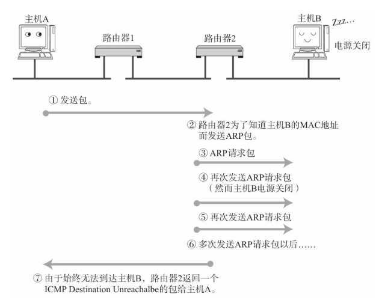
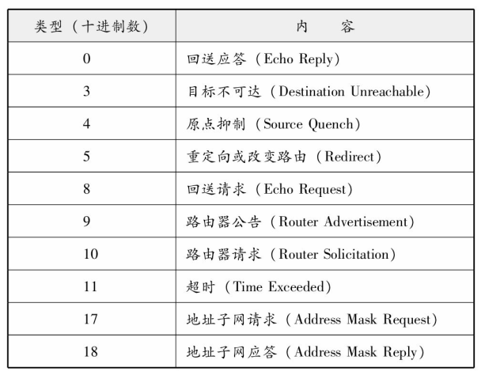

# DNS  

DNS（Domain Name System） 可以将那串字符串自动转换为具体的IP地址。这种DNS不仅适用于IPv4， 还适用于IPv6。  

## IP地址不便记忆  

TCP/IP网络中要求每一个互连的计算机都具有其唯一的IP地址， 并基于这个IP地址进行通信。 然而， 直接使用IP地址有很多不便之处。  

## DNS的产生  

在应用中， 当用户输入主机名（域名） 时， DNS会自动检索那个注册了主机名和IP地址的数据库， 并迅速定位对应的IP地址。 而且， 如果主机名和IP地址需要进行变更时， 也只需要在组织机构内部进行处理即可， 而没必要再向其他机构进行申请或报告。    

## 域名的构成  

域名是指为了识别主机名称和组织机构名称的一种具有分层的名称。   

DNS的分层结构叫做树形结构。   

### 域名服务器  

域名服务器是指管理域名的主机和相应的软件， 它可以管理所在分层的域的相关信息。 其所管理的分层叫做ZONE。每层都设有一个域名服务器。  

根部所设置的DNS叫做根域名服务器。  在根域名服务器的下一层域名服务器中注册了再往下一层域名服务器的IP地址。 根据每个域名服务器所管理的域名， 如果下面再没有其他分层， 就可以自由地指定主机名称或子网名称。 不过， 如果想修改该分层的域名或重新设置域名服务器的IP地址， 还必须得在其上层的域名服务器中进行追加或修改。  

域名和域名服务器需要按照分层进行设置。 如果域名服务器宕机， 那么针对该域的DNS查询也就无法正常工作。 因此， 为了提高容灾能力， 一般会设置至少两个以上的域名服务器。 一旦第一个域名服务器无法提供查询时， 就会自动转到第二个甚至第三个域名服务器上进行， 以此可以按照顺序进行灾备处理。  

### 解析器（Resolver）  

进行DNS查询的主机和软件叫做DNS解析器。 用户所使用的工作站或个人电脑都属于解析器。 一个解析器至少要注册一个以上域名服务器的IP地址。 通常， 它至少包括组织内部的域名服务器的IP地址。  

## DNS查询  

解析器为了调查IP地址， 向域名服务器进行查询处理。 接收这个查询请求的域名服务器首先会在自己的数据库进行查找。如果有该域名所对应的IP地址就返回。 如果没有， 则域名服务器再向上一层根域名服务器进行查询处理。 因此， 如图所示， 从根开始对这棵树按照顺序进行遍历， 直到找到指定的域名服务器， 并由这个域名服务器返回想要的数据。

解析器和域名服务器将最新了解到的信息暂时保存在缓存里（缓存的时限可以在提供信息的域名服务上进行设置。 ） 。 这样， 可以减少每次查询时的性能消耗。  

## DNS如同互联网中的分布式数据库  

前面提到DNS是一种通过主机名检索IP地址的系统。 然而， 它所管理的信息不仅仅是这些主机名跟IP地址之间的映射关系。 它还要管理众多其他信息。

# ARP  

ARP（Address Resolution Protocol） 是一种解决地址问题的协议。 以目标IP地址为线索， 用来定位下一个应该接收数据分包的网络设备对应的MAC地址。 如果目标主机不在同一个链路上时， 可以通过ARP查找下一跳路由器的MAC地址。 不过ARP只适用于IPv4， 不能用于IPv6。 IPv6中可以用ICMPv6替代ARP发送邻居探索消息。

##　ARP的工作机制  

ARP是借助ARP请求与ARP响应两种类型的包确定MAC地址的。  

主机A为了获得主机B的MAC地址， 起初要通过广播发送一个ARP请求包。 这个包中包含了想要了解其MAC地址的主机IP地址。 也就是说， ARP请求包中已经包含了主机B的IP地址172.20.1.2。 由于广播的包可以被同一个链路上所有的主机或路由器接收， 因此ARP的请求包也就会被这同一个链路上所有的主机和路由器进行解析。 如果ARP请求包中的目标IP地址与自己的IP地址一致， 那么这个节点就将自己的MAC地址塞入ARP响应包返回给主机A。  

如果每发送一个IP数据报都要进行一次ARP请求以此确定MAC地址， 那将会造成不必要的网络流量，因此， 通常的做法是把获取到的MAC地址缓存到一个ARP缓存表中， 下一次再向这个IP地址发送数据报时不需再重新发送ARP请求， 而是直接使用这个缓存表当中的MAC地址进行数据报的发送。 每执行一次ARP， 其对应的缓存内容都会被清除。不过在清除之前都可以不需要执行ARP就可以获取想要的MAC地址。  

不过， MAC地址的缓存是有一定期限的。 超过这个期限， 缓存的内容将被清除。 这使得MAC地址与IP地址对应关系即使发生了变化（尤其是在换网卡， 或移动笔记本电脑、 智能终端时。 ） ， 也依然能够将数据包正确地发送给目标地址。    

## IP地址和MAC地址缺一不可？  

主机A想要发送IP数据报给主机B时必须得经过路由器C。 即使知道了主机B的MAC地址， 由于路由器C会隔断两个网络， 还是无法实现直接从主机A发送数据报给主机B。 此时， 主机A必须得先将数据报发送给路由器C的MAC地址C1。  在以太网上发送IP包时， “下次要经由哪个路由器发送数据报”这一信息非常重要。 而这里的“下一个路由器”就是相应的MAC地址。  

## RARP  

RARP（Reverse Address Resolution Protocol） 是将ARP反过来， 从MAC地址定位IP地址的一种协议。   

需要架设一台RARP服务器， 从而在这个服务器上注册设备的MAC地址及其IP地址。

## 代理ARP  

通常ARP包会被路由器隔离， 但是采用代理ARP（Proxy ARP） 的路由器可以将ARP请求转发给邻近的网段。 由此， 两个以上网段的节点之间可以像在同一个网段中一样进行通信。  

# ICMP  

## 辅助IP的ICMP  

架构IP网络时需要特别注意两点： 确认网络是否正常工作， 以及遇到异常时进行问题诊断。  

ICMP的主要功能包括， 确认IP包是否成功送达目标地址， 通知在发送过程当中IP包被废弃的具体原因， 改善网络设置等。  

在IP通信中如果某个IP包因为某种原因未能达到目标地址， 那么这个具体的原因将由ICMP负责通知。ICMP的这种通知消息会使用IP进行发送。 收到该ICMP包的主机A则分解ICMP的首部和数据域以后得知具体发生问题的原因。    

 

ICMP的消息大致可以分为两类： 一类是通知出错原因的错误消息， 另一类是用于诊断的查询消息。  

## 主要的ICMP消息  

### ICMP目标不可达消息（类型3）  

IP路由器无法将IP数据包发送给目标地址时， 会给发送端主机返回一个目标不可达（Destination Unreachable Message） 的ICMP消息， 并在这个消息中显示不可达的具体原因：

### ICMP重定向消息（类型5）  

如果路由器发现发送端主机使用了次优的路径发送数据， 那么它会返回一个ICMP重定向（ICMP Redirect Message） 的消息给这个主机。 在这个消息中包含了最合适的路由信息和源数据。 这主要发生在路由器持有更好的路由信息的情况下。 路由器会通过这样的ICMP消息给发送端主机一个更合适的发送路由。  

  

### ICMP超时消息（类型11）  

IP包中有一个字段叫做TTL（Time To Live， 生存周期） ， 它的值随着每经过一次路由器就会减1， 直到减到0时该IP包会被丢弃。 此时， IP路由器将会发送一个ICMP超时的消息（ICMP Time Exceeded Message， 错误号0（错误号1表示将被拆分包做重构处理时超时。 ） ） 给发送端主机， 并通知该包已被丢弃。    

设置IP包生存周期的主要目的， 是为了在路由控制遇到问题发生循环状况时， 避免IP包无休止地在网络上被转发。 此外， 有时可以用TTL控制包的到达范围， 例如设置一个较小的TTL值。  

### ICMP回送消息（类型0、 8）  

用于进行通信的主机或路由器之间， 判断所发送的数据包是否已经成功到达对端的一种消息。 可以向对端主机发送回送请求的消息（ICMP Echo Request Message， 类型8） ， 也可以接收对端主机发回来的回送应答消息（ICMP Echo Reply Message， 类型0） 。 网络上最常用的ping命令（Packet InterNetwork Groper，判断对端主机是否可达的一种命令。 ） 就是利用这个消息实现的。    

## 其他ICMP消息  

### ICMP原点抑制消息（类型4）  

