# TCP/IP的标准化  

##　TCP/IP的具体含义  

TCP/IP 本质上是协议群，有时也称 TCP/IP 为网际协议族（网际协议族（Internet Protocol Suite） ： 组成网际协议的一组协议。  ）

 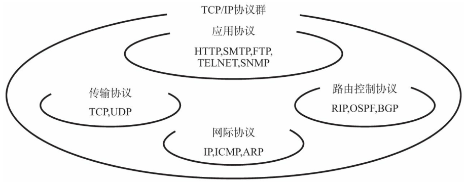

## TCP/IP规范——RFC  

TCP/IP的协议由IETF讨论制定。 那些需要标准化的协议， 被人们列入RFC（Request For Comment）文档并在互联网上公布。 RFC不仅记录了协议规范内容， 还包含了协议的实现和运用的相关信息， 以及实验方面的信息。

RFC文档通过编号组织每个协议的标准化请求。 例如 IP 协议的规范由 RFC279 制定， TCP协议的规范由 RFC793 号文档决定。RFC的编码是既定的， 一旦成为某一RFC的内容， 就不能再对其进行随意修改。 若要扩展已有某个协议规范的内容， 一定要有一个全新编号的RFC文档对其进行记录。 若要修改已有某个协议规
范内容， 则需要重新发行一个新的RFC文档， 同时， 老的那份RFC作废。     

每当对RFC进行修改时都要产生新的RFC编号太麻烦。 为此， 人们采用 STD（Standard）方式管理编号。 STD用来记载哪个编号制定哪个协议。 因此， 同一个协议的规范内容即便发生了变化也不会导致STD编号发生变化。     

# 互联网基础知识  

## 互联网定义

“互联网”， 英文单词为“Internet”。 从字面上理解， internet指的是将多个网络连接使其构成一个更大的网络， 所以internet一词本意为网际网。  

## 互联网与TCP/IP的关系  

互联网进行通信时， 需要相应的网络协议， TCP/IP原本就是为使用互联网而开发制定的协议族。 因此，互联网的协议就是TCP/IP， TCP/IP就是互联网的协议。  

## 互联网的结构  

互联网中的每个网络都是由骨干网（BackBone） 和末端网（Stub） 组成的。 每个网络之间通过NOC（Network Operation Center， 网络操作中心。 ） 相连。 如果网络的运营商不同， 它的网络连接方式和使用方法也会不同。 连接这种异构网络需要有IX（Internet Exchange， 网络交换中心。 ） 的支持。 总之， 互联网就是众多异构的网络通过IX互连的一个巨型网络。  

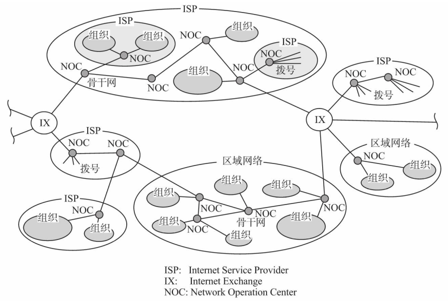

## ISP和区域网  

连接互联网需要向ISP或区域网提出申请。 公司企业或一般家庭申请入网只要联系ISP签约即可。  

区域网指的是在特定区域内由团体或志愿者所运营的网络。 这种方式通常价格比较便宜， 但是有时可能会出现连接方式复杂或使用上有限制等情况。  

当公司的网络与家里的个人电脑都能连网时， 一方面可以认为它们都是互联网的一部分， 另一方面， 从公司的局域网或家里个人电脑的角度出发， 可以认为它们连接的目标网络都是互联网。   

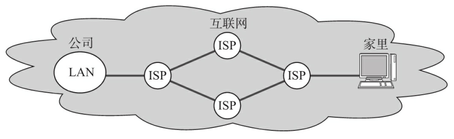

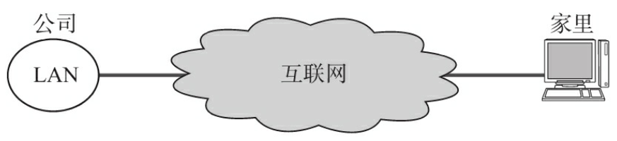

# TCP/IP协议分层模型  

## TCP/IP与OSI参考模型  

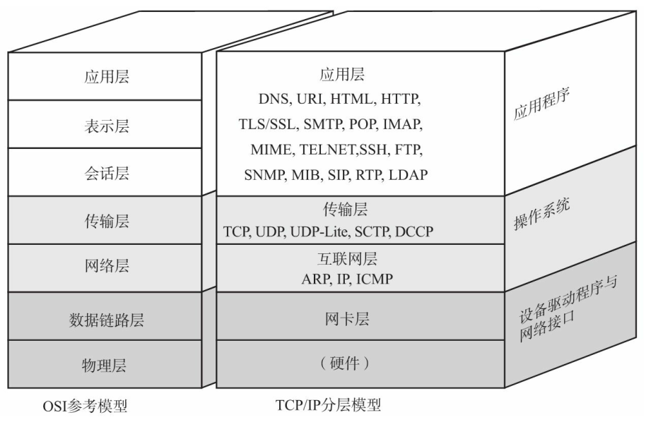

TCP/IP与OSI在分层模块上稍有区别。 OSI 参考模型注重“通信协议必要的功能是什么”， 而TCP/IP则更强调“在计算机上实现协议应该开发哪种程序”。  

## 硬件（物理层）

TCP/IP 的最底层是负责数据传输的硬件。 这种硬件就相当于以太网或电话线路等物理层的设备。   

TCP/IP 是在网络互连的设备之间能够通信的前提下才被提出的协议。  

## 网络接口层（数据链路层）  

网络接口层（有时人们也将网络接口层与硬件层合并起来称作网络通信层。 ） 利用以太网中的数据链路层进行通信， 因此属于接口层。 也就是说， 把它当做让NIC起作用的“驱动程序”也无妨。 驱动程序是在操作系统与硬件之间起桥梁作用的软件。   

## 互联网层（网络层）  

互联网层使用IP协议， 它相当于OSI模型中的第3层网络层。 IP协议基于IP地址转发分包数据。  

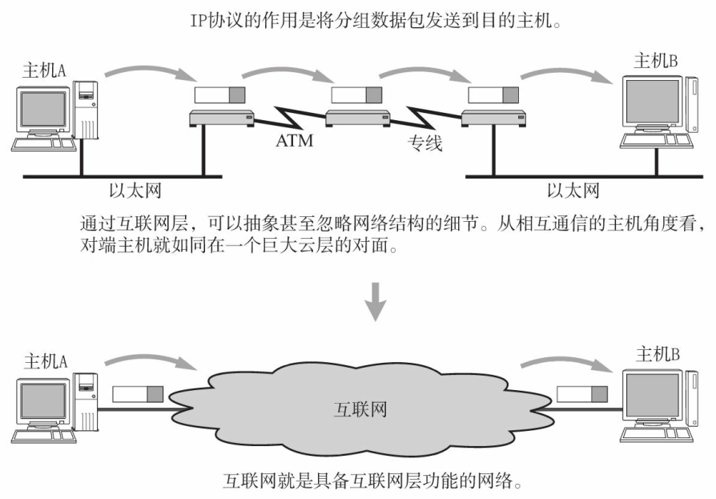

TCP/IP分层中的互联网层与传输层的功能通常由操作系统提供。 尤其是路由器， 它必须得实现通过互联网层转发分组数据包的功能。  

### IP  

IP是跨越网络传送数据包， 使整个互联网都能收到数据的协议。 IP协议使数据能够发送到地球的另一端， 这期间它使用IP地址作为主机的标识。

IP还隐含着数据链路层的功能。 通过IP， 相互通信的主机之间不论经过怎样的底层数据链路都能够实现通信。  

虽然IP也是分组交换的一种协议， 但是它不具有重发机制。 即使分组数据包未能到达对端主机也不会重发。 因此， 属于非可靠性传输协议。  

### ICMP  

IP数据包在发送途中一旦发生异常导致无法到达对端目标地址时， 需要给发送端发送一个发生异常的通知。 ICMP就是为这一功能而制定的。 它有时也被用来诊断网络的健康状况。  

### ARP  

从分组数据包的IP地址中解析出物理地址（MAC地址） 的一种协议。  

## 传输层  

TCP/IP的传输层有两个具有代表性的协议。 该层的功能本身与OSI参考模型中的传输层类似。  

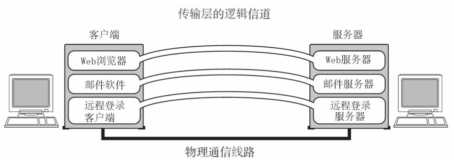

传输层最主要的功能就是能够让应用程序之间实现通信。 计算机内部， 通常同一时间运行着多个程序。为此， 必须分清是哪些程序与哪些程序在进行通信。 识别这些应用程序的是端口号。  

### TCP  

TCP是一种面向有连接的传输层协议。 它可以保证两端通信主机之间的通信可达。 TCP能够正确处理在传输过程中丢包、 传输顺序乱掉等异常情况。 此外， TCP还能够有效利用带宽， 缓解网络拥堵。  

然而， 为了建立与断开连接， 有时它需要至少7次的发包收包， 导致网络流量的浪费。 此外， 为了提高网络的利用率， TCP协议中定义了各种各样复杂的规范， 因此不利于视频会议（音频、 视频的数据量既定）等场合使用。  

### UDP

UDP有别于TCP， 它是一种面向无连接的传输层协议。 UDP不会关注对端是否真的收到了传送过去的数据， 如果需要检查对端是否收到分组数据包， 或者对端是否连接到网络， 则需要在应用程序中实现。  

UDP常用于分组数据较少或多播、 广播通信以及视频通信等多媒体领域。  

## 应用层（会话层以上的分层）  

TCP/IP的分层中， 将OSI参考模型中的会话层、 表示层和应用层的功能都集中到了应用程序中实现。 这些功能有时由一个单一的程序实现， 有时也可能会由多个程序实现。 

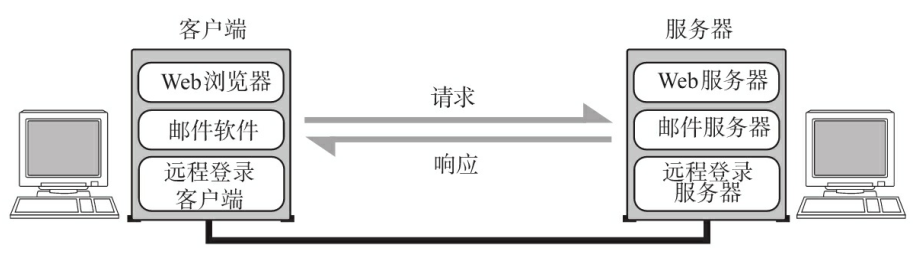  

TCP/IP应用的架构绝大多数属于客户端/服务端模型。 提供服务的程序叫服务端， 接受服务的程序叫客户端。 在这种通信模式中， 提供服务的程序会预先被部署到主机上， 等待接收任何时刻客户可能发送的请求。客户端可以随时发送请求给服务端。   

### WWW  

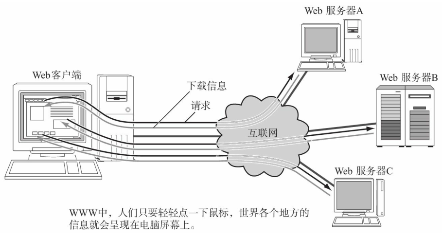

WWW（中文叫万维网， 是一种互联网上数据读取的规范。 有时也叫做Web、 WWW或W3。 ） 可以说是互联网能够如此普及的一个重要原动力。 用户在一种叫Web浏览器的软件上借助鼠标和键盘就可以轻轻松松地在网上自由地冲浪。 也就是说轻按一下鼠标架设在远端服务器上的各种信息就会呈现到浏览器上。 浏览器中既可以显示文字、 图片、 动画等信息， 还能播放声音以及运行程序。  

浏览器与服务端之间通信所用的协议是HTTP（HyperText Transfer Protocol） 。 所传输数据的主要格式是HTML（HyperText Markup Language） 。 WWW中的HTTP属于OSI应用层的协议， 而HTML属于表示层的协议。  

### 电子邮件（E-Mail）  

电子邮件其实就是指在网络上发送信件。 有了电子邮件， 不管距离多远的人， 只要连着互联网就可以相互发送邮件。 发送电子邮件时用到的协议叫做 SMTP（Simple Mail Tranfer Protocol） 。  

### 文件传输（FTP）  

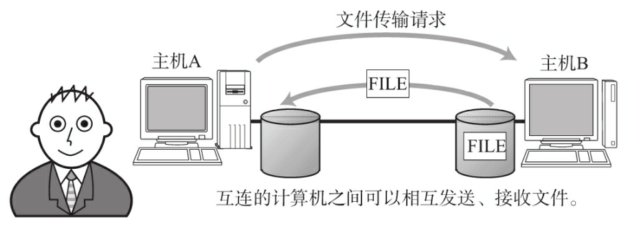

文件传输是指将保存在其他计算机硬盘上的文件转移到本地的硬盘上， 或将本地硬盘的文件传送到其他机器硬盘上的意思。该过程使用的协议叫做FTP（File Transfer Prototol） 。   传输过程中可以选择用二进制方式还是文本方式（用文本方式在Windows、 MacOS或Unix等系统之间进行文件传输时， 会自动修改换行符。 这也属于表示层的功能。 ） 。

在FTP中进行文件传输时会建立两个TCP连接， 分别是发出传输请求时所要用到的控制连接与实际传输数据时所要用到的数据连接（这两种连接的控制管理属于会话层的功能。 ） 。    

### 远程登录（TELNET与SSH）  

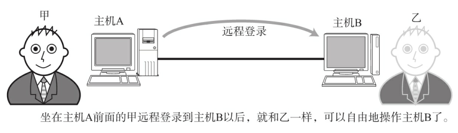

远程登录是指登录到远程的计算机上， 使那台计算机上的程序得以运行的一种功能。 TCP/IP网络中远程登录常用TELNET（TELetypewriter NETwork的缩写。 有时也称作默认协议。 ） 和SSH（SSH是Secure SHell的缩写。 ） 两种协议。  

### 网络管理（SNMP）  

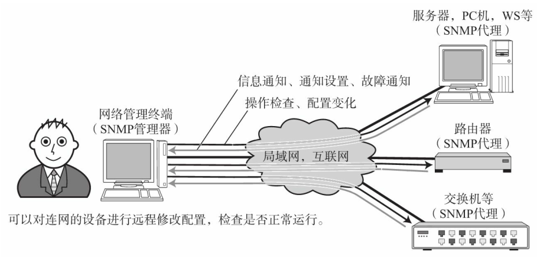

在TCP/IP中进行网络管理时， 采用SNMP（Simple Network Management Protocol） 协议。 使用SNMP管理的主机、 网桥、 路由器等称作SNMP代理（Agent） ， 而进行管理的那一段叫做管理器（Manager） 。SNMP正是这个Manager与Agent所要用到的协议。  

在SNMP的代理端， 保存着网络接口的信息、 通信数据量、 异常数据量以及设备温度等信息。 这些信息可以通过MIB（Management Information Base） （MIB也被称为是一种可透过网络的结构变量。 ） 访问。 因此， 在TCP/IP的网络管理中， SNMP属于应用协议， MIB属于表示层协议。    

# TCP/IP分层模型与通信示例  

## 数据包首部

每个分层中， 都会对所发送的数据附加一个首部， 在这个首部中包含了该层必要的信息， 如发送的目标地址以及协议相关信息。  

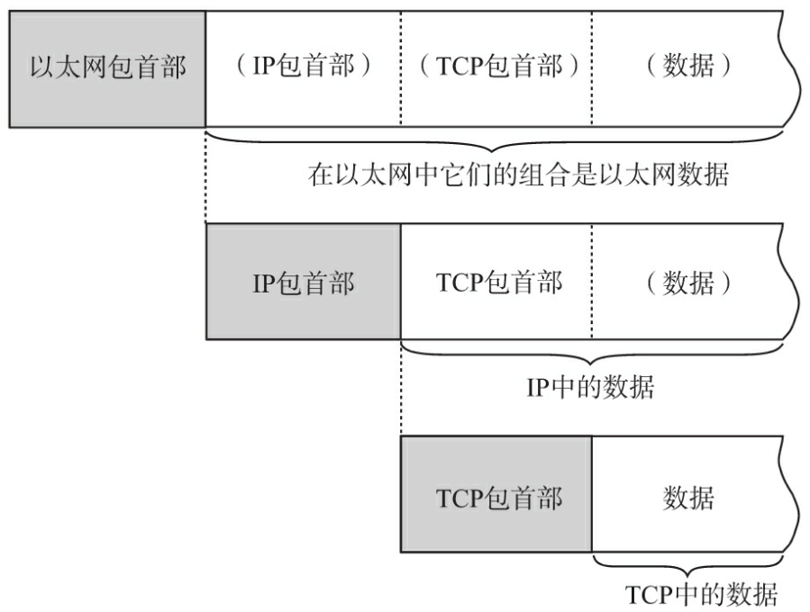

### 包、 帧、 数据报、 段、 消息  

- 包可以说是全能性述语
- 帧用于表示数据链路层中包的单位
- 数据报是IP和UDP等网络层以上的分层中包的单位
- 段则表示TCP数据流中的信息
- 消息是指应用协议中数据的单位

### 包首部就像是协议的脸  

网络中传输的数据包由两部分组成： 

- 一部分是协议所要用到的首部
- 另一部分是上层传过来的数据

首部的结构由协议的具体规范详细定义。在数据包的首部， 明确标明了协议应该如何读取数据。     

## 发送数据包  

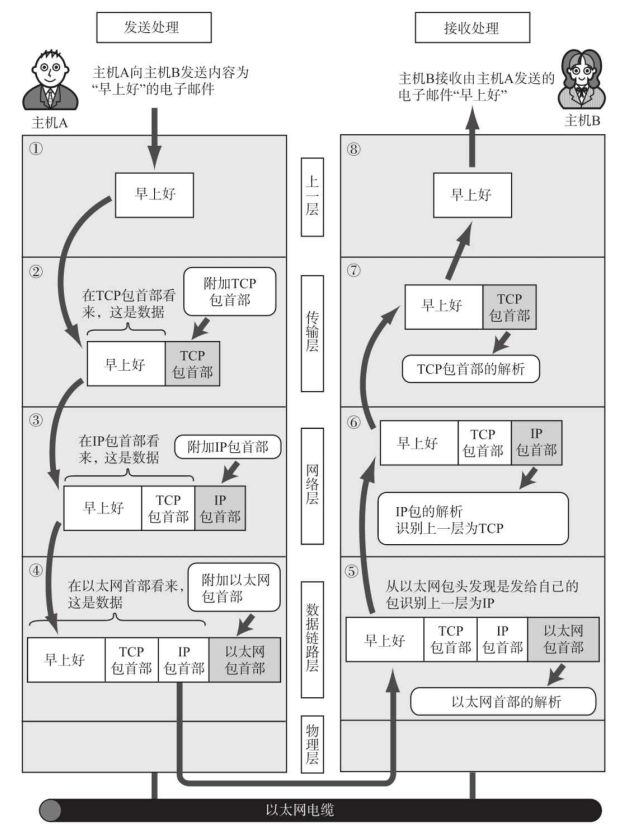

### 应用程序处理

- 键入信息，信息编码
- 应用数据发送给下一层的 TCP

### TCP 模块的处理

- 负责建立连接，发送数据，以及断开连接，确保可靠传输
- 附加 TCP 头部，包含了源端口号和目标端口号，序号，校验码等
- 附加 TCP 首部的包发送给 IP

### IP 模块的处理

- IP将TCP传过来的TCP首部和TCP数据合起来当做自己的数据， 并在TCP首部的前端在加上自己的IP首部  
- IP首部中包含接收端IP地址以及发送端IP地址。 紧随IP首部的还有用来判断其后面数据是TCP还是UDP的信息
- IP包生成后， 参考路由控制表决定接受此IP包的路由或主机。 随后， IP包将被发送给连接这些路由器或主机网络接口的驱动程序， 以实现真正发送数据
- 如果尚不知道接收端的MAC地址， 可以利用ARP（Address Resolution Protocol） 查找。 只要知道了对端的MAC地址， 就可以将MAC地址和IP地址交给以太网的驱动程序， 实现数据传输  

### 网络接口（以太网驱动） 的处理  

- 从IP传过来的IP包， 对于以太网驱动来说不过就是数据。 给这数据附加上以太网首部并进行发送处理  
- 以太网首部中包含接收端MAC地址、 发送端MAC地址以及标志以太网类型的以太网数据的协议  
- 发送处理中的FCS（Frame Check Sequence） 由硬件计算， 添加到包的最后。 设置FCS的目的是为了判断数据包是否由于噪声而被破坏  

## 经过数据链路的包

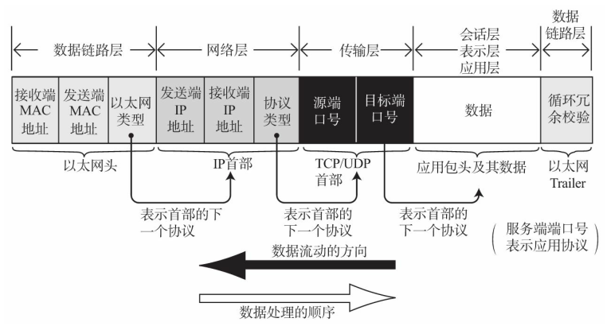

- 包流动时， 从前往后依此被附加了以太网包首部、 IP包首部、 TCP包首部（或者UDP包首部） 以及应用自己的包首部和数据。包的最后则追加了以太网包
- 每个包首部中至少都会包含两个信息： 一个是发送端和接收端地址， 另一个是上一层的协议类型
  - 经过每个协议分层时， 都必须有识别包发送端和接收端的信息。 以太网会用MAC地址， IP会用IP地址， 而TCP/UDP则会用端口号作为识别两端主机的地址  
  - 每个分层的包首部中还包含一个识别位， 它是用来标识上一层协议的种类信息
    - 以太网的包首部中的以太网类型
    - IP中的协议类型
    - TCP/UDP中两个端口的端口号
    - 在应用的首部信息中， 有时也会包含一个用来识别其数据类型的标签  

  ## 数据包接收处理  

包的接收流程是发送流程的逆序过程。  

### 网络接口（以太网驱动） 的处理  

- 主机收到以太网包以后， 首先从以太网的包首部找到MAC地址判断是否为发给自己的包。 如果不是发给自己的包则丢弃数据
- 如果接收到了恰好是发给自己的包， 就查找以太网包首部中的类型域从而确定以太网协议所传送过来的数据类型并交给指定的子程序进行处理，如果以太网包首部的类型域包含了一个无法识别的协议类型， 则丢弃数据

### IP模块的处理  

- IP模块收到IP包首部及后面的数据部分以后如果判断得出包首部中的IP地址与自己的IP地址匹配， 则可接收数据并从中查找上一层的协议，并交给相应的子程序处理
- 对于有路由器的情况下， 接收端地址往往不是自己的地址， 此时， 需要借助路由控制表， 在调查应该送达的主机或路由器以后再转发数据   

### TCP模块的处理  

- 首先会计算一下校验和， 判断数据是否被破坏。 然后检查是否在按照序号接收数据。 最后检查端口号， 确定具体的应用程序  
- 数据接收完毕后， 接收端则发送一个“确认回执”给发送端。 如果这个回执信息未能达到发送端， 那么发送端会认为接收端没有接收到数据而一直反复发送
- 数据被完整地接收以后， 会传给由端口号识别的应用程序

### 应用程序的处理  

- 接收端应用程序会直接接收发送端发送的数据

