# 传输层的作用  

TCP/IP中有两个具有代表性的传输层协议， 它们分别是TCP和UDP。 TCP提供可靠的通信传输， 而UDP则常被用于让广播和细节控制交给应用的通信传输。   

## 传输层定义  

传输层的TCP和UDP， 为了识别自己所传输的数据部分究竟应该发给哪个应用， 也设定了这样一个编号。  根据端口号就可以识别在传输层上一层的应用层中所要进行处理的具体程序（一个程序可以使用多个端口。 ） 。  

## 通信处理  

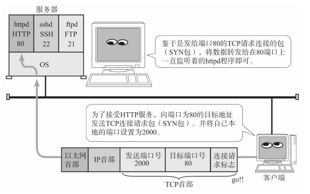

传输协议TCP、 UDP通过接收数据中的目标端口号识别目标处理程序。   

## 两种传输层协议TCP和UDP  

### TCP  

TCP是面向连接的、 可靠的流协议。 流就是指不间断的数据结构，当应用程序采用TCP发送消息时， 虽然可以保证发送的顺序， 但还是犹如没有任何间隔的数据流发送给接收端。

TCP为提供可靠性传输， 实行“顺序控制”或“重发控制”机制。 此外还具备“流控制（流量控制） ”、 “拥塞控制”、 提高网络利用率等众多功能。       

### UDP  

UDP是不具有可靠性的数据报协议。 细微的处理它会交给上层的应用去完成。 在UDP的情况下， 虽然可以确保发送消息的大小， 却不能保证消息一定会到达。 因此， 应用有时会根据自己的需要进行重发处理。    

##　TCP与UDP区分  

TCP用于在传输层有必要实现可靠传输的情况。 由于它是面向有连接并具备顺序控制、 重发控制等机制的， 所以它可以为应用提供可靠传输。  

UDP主要用于那些对高速传输和实时性有较高要求的通信或广播通信。   

因此， TCP和UDP应该根据应用的目的按需使用。  

# 端口号  

## 端口号定义  

数据链路和IP中的地址， 分别指的是MAC地址和IP地址。 前者用来识别同一链路中不同的计算机， 后者用来识别TCP/IP网络中互连的主机和路由器。 在传输层中也有这种类似于地址的概念， 那就是端口号。 端口号用来识别同一台计算机中进行通信的不同应用程序。 因此， 它也被称为程序地址。  

## 根据端口号识别应用  

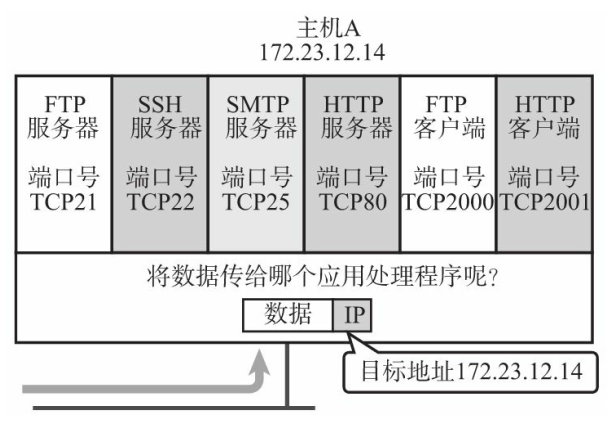

传输层协议正是利用这些端口号识别本机中正在进行通信的应用程序， 并准确地将数据传输。  

## 通过IP地址、 端口号、 协议号进行通信识别  

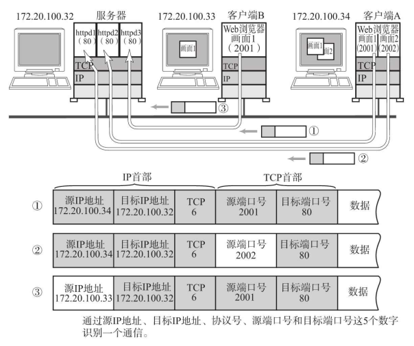

仅凭目标端口识别某一个通信是远远不够的。  

①和②的通信是在两台计算机上进行的。 它们的目标端口号相同， 都是80。   在这种情况下也必须严格区分这两个通信。 因此可以根据源端口号加以区分。  

③跟①的目标端口号和源端口号完全相同， 但是它们各自的源IP地址不同。   

此外， 还有一种情况上图中并未列出， 那就是IP地址和端口全都一样， 只是协议号（表示上层是TCP或UDP的一种编号） 不同。这种情况下， 也会认为是两个不同的通信。  

因此， TCP/IP或UDP/IP通信中通常采用5个信息来识别一个通信。 它们是“源IP地址”、 “目标IP地址”、 “协议号”、 “源端口号”、 “目标端口号”。 只要其中某一项不同， 则被认为是其他通信。    

## 端口号如何确定  

在实际进行通信时， 要事先确定端口号。 确定端口号的方法分为两种：  

### 标准既定的端口号  

这种方法也叫静态方法。 它是指每个应用程序都有其指定的端口号。 但并不是说可以随意使用任何一个端口号。 每个端口号都有其对应的使用目的。

例如， HTTP、 TELNET、 FTP等广为使用的应用协议中所使用的端口号就是固定的。 这些端口号也被称之为知名端口号（Well-Known Port Number） 。   

除知名端口号之外， 还有一些端口号也被正式注册。 它们分布在1024到49151的数字之间。 不过， 这些端口号可用于任何通信用途。   

### 时序分配法  

第二种方法也叫时序（或动态的） 分配法。 此时， 服务端有必要确定监听端口号， 但是接受服务的客户端没必要确定端口号。  

动态分配的端口号取值范围在49152到65535之间。  

## 端口号与协议  

端口号由其使用的传输层协议决定。 因此， 不同的传输协议可以使用相同的端口号。 例如， TCP与UDP使用同一个端口号， 但使用目的各不相同。 这是因为端口号上的处理是根据每个传输协议的不同而进行的。  

数据到达IP层后， 会先检查IP首部中的协议号， 再传给相应协议的模块。 如果是TCP则传给TCP模块、如果是UDP则传给UDP模块去做端口号的处理。 即使是同一个端口号， 由于传输协议是各自独立地进行处理， 因此相互之间不会受到影响。  

此外， 那些知名端口号与传输层协议并无关系， 只要端口一致都将分配同一种程序进行处理。例如， 53号端口在TCP与UDP中都用于DNS服务， 而80端口用于HTTP通信。 从目前来看， 由于HTTP通信必须使用TCP， 因此UDP的80端口并未投入使用。 但是将来， 如果HTTP协议的实现也开始应对UDP协议以及应用协议被相应扩展的情况下， 就可以原样使用与TCP保持相同的80端口号了。     

TCP具有代表性的知名端口号：

UDP具有代表性的知名端口号：

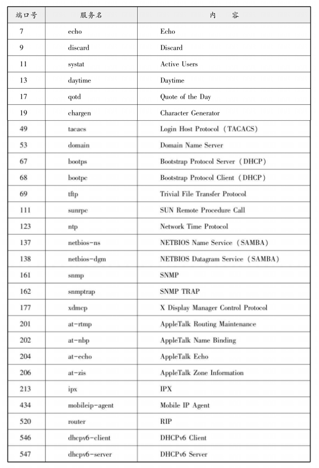

# UDP

UDP是User Datagram Protocol的缩写。

UDP不提供复杂的控制机制， 利用IP提供面向无连接的通信服务。 并且它是将应用程序发来的数据在收到的那一刻， 立即按照原样发送到网络上的一种机制。  

即使是出现网络拥堵的情况下， UDP也无法进行流量控制等避免网络拥塞的行为。 此外， 传输途中即使出现丢包， UDP也不负责重发。 甚至当出现包的到达顺序乱掉时也没有纠正的功能。 如果需要这些细节控制， 那么不得不交由采用UDP的应用程序去处理。

由于UDP面向无连接， 它可以随时发送数据。 再加上UDP本身的处理既简单又高效， 因此经常用于以下几个方面：  

- 包总量较少的通信（DNS、 SNMP等）
- 视频、 音频等多媒体通信（即时通信）
- 限定于LAN等特定网络中的应用通信
- 广播通信（广播、 多播）  

# TCP  

UDP是一种没有复杂控制， 提供面向无连接通信服务的一种协议。 换句话说， 它将部分控制转移给应用程序去处理， 自己却只提供作为传输层协议的最基本功能。  

TCP与UDP的区别相当大。 它充分地实现了数据传输时各种控制功能， 可以进行丢包时的重发控制， 还可以对次序乱掉的分包进行顺序控制。 而这些在UDP中都没有。 此外， TCP作为一种面向有连接的协议， 只有在确认通信对端存在时才会发送数据， 从而可以控制通信流量的浪费。

##　TCP的特点及其目的  

为了通过IP数据报实现可靠性传输， 需要考虑很多事情， 例如数据的破坏、 丢包、 重复以及分片顺序混乱等问题。

TCP通过检验和、 序列号、 确认应答、 重发控制、 连接管理以及窗口控制等机制实现可靠性传输。  

## 通过序列号与确认应答提高可靠性  

在TCP中， 当发送端的数据到达接收主机时， 接收端主机会返回一个已收到消息的通知。 这个消息叫做确认应答（ACK（ACK（Positive Acknowled-gement） 意指已经接收。 ） ） 。  

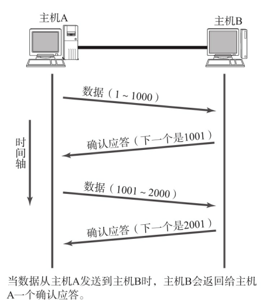

TCP通过肯定的确认应答（ACK） 实现可靠的数据传输。 当发送端将数据发出之后会等待对端的确认应答。 如果有确认应答， 说明数据已经成功到达对端。 反之， 则数据丢失的可能性很大。  

在一定时间内没有等到确认应答， 发送端就可以认为数据已经丢失， 并进行重发。 由此， 即使产生了丢包， 仍然能够保证数据能够到达对端， 实现可靠传输。  

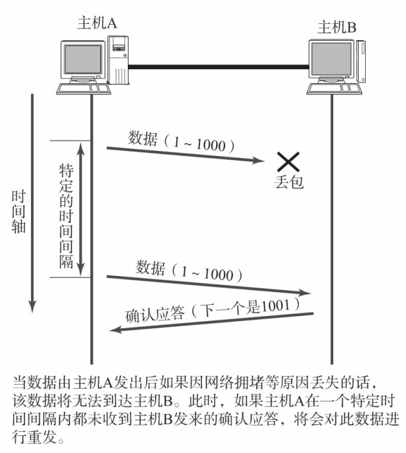

未收到确认应答并不意味着数据一定丢失。 也有可能是数据对方已经收到， 只是返回的确认应答在途中丢失。 这种情况也会导致发送端因没有收到确认应答， 而认为数据没有到达目的地， 从而进行重新发送。   

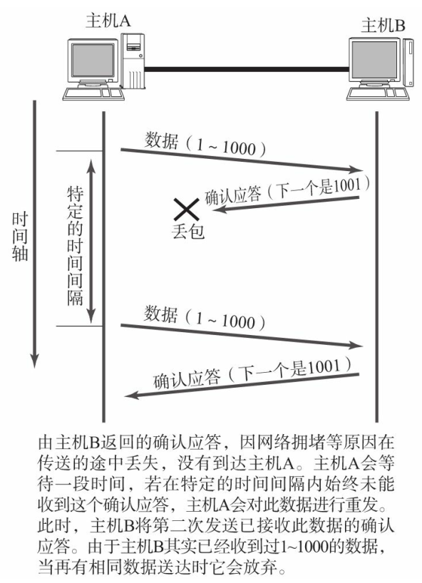

序列号是按顺序给发送数据的每一个字节（8位字节） 都标上号码的编号（序列号的初始值并非为0。 而是在建立连接以后由随机数生成。 而后面的计算则是对每一字节加一。 ） 。 接收端查询接收数据TCP首部中的序列号和数据的长度，将自己下一步应该接收的序号作为确认应答返送回去。 就这样， 通过序列号和确认应答号， TCP可以实现可靠传输。  

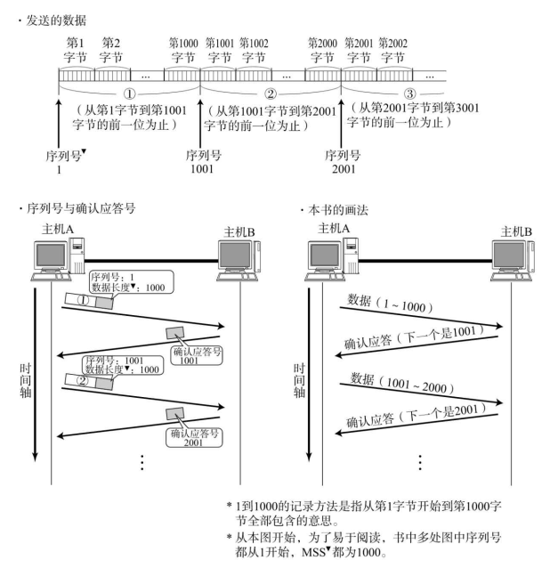

- 序列号（或确认应答号） 也指字节与字节之间的分隔  
- TCP的数据长度并未写入TCP首部。 实际通信中求得TCP包的长度的计算公式是： IP首部中的数据包长度-IP首部长度TCP首部长度。  

## 重发超时如何确定  

重发超时是指在重发数据之前， 等待确认应答到来的那个特定时间间隔。 如果超过了这个时间仍未收到确认应答， 发送端将进行数据重发。   

TCP要求不论处在何种网络环境下都要提供高性能通信， 并且无论网络拥堵情况发生何种变化， 都必须保持这一特性。 为此， 它在每次发包时都会计算往返时间（Round Trip Time也叫RTT。 是指报文段的往返时间。 ） 及其偏差（RTT时间波动的值、 方差。 有时也叫抖动。 ） 。 将这个往返时间和偏差相加重发超时的时间， 就是比这个总和要稍大一点的值。  

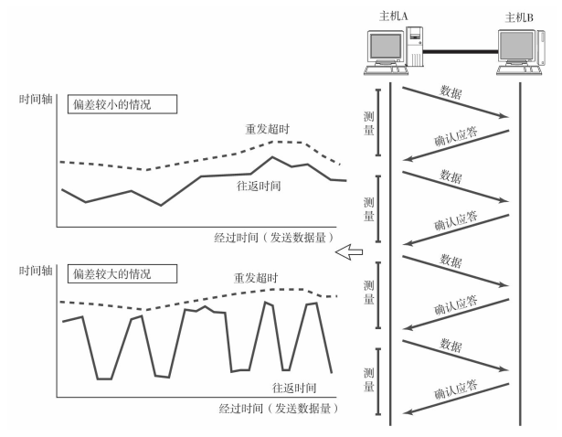

数据被重发之后若还是收不到确认应答， 则进行再次发送。 此时， 等待确认应答的时间将会以2倍、 4倍的指数函数延长。

此外， 数据也不会被无限、 反复地重发。 达到一定重发次数之后， 如果仍没有任何确认应答返回， 就会判断为网络或对端主机发生了异常， 强制关闭连接。 并且通知应用通信异常强行终止。  

## 连接管理  

TCP提供面向有连接的通信传输。 面向有连接是指在数据通信开始之前先做好通信两端之间的准备工作。TCP提供面向有连接的通信传输。 面向有连接是指在数据通信开始之前先做好通信两端之间的准备工作。如果对端发来确认应答， 则认为可以进行数据通信。 如果对端的确认应答未能到达， 就不会进行数据通信。       

可以使用TCP首部用于控制的字段来管理TCP连接一个连接的建立与断开， 正常过程至少需要来回发送7个包才能完成。

  

## TCP以段为单位发送数据  

在建立TCP连接的同时， 也可以确定发送数据包的单位， 我们也可以称其为“最大消息长度”（MSS：Maximum Segment Size） 。 最理想的情况是， 最大消息长度正好是IP中不会被分片处理的最大数据长度。  

TCP在传送大量数据时， 是以MSS的大小将数据进行分割发送。 进行重发时也是以MSS为单位。  

MSS是在三次握手的时候， 在两端主机之间被计算得出。 两端的主机在发出建立连接的请求时， 会在TCP首部中写入MSS选项， 告诉对方自己的接口能够适应的MSS的大小（为附加MSS选项， TCP首部将不再是20字节， 而是4字节的整数倍。) 。然后会在两者之间选择一个较小的值投入使用（在建立连接时， 如果某一方的MSS选项被省略， 可以选为IP包的长度不超过576字节的值（IP首部20字节， TCP首部20字节， MSS 536字节） 。 ） 。  

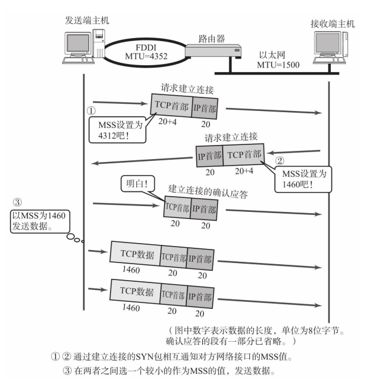

## 利用窗口控制提高速度  

TCP以1个段为单位， 每发一个段进行一次确认应答的处理。 这样的传输方式有一个缺点。那就是， 包的往返时间越长通信性能就越低。     

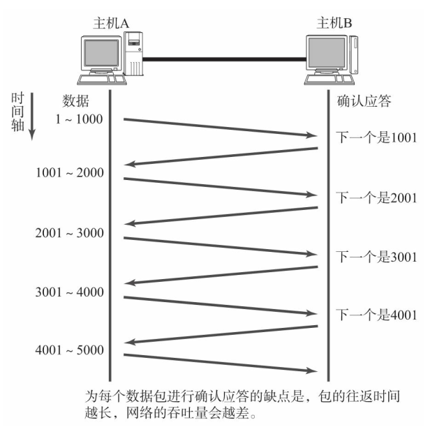

为解决这个问题， TCP引入了窗口这个概念。 即使在往返时间较长的情况下， 它也能控制网络性能的下降。确认应答不再是以每个分段， 而是以更大的单位进行确认时， 转发时间将会被大幅度的缩短。 也就是说， 发送端主机， 在发送了一个段以后不必要一直等待确认应答， 而是继续发送。     

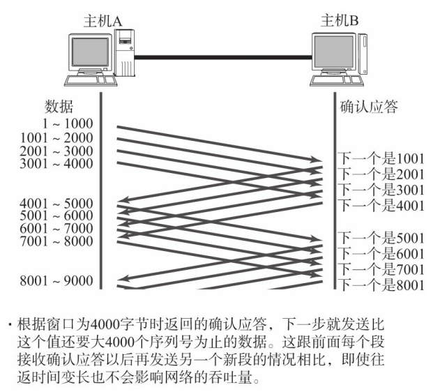

窗口大小就是指无需等待确认应答而可以继续发送数据的最大值。   

这个机制实现了使用大量的缓冲区（缓冲区（Buffer） 在此处表示临时保存收发数据的场所。 通常是在计算机内存中开辟的一部分空间。 ） ， 通过对多个段同时进行确认应答的功能。  

在滑动窗口以外的部分包括尚未发送的数据以及已经确认对端已收到的数据。 当数据发出后若如期收到确认应答就可以不用再进行重发， 此时数据就可以从缓存区清除。

收到确认应答的情况下， 将窗口滑动到确认应答中的序列号的位置。 这样可以顺序地将多个段同时发送提高通信性能。 这种机制也被称为滑动窗口控制。

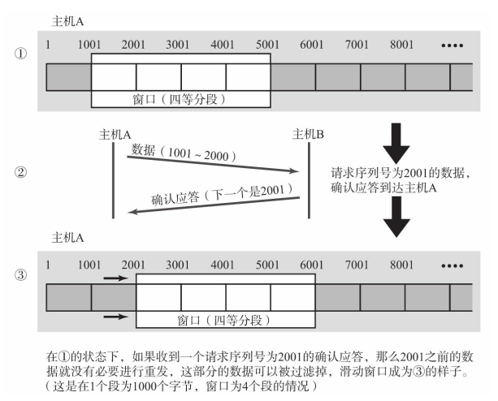

## 窗口控制与重发控制  

在没有使用窗口控制的时候， 没有收到确认应答的数据都会被重发。 而使用了窗口控制，某些确认应答即便丢失也无需重发。     

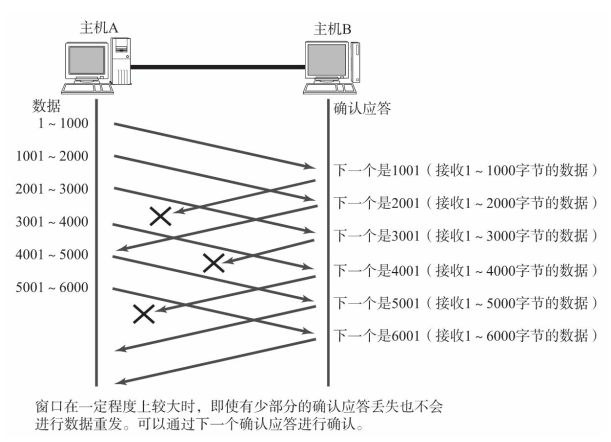

接收主机如果收到一个自己应该接收的序号以外的数据时， 会针对当前为止收到数据返回确认应答（不过即使接收端主机收到的包序号并不连续，也不会将数据丢弃而是暂时保存至缓冲区中。 ） 。  

在窗口比较大， 又出现报文段丢失的情况下， 同一个序号的确认应答将会被重复不断地返回。 而发送端主机如果连续3次收到同一个确认应答（之所以连续收到3
次而不是两次的理由是因为， 即使数据段的序号被替换两次也不会触发重发机制。 ） ， 就会将其所对应的数据进行重发。 这种机制比之前提到的超时管理更加高效， 因此也被称作高速重发控制。  

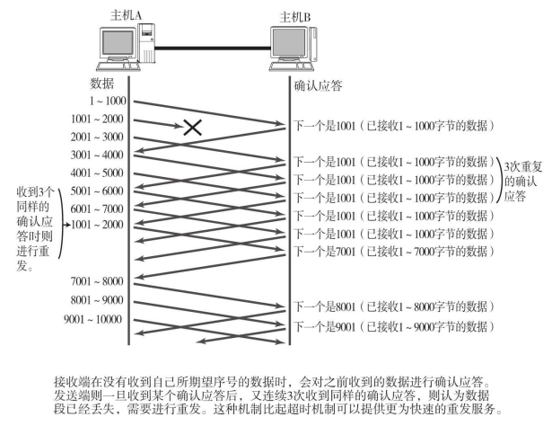

## 流控制  

TCP提供一种机制可以让发送端根据接收端的实际接收能力控制发送的数据量。 这就是所谓的流控制。 它的具体操作是， 接收端主机向发送端主机通知自己可以接收数据的大小， 于是发送端会发送不超过这个限度的数据。 该大小限度就被称作窗口大小。   

TCP首部中， 专门有一个字段用来通知窗口大小。 接收主机将自己可以接收的缓冲区大小放入这个字段中通知给发送端。 这个字段的值越大， 说明网络的吞吐量越高。  

不过， 接收端的这个缓冲区一旦面临数据溢出时， 窗口大小的值也会随之被设置为一个更小的值通知给发送端， 从而控制数据发送量。 也就是说， 发送端主机会根据接收端主机的指示， 对发送数据的量进行控制。 这也就形成了一个完整的TCP流控制（流量控制） 。  

当接收端收到从3001号开始的数据段后其缓冲区即满， 不得不暂时停止接收数据。 之后， 在收到发送窗口更新通知后通信才得以继续进行。 如果这个窗口的更新通知在传送途中丢失， 可能会导致无法继续通信。 为避免此类问题的发生， 发送端主机会时不时的发送一个叫做窗口探测的数据段， 此数据段仅含一个字节以获取最新的窗口大小信息。  

## 拥塞控制  

有了TCP的窗口控制， 收发主机之间即使不再以一个数据段为单位发送确认应答， 也能够连续发送大量数据包。 然而， 如果在通信刚开始时就发送大量数据， 也可能会引发其他问题。  一般来说， 计算机网络都处在一个共享的环境。 因此也有可能会因为其他主机之间的通信使得网络拥堵。 在网络出现拥堵时， 如果突然发送一个较大量的数据， 极有可能会导致整个网络的瘫痪。  

TCP为了防止该问题的出现， 在通信一开始时就会通过一个叫做慢启动的算法得出的数值， 对发送数据量进行控制。  

首先， 为了在发送端调节所要发送数据的量， 定义了一个叫做“拥塞窗口”的概念。 于是在慢启动的时候， 将这个拥塞窗口的大小设置为1个数据段（1MSS）发送数据， 之后每收到一次确认应答（ACK） ， 拥塞窗口的值就加1。 在发送数据包时， 将拥塞窗口的大小与接收端主机通知的窗口大小做比较， 然后按照它们当中较小那个值， 发送比其还要小的数据量。  

 如果重发采用超时机制， 那么拥塞窗口的初始值可以设置为1以后再进行慢启动修正。 有了上述这些机制， 就可以有效地减少通信开始时连续发包导致的网络拥堵， 还可以避免网络拥塞情况的发生。    

不过， 随着包的每次往返， 拥塞窗口也会以1、 2、 4等指数函数的增长， 拥堵状况激增甚至导致网络拥塞的发生。 为了防止这些， 引入了慢启动阀值的概念。 只要拥塞窗口的值超出这个阀值， 在每收到一次确认应答时， 只允许以下面这种比例放大拥塞窗口：  

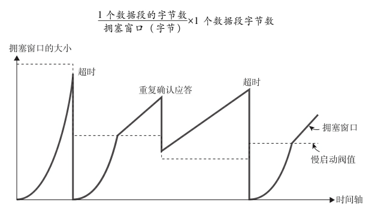

拥塞窗口越大， 确认应答的数目也会增加。 不过随着每收到一个确认应答， 其涨幅也会逐渐减少， 甚至小过比一个数据段还要小的字节数。 因此， 拥塞窗口的大小会呈直线上升的趋势。

TCP的通信开始时， 并没有设置相应的慢启动阀值（与窗口的最大值相同。 ） 。 而是在超时重发时，才会设置为当时拥塞窗口一半的大小。

由重复确认应答而触发的高速重发与超时重发机制的处理多少有些不同。 因为前者要求至少3次的确认应答数据段到达对方主机后才会触发， 相比后者网络的拥堵要轻一些。

而由重复确认应答进行高速重发控制时， 慢启动阀值的大小被设置为当时窗口大小的一半（严格来说，是设置为“ 实际已发送但未收到确认应答的数据量” 的一半。 ） 。 然后将窗口的大小设置为该慢启动阀值+3个数据段的大小。  

当TCP通信开始以后， 网络吞吐量会逐渐上升， 但是随着网络拥堵的发生吞吐量也会急速下降。 于是会再次进入吞吐量慢慢上升的过程。 因此所谓TCP的吞吐量的特点就好像是在逐步占领网络带宽的感觉。  

## 提高网络利用率的规范  

### Nagle算法  

TCP中为了提高网络的利用率， 经常使用一个叫做Nagle的算法。  

该算法是指发送端即使还有应该发送的数据， 但如果这部分数据很少的话， 则进行延迟发送的一种处理机制。 具体来说， 就是仅在下列任意一种条件下才能发送数据。 如果两个条件都不满足， 那么暂时等待一段时间以后再进行数据发送。

- 已发送的数据都已经收到确认应答时
- 可以发送最大段长度（MSS） 的数据时  

根据这个算法虽然网络利用率可以提高， 但是可能会发生某种程度的延迟。 为此， 在窗口系统以及机械控制等领域中使用TCP时， 往往会关闭对该算法的启用。    

### 延迟确认应答  

接收数据的主机如果每次都立刻回复确认应答的话， 可能会返回一个较小的窗口。 那是因为刚接收完数据， 缓冲区已满。当某个接收端收到这个小窗口的通知以后， 会以它为上限发送数据， 从而又降低了网络的利用率（这其实是窗口控制特有的问题， 专门术语叫做糊涂窗口综合征（SWS： Silly Window Syndrome） 。 ） 。 为此，引入了一个方法， 那就是收到数据以后并不立即返回确认应答， 而是延迟一段时间的机制。  

- 在没有收到2×最大段长度的数据为止不做确认应答（根据操作系统的不同， 有时也有不论数据大小，只要收到两个包就即刻返回确认应答的情况。 ）
- 其他情况下， 最大延迟0.5秒发送确认应答（如果延迟多于0.5秒可能会导致发送端重发数据。 ）  

事实上， 大可不必为每一个数据段都进行一次确认应答。 TCP采用滑动窗口的控制机制， 因此通常确认应答少一些也无妨。 TCP文件传输中， 绝大多数是每两个数据段返回一次确认应答。  

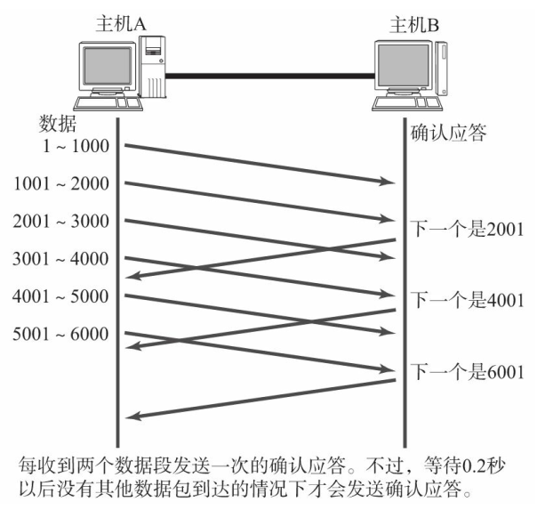

### 捎带应答  

根据应用层协议， 发送出去的消息到达对端， 对端进行处理以后， 会返回一个回执。在此类通信当中， TCP的确认应答和回执数据可以通过一个包发送。 这种方式叫做捎带应答。 通过这种机制， 可以使收发的数据量减少。       

另外， 接收数据以后如果立刻返回确认应答， 就无法实现捎带应答。 而是将所接收的数据传给应用处理生成返回数据以后进再进行发送请求为止， 必须一直等待确认应答的发送。 也就是说， 如果没有启用延迟确认应答就无法实现捎带应答。 延迟确认应答是能够提高网络利用率从而降低计算机处理负荷的一种较优的处理机制。  

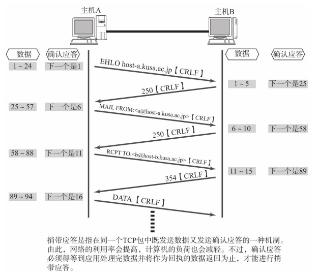

## 使用TCP的应用  

如果需要应用自己处理一些更为细节上的控制， 使用UDP协议是不错的选择。 如果转发数据量较多、 对可靠性的要求比较高时， 可以选择使用TCP。 TCP和UDP两者各有长短， 在设计和开发应用时， 应准确掌握它们各自协议的特点酌情选择。  

# 其他传输层协议  

##　UDP-Lite  

