# 应用层协议概要  

- 应用协议的定义

利用网络的应用程序有很多， 包括Web 浏览器、 电子邮件、 远程登录、 文件传输、 网络管理等。 能够让这些应用进行特定通信处理的正是应用协议。  

- 应用协议与协议的分层  

网络应用由不同的用户和软件供应商开发而成。 为了实现网络应用的功能， 在应用之间进行通信时将其连接的网络协议是非常重要的应用之间交互的信息叫消息。 应用协议定义这些消息的格式以及使用这些消息进行控制或操作的规则。 ） 。 设计师和开发人员根据所开发模块的功能和目的， 可以利用现有的应用协
议， 也可以自己定义一个新的应用协议。    

- 相当于OSI中第5、 第6、 第7层的协议  

TCP/IP的应用层涵盖了OSI参考模型中第5、 第6、 第7层的所有功能， 不仅包含了管理通信连接的会话层功能、 转换数据格式的表示层功能， 还包括与对端主机交互的应用层功能在内的所有功能。  

# 远程登录  

远程登录是为了实现TSS（TSS（Time Sharing System） 分时系统。）  环境， 是将主机和终端的关系应用到计算机网络上的一个结果。 TSS中通常有一个处理能力非常强的主机，围绕着这台主机的是处理能力没有那么强的多个终端机器。 这些终端通过专线与主机相连。   

类似地， 实现从自己的本地计算机登录到网络另一端计算功能的应用就叫做远程登录。 通过远程登录到通用计算机或UNIX工作站以后， 不仅可以直接使用这些主机上的应用， 还可以对这些计算机进行参数设置。 远程登录主要使用TELNET和SSH（Secure SHell。 ） 两种协议。  

## TELNET  

TELNET利用TCP的一条连接， 通过这一条连接向主机发送文字命令并在主机上执行。 本地用户好像直接与远端主机内部的 Shell 相连着似的， 直接在本地进行操作。   

TELNET可以分为两类基本服务。 一是仿真终端功能， 二是协商选项机制。  

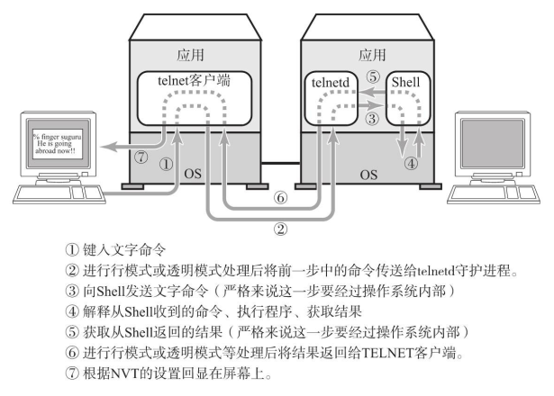

TELNET经常用于登录路由器或高性能交换机等网络设备进行相应的设置。 通过TELNET登录主机或路由器等设备时需要将自己的登录用户名和密码注册到
服务端。  

### 选项

TELNET中除了处理用户所输入的文字外， 还提供选项的交互和协商功能。   

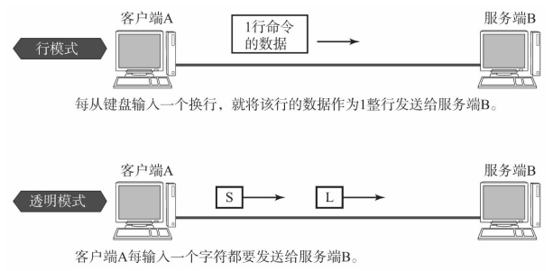

### TELNET客户端  

所谓TELNET客户端是指利用TELNET协议实现远程登录的客户端程序。 很多情况下， 它的程序名就是telnet命令。  

TELNET客户端通常与目标主机的23号端口建立连接， 并与监听这个端口的服务端程序telnetd进行交互。 当然， 也可以与其他的TCP端口号连接， 只要在该端口上有监听程序能够处理telnet请求即可。  

## SSH  

SSH是加密的远程登录系统。 TELNET中登录时无需输入密码就可以发送， 容易造成通信窃听和非法入侵的危险。 使用SSH后可以加密通信内容。 即使信息被窃听也无法破解所发送的密码、 具体命令以及命令返回的结果是什么。  

SSH还包括很多非常方便的功能：

- 可以使用更强的认证机制
- 可以转发文件（UNIX中可以使用scp、 sftp等命令。 ） 
- 可以使用端口转发功能（可以通过X Window System串口展现。 ）

端口转发是指将特定端口号所收到的消息转发到特定的IP地址和端口号码的一种机制。 由于经过SSH连接的那部分内容被加密， 确保了信息安全， 提供了更为灵活的通信（可以实现虚拟专用网（VPN， Virtual Private Network） 。 ）   。  

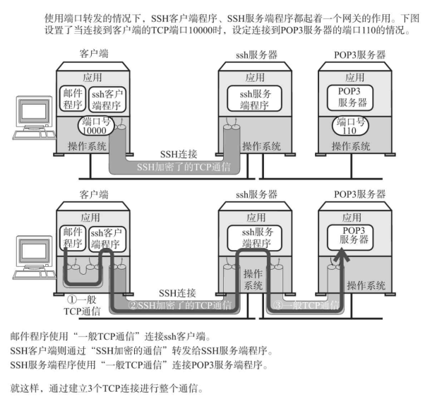

# 文件传输  

FTP是在两个相连的计算机之间进行文件传输时使用的协议。FTP中也需要在登录到对方的计算机后才能进行相应的操作。互联网上有一种FTP服务器是允许任何人进行访问的， 这种服务器叫做匿名服务器（anonymous ftp） 。登录这些服务器时使用匿名（anonymous） 或ftp都可以 。

## FTP的工作机制概要  

FTP使用两条TCP连接： 一条用来控制， 另一条用于数据（文件） 的传输。  

用于控制的TCP连接主要在FTP的控制部分使用。 例如登录用户名和密码的验证、 发送文件的名称、 发送方式的设置。 利用这个连接， 可以通过ASCII码字符串发送请求和接收应答。 在这个连接上无法发送数据， 数据需要一个专门的TCP进行连接。  

FTP控制用的连接使用的是TCP21号端口。 在TCP21号端口上进行文件GET（RETR） 、PUT（STOR） 、 以及文件一览（LIST） 等操作时， 每次都会建立一个用于数据传输的TCP连接。 数据的传输和文件一览表的传输正是在这个新建的连接上进行。 当数据传送完毕之后， 传输数据的这条连接也会被断开， 然后会在控制用的连接上继续进行命令或应答的处理。  

通常， 用于数据传输的TCP连接是按照与控制用的连接相反的方向建立的。 因此， 在通过NAT连接外部FTP服务器的时候， 无法直接建立传输数据时使用的TCP连接。 此时， 必须使用PASV命令修改建立连接的方向才行。  

控制用的连接， 在用户要求断开之前会一直保持连接状态。 不过， 绝大多数FTP服务器都会对长时间没有任何新命令输入的用户的连接强制断开。

数据传输用的TCP连接通常使用端口20。 不过可以用PORT命令修改为其他的值。 最近， 出于安全的考虑， 普遍在数据传输用的端口号中使用随机数进行分配。  

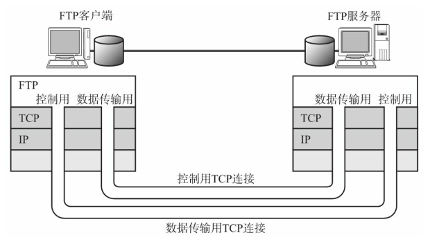

## 通过ASCII码字符串进行的交互处理  

FTP中请求命令中使用着“RETR”等ASCII（American Standard Code for Information Interchange的省略。 ） 码字符串。 而针对这些命令的应答则使用如“200”等3位数字的ASCII码字符串。 TCP/IP的应用协议中有很多使用这种ASCII码字符串的协议。  

对于ASCII码字符串型的协议来说换行具有重要意义。 很多情况下， 一行字符串表示一个命令或一个应答， 而空白则用来标识与参数之间的分割符。 即， 命令和应答的消息通过换行区分、 参数用空格区分。 换行由“CR”（ASCII码的十进制数为13） 和“LF”（ASCII码的十进制数为10） 两个控制符号组成。  

## FTP主要的命令和应答信息  

FTP 主要命令：

FTP 应答信息：

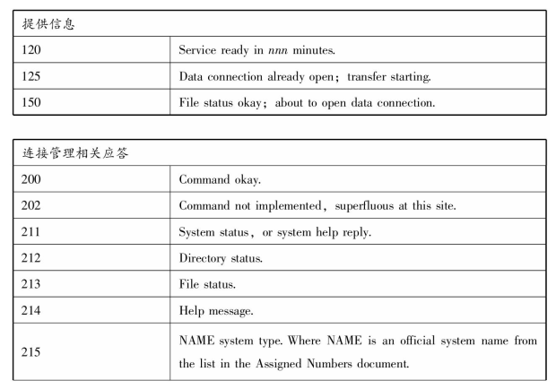

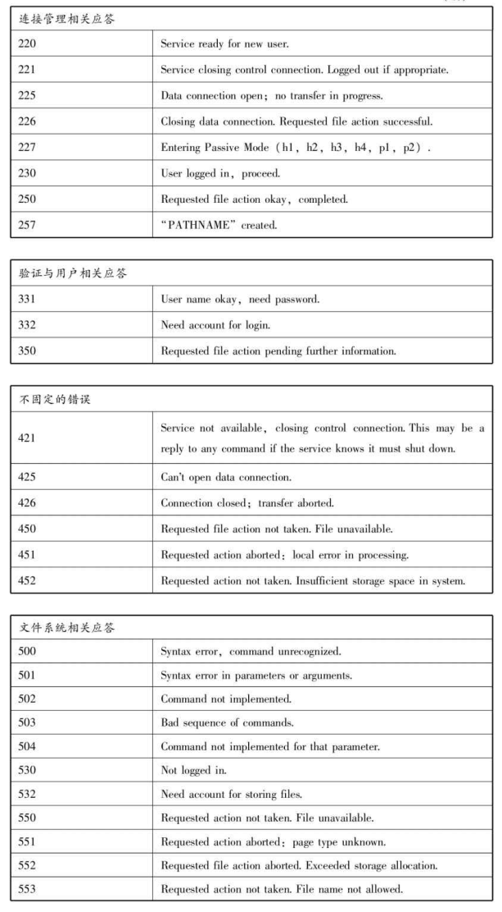

# 电子邮件  

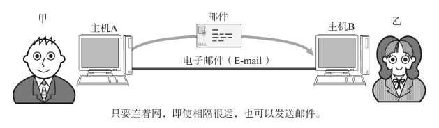

## 电子邮件的工作机制  

提供电子邮件服务的协议叫做SMTP（Simple Mail Transfer Protocol） 。 SMTP为了实现高效发送邮件内容， 在其传输层使用了TCP协议。  

早期电子邮件是在发送端主机与接收端主机之间直接建立TCP连接进行邮件传输。这种方法， 在提高电子邮件的可靠性传输上非常有效。 但是， 互联网应用逐渐变得越发复杂， 这种机制也将无法正常工作。 例如， 使用者的计算机时而关机时而开机的情况下， 只有发送端和接收端都处于插电并且开机的状态时才可能实现电子邮件的收发。     

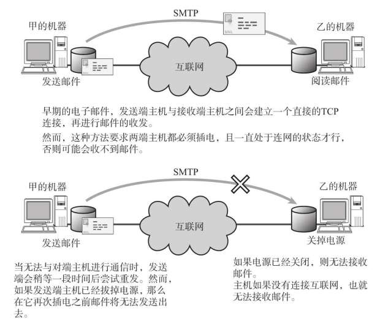

为此， 在技术上改变了以往直接在发送端与接收端主机之间建立TCP连接的机制， 而引进了一种一直会连接电源的邮件服务器。 发送和接收端通过邮件服务器进行收发邮件。 接收端从邮件服务器接收邮件时使用POP3（Post Office Protocol） 协议。    

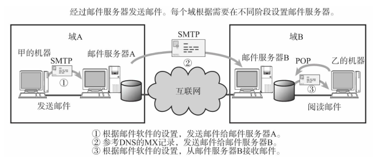

电子邮件的机制由3部分组成， 它们分别是邮件地址， 数据格式以及发送协议。  

## 邮件地址  

使用电子邮件时需要拥有的地址叫做邮件地址。 它就相当于通信地址和姓名。 互联网中电子邮件地址的格式如下：名称@通信地址。  

 ## MIME  

电子邮件所能发送的数据类型已被扩展到MIME（Multipurpose Internet Mail Extensions， 广泛用于互联网并极大地扩展了数据格式， 还可以用于WWW和NetNews中。 ） ， 可以发送静态图像、 动画、 声音、 程序等各种形式的数据。      

MIME基本上由首部和正文（数据） 两部分组成。 首部不能是空行， 因为一旦出现空行， 其后的部分将被视为正文（数据） 。 如果MIME首部的“Content-Type”中指定“Multipart/Mixed”， 并以“boundary=”后面字符作为分隔符（boundary=后面的字符串， 开头一定要写- -。 而且， 间隔符后面也一定要写- -。 ） ， 那么可以将多个MIME消息组合成为一个MIME消息。 这就叫做multipart。 即， 各个部分都由MIME首部和正文（数据） 组成。  

“Content-Type”定义了紧随首部信息的数据类型。 以IP首部为例， 它就相当于协议字段。  

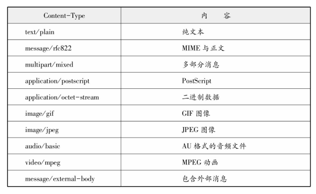

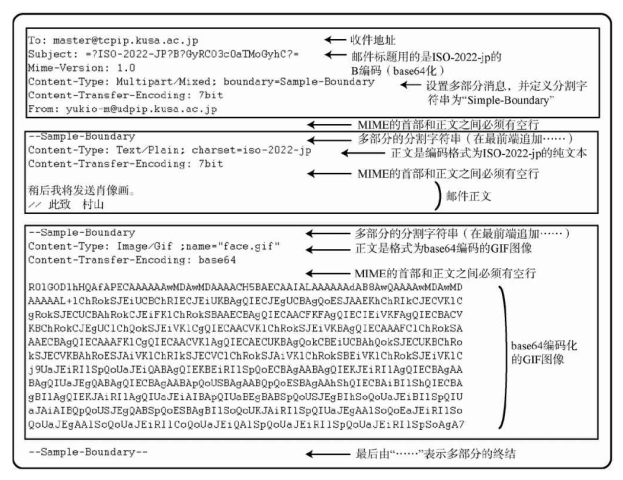

## SMTP  

SMTP是发送电子邮件的协议。 它使用的是TCP的25号端口。 SMTP建立一个TCP连接以后， 在这个连接上进行控制和应答以及数据的发送。 客户端以文本的形式发出请求， 服务端返回一个3位数字的应答。每个指令和应答的最后都必须追加换行指令（CR、 LF） 。 

SMTP 命令：

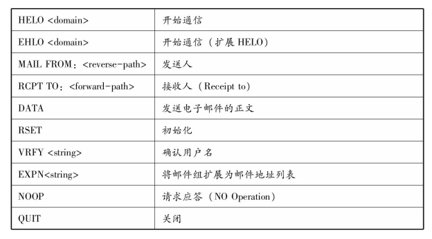 

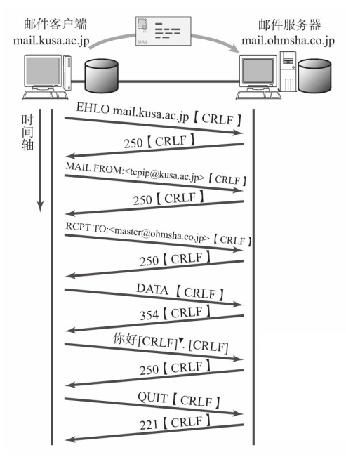

SMTP应答：

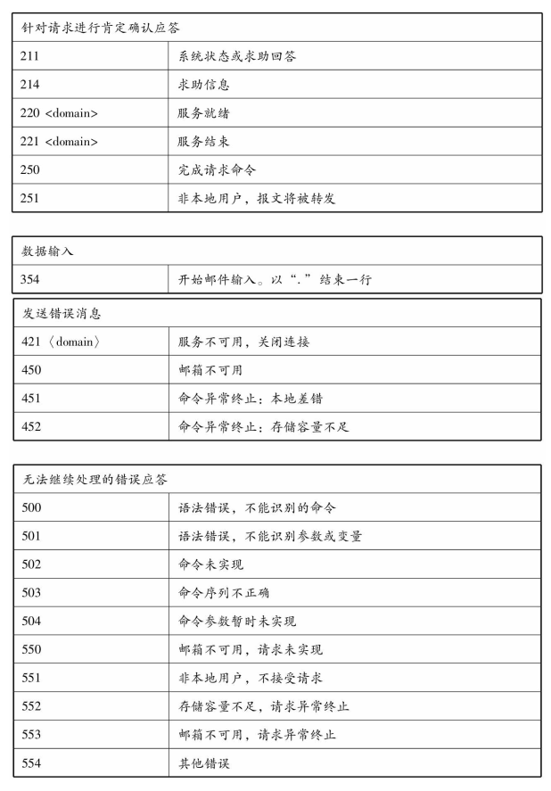  

## POP  

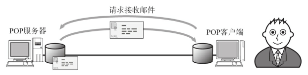

SMTP的一个不利之处就在于它支持的是发送端主机的行为， 而不是根据接收端的请求发送邮件。为了解决这个问题， 就引入了POP协议。   

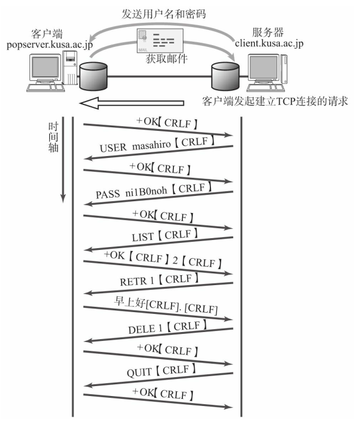

POP与SMTP一样， 也是在其客户端与服务器之间通过建立一个TCP连接完成相应操作。  

POP主要命令：

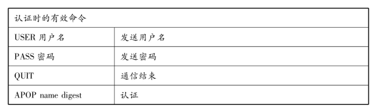

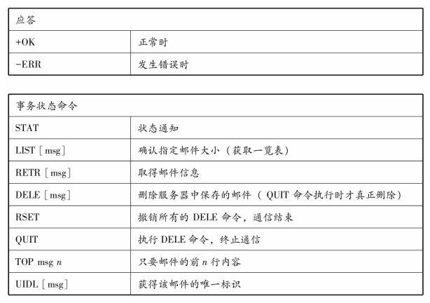

## IMAP  

IMAP（Internet Message Access Protocol） 与POP类似， 也是接收电子邮件的协议。 在POP中邮件由客户端进行管理， 而在IMAP中邮件则由服务器进行管理。  

使用IMAP时， 可以不必从服务器上下载所有的邮件也可以阅读。使用IMAP， 在服务器上保存和管理邮件信息， 就如同在自己本地客户端的某个闪存中管理自己的信息一样简单。     

有了IMAP人们就可以通过个人电脑、 公司的电脑、 笔记本电脑以及智能手机等连接到IMAP服务器以后进行收发邮件。   

# WWW  

万维网（WWW， World Wide Web） 是将互联网中的信息以超文本（超文本用以显示文本及与文本相关的内容。 ） 形式展现的系统。 也叫做Web。   

借助浏览器， 人们不需要考虑该信息保存在哪个服务器， 只需要轻轻点击鼠标就可以访问页面上的链接并打开相关信息。  

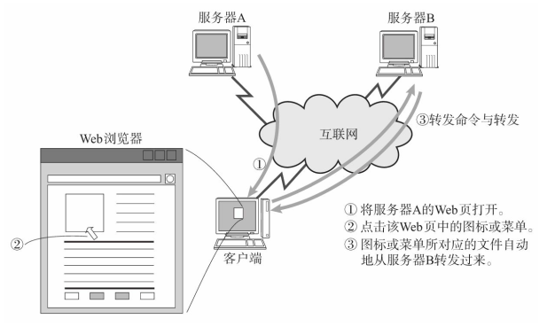

WWW定义了3个重要的概念， 它们分别是访问信息的手段与位置（URI， Uniform Resource Identifier） 、 信息的表现形式（HTML， HyperText Markup Language） 以及信息转发（HTTP， HyperText Transfer Protocol） 等操作。   

## URI  

URI是 Uniform Resource Identifier的缩写， 用于标识资源。 URI是一种可以用于WWW之外的高效的识别码， 它被用于主页地址、 电子邮件、 电话号码等各种组合中。   

URL（ Uniform Resource Locator）常被人们用来表示互联网中资源（ 文件） 的具体位置。 但是URI不局限于标识互联网资源， 它可以作为所有资源的识别码。      

相比URL狭义的概念， URI则是一个广义的概念。 因此， URI可以用于除了WWW之外的其他应用协议中。  

URI所表示的组合叫方案（ Scheme） （schema是指具有体系的计划或方案。 ） 。 在众多URI的Scheme中WWW主要用其中的http和https表示Web页的位置和访问Web页的方法。   

主要的URI方案：

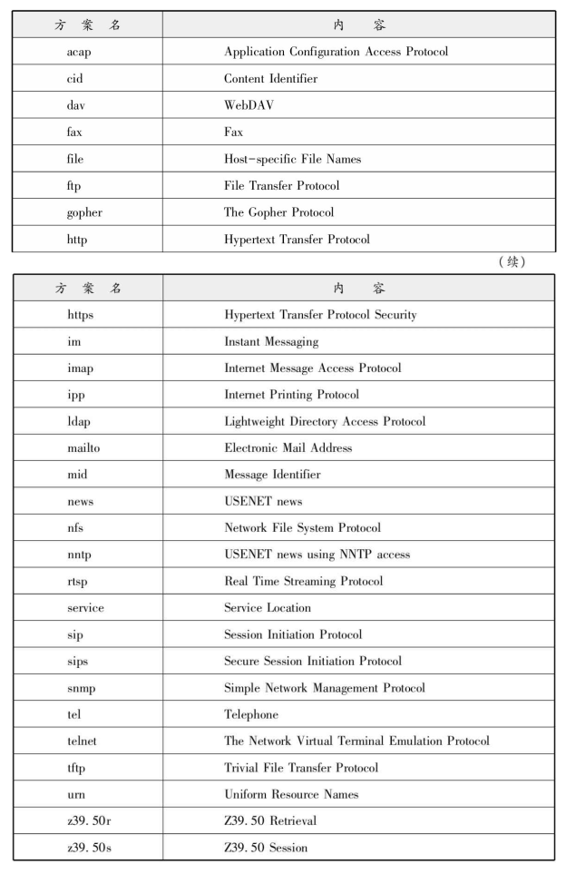  

## HTML  

HTMP是记述Web页的一种语言（数据格式） 。 它可以指定浏览器中显示的文字、 文字的大小和颜色。此外， 不仅可以对图像或动画进行相关设置， 还可以设置音频内容。  

HTML也可以说是WWW通用的数据表现协议。 即使是在异构的计算机上， 只要是可以用HTML展现的数据， 那么效果基本上是一致的。   

## HTTP  

HTTP中默认使用80端口。 它的工作机制， 首先是客户端向服务器的80端口建立一个TCP连接， 然后在这个TCP连接上进行请求和应答以及数据报文的发送。  

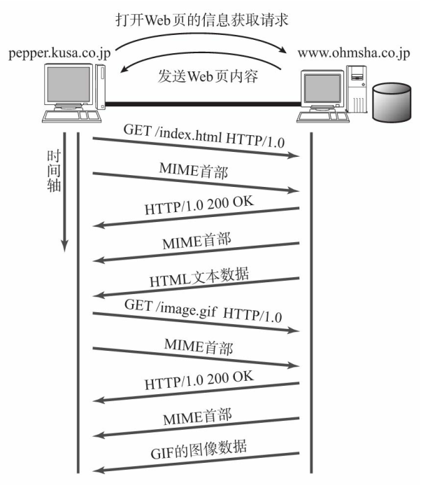

HTTP中常用的有两个版本， 一个HTTP1.0， 另一个是HTTP1.1。 在HTTP1.0中每一个命令和应答都会触发一次TCP连接的建立和断开。 而从HTTP1.1开始， 允许在一个TCP连接上发送多个命令和应答（这种方式也叫保持连接（keep-alive） 。 ） 。 由此， 大量地减少了TCP连接的建立和断开操作， 从而也提高了效率。  

### HTTP的主要命令以及应答报文  

HTTP的主要命令：

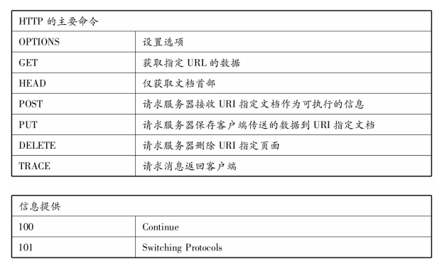

HTTP应答报文：

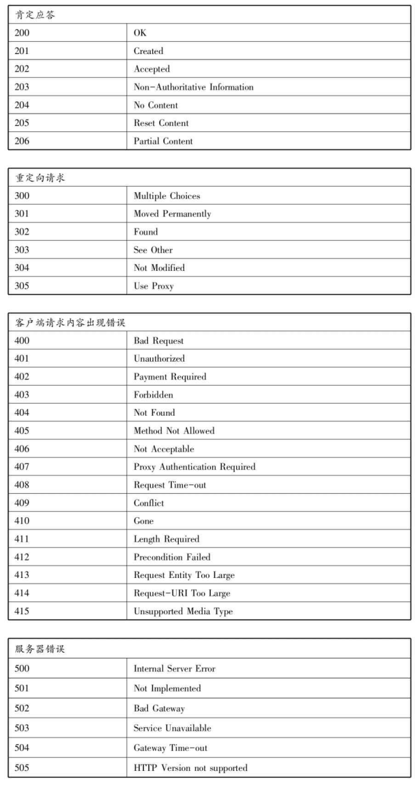  

## JavaScript、 CGI、 Cookie  

### JavaScript  

JavaScript是一种嵌入在HTML中的编程语言， 作为客户端程序可以运行于多种类型的浏览器中。 这些浏览器将嵌入JavaScript的HTML下载后， 其对应的JavaScript程序就可以在客户端得到执行。  

JavaScript还可以用于操作HTML或XML的逻辑结构（DOM， Document Object Model） 以及动态显示Web页的内容和页面风格上。  

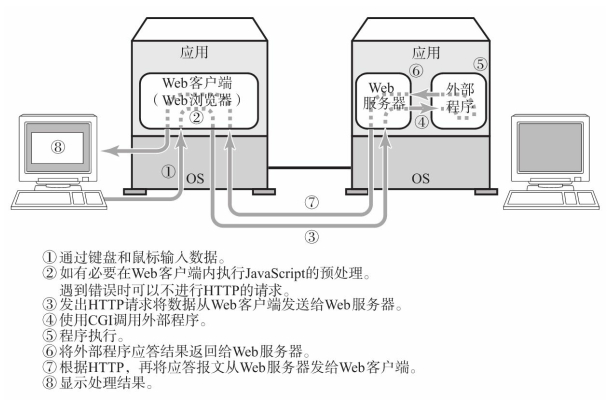

### CGI  

CGI（Common Gateway Interface） 是Web服务器调用外部程序时所使用的一种服务端应用的规范。  

一般的Web通信中， 只是按照客户端请求将保存在Web服务器硬盘中的数据转发而已。 这种情况下客户端每次收获的信息也是同样（静态） 的内容。 而引入CGI以后客户端请求会触发Web服务器端运行另一个程序， 客户端所输入的数据也会传给这个外部程序。 该程序运行结束后会将生成的HTML和其他数据再返回给客户端。  

### Cookie  

Web应用中为了获取用户信息使用一个叫做Cookie的机制。 Web服务器用Cookie在客户端保存信息。 Cookie常被用于保存登录信息或网络购物中放入购物车的商品信息。    

# 网络管理  

## SNMP  

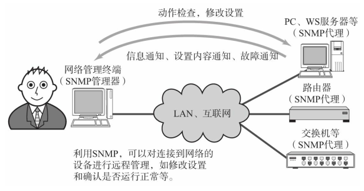

在TCP/IP的网络管理中可以使用SNMP（Simple Network Management Protocol） 收集必要的信息。 它是一款基于UDP/IP的协议。  

SNMP中管理端叫做管理器（Manager， 网络监控终端） ， 被管理端叫做代理（路由器、 交换机等）（SNMPv3中管理器和代理都叫做实体（Entity） 。 ） 。 决定管理器与代理之间的通信中所要交互信息的正是SNMP。

SNMPv3， 不仅集合了所有SNMP的功能于同一个版本， 定义了个别的功能模块（Component） ， 并可以结合各种不同版本进行通信。SNMPv3中将“消息处理”、 “用户安全”和“访问控制”三部分分开考虑， 可以为每一个部选择各自必要的机制。    

消息处理中如果选择了SNMPv2的模型， 那么会进行以下8种操作。 它们分别是： 查询请求， 上次要求的下一个信息的查询请求（GetNextRequest-PDU） 、 应答、 设置请求、 批量查询请求（GetBulkRequestPDU） 、 向其他管理器发送信息通知（InformRequest-PDU） 、 事件通知、 用管理系统定义的命令（ReportPDU） 等操作。  

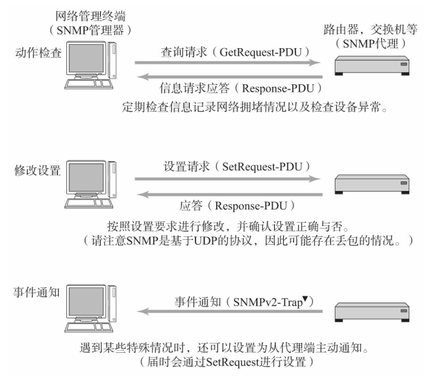

通常， 根据查询请求和应答可以定期检查设备的运行动作， 根据设置请求可以修改设备的参数。 SNMP的处理可以分为从设备读取数据和向设备写入数据两种。 它们采用Fetch和Store模式。   

如果出于某种原因网络设备的状况发生变化， 将这个变化通知给SNMP管理器时就可以使用Trap。 有了Trap， 即使没有管理器到代理的请求， 也能在设备发生变化时收到从代理发来的通知。  

## MIB  

SNMP中交互的信息是MIB（Management Information Base） 。 MIB是在树形结构的数据库中为每个项目附加编号的一种信息结构。  

SNMP访问MIB信息时使用数字序列。 这些数字序列各自都有其易于理解的名字。 MIB分为标准MIB（有时也叫私有MIB。 ） （MIB、 MIB-II、 FDDI-MIB等） 和各个提供商提供的扩展MIB。 不论是哪种类型的MIB都通过SMI（Structure of Management Information） 定义， 其中SMI使用ISO 提出的ASN.1方法。  

MIB相当于SNMP的表示层， 它是一种能够在网络上传输的结构。 SNMP中可以将MIB值写入代理， 也可以从代理中读取MIB值。 通过这些操作可以收集冲突的次数和流量统计等信息， 可以修改接口的IP地址，还可以进行路由器的启停、 设备的启动和关闭等处理。  

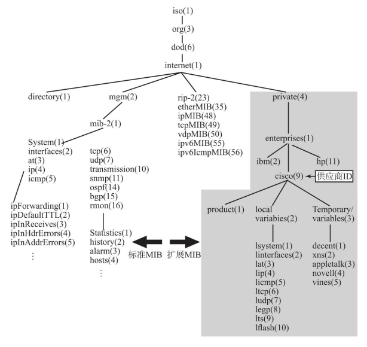  

## RMON  

RMON是Remote Monitoring MIB的缩写。 MIB由监控网络中某个设备接口（某个点） 的众多参数构成。相比之下， RMON则由监控网络上线路的众多参数构成。

RMON中可监控的信息从原来的一个点扩展到了一条线上。 这样可以更高效率地监控网络。 可监控的内容上也增加了很多从用户角度看极为有意义的信息， 如网络流量统计等。  

通过RMON可以监控某个特定的主机在哪里通过什么样的协议正在与谁进行通信的统计信息， 从而可以更加详细地了解网络上成为负荷的主体并进行后续分析。  

RMON中从当前使用状况到通信方向性为止， 可以以终端为单位也可以以协议为单位进行监控。 此外，它不仅可以用于网络监控， 以后还可以用于收集网络扩展和变更时期更为有意义的数据。 尤其是通过WAN线路或服务器段部分的网络流量信息， 可以统计网络利用率， 还可以定位负载较大的主机及其协议相关信息。 因此， RMON是判断当前网络是否被充分利用的重要资料。  

# 其他应用层协议  

## 多媒体通信实现技术  

由于TCP具有流控制、 拥塞控制、 重发机制等功能， 有时应用所发出去的数据可能无法迅速到达对端目标主机。 然而在互联网电话（使用的VoIP（Voice Over IP的缩写。 ） ） 和电视会议当中， 即使有少许丢包， 也希望系统延时少一点， 非常注重系统的即时性。 因此， 在实时多媒体通信当中采用UDP。然而， 只使用UDP还不足以达到进行实时多媒体通信的目的。         

需要一个叫做“呼叫控制”的支持。 呼叫控制主要采用H.323与SIP协议。 此外， 还需要RTP协议（结合多媒体数据本身的特性进行传输的一种协议） 和压缩技术（在网络上传输音频、 视频等大型多媒体数据时进行压缩） 的支持。  

### H.323  

H.323是由ITU开发用于在IP网上传输音频、 视频的一种协议。 起初， 它主要是作为接入ISDN网和IP网之上的电话网为目的的一种规范而被提出的。

H.323定义了4个主要组件。 它们分别是终端（用户终端） 、 网关（吸收用户数据压缩顺序的不一致性） 、 网闸（电话本管理、 呼叫管理） 以及多点控制单元（允许多个终端同时使用） 。  

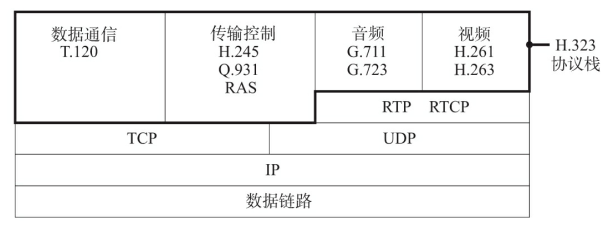

### SIP  

与H.323相对的TCP/IP协议即是SIP（Session Initiation Protocol） 协议。 SIP的提出要晚于H.323， 但是被普遍认为更适用于互联网。 H.323的规范内容较多、 对应起来比较复杂， 而相比之下SIP的构成则简单了许多。  

终端之间进行多媒体通信时， 需要具备事先解析对方地址、 呼出对方号码并对所要传输的媒体信息进行处理等功能。 此外， 还需要具备中断会话和数据转发的功能。 这些功能（呼叫控制与信令） 都被统一于SIP协议中。 它相当于OSI参考模型中的会话层。  

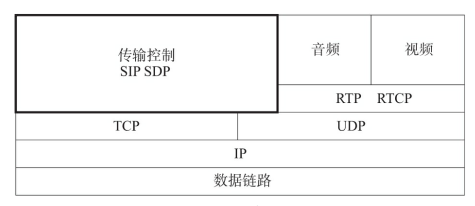

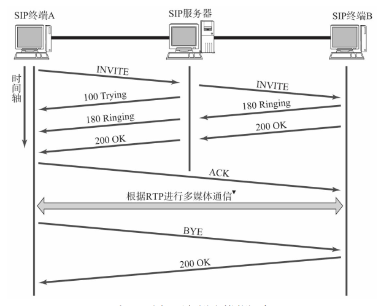

根据RTP通信可以不必经过SIP服务器， 可直接在SIP终端之间进行。

主要SIP命令：

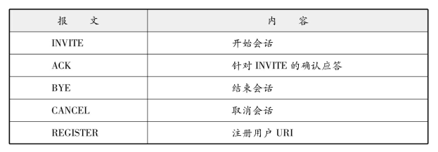

主要SIP响应消息：

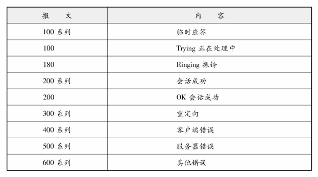

### RTP  

UDP不是一种可靠性传输协议。 因此有可能发生丢包或乱序等现象。 因此采用UDP实现实时的多媒体通信需要附加一个表示报文顺序的序列号字段， 还需要对报文发送时间进行管理。 这些正是RTP（Real-Time Protocol） 的主要职责。  

RTP为每个报文附加时间戳和序列号。 接收报文的应用， 根据时间戳决定数据重构的时机。 序列号则根据每发出一次报文加一的原则进行累加。 RTP使用这个序列号对同一时间戳的数据进行排序， 掌握是否有丢包的情况发生。    

RTCP（RTP Control Protocol） 是辅助RTP的一种协议。 通过丢包率等线路质量的管理， 对RTP的数据传送率进行控制。  

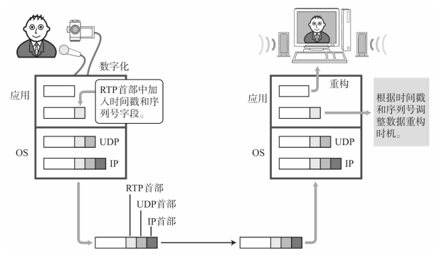

通过有效的压缩可以大量减少音频和视频数据的大小。 在有限的网络资源中进行多媒体数据的传输， 压缩技术成为一个必要的手段。    

MPEG（Moving Picture Experts Group） 是决定数字压缩规范的ISO/IEC工作组。 在这里所制定的规范叫做MPEG。 在MPEG的众多规范当中， MPEG1主要用于VideoCD， 而MPEG2主要用于DVD和数字电视播放领域。 此外， 还有MPEG4和MPEG7等规范。  

另一方面， 由ITU-T的H.323所规定H.261、 H.263与MPEG共同协作的产生了H.264。  

## P2P  

网络上的终端或主机不经服务器直接1对1相互通信的情况叫做P2P（Peer To Peer） 。 这就好比使用无线收发器进行一对一通话。 P2P中主机具备客户端和服务端两方面的功能， 以对等的关系相互提供服务。  

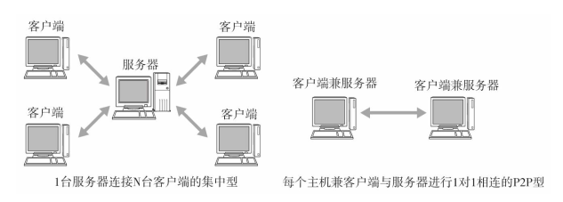

不过， 也有不支持P2P的环境。 例如在服务器与客户端分离型的环境中， 服务器要在一个可以由互联网直接访问的地方， 而客户端即使是在NAT内侧也不会有问题。 然而在P2P中这个结构却行不通。 它必须具备从互联网越过NAT令双方终端能够访问的功能。  

## LDAP  

LDAP（Lightweight Directory Access Protocol） 是访问目录服务的一种协议， 也叫轻量级目录访问协议。 所谓“目录服务”是指网络上存在的一种提供相关资源的数据库的服务。 这里的目录也有地址簿的意思。可以认为目录服务就是管理网络上资源的一种服务。  

LDAP定义了目录树的结构、 数据格式、 命名规则、 目录访问顺序和安全认证。   

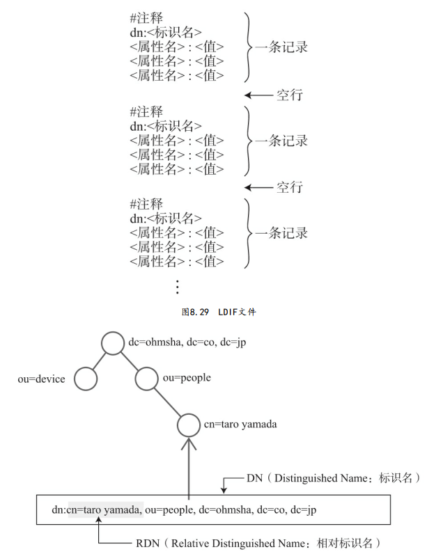

