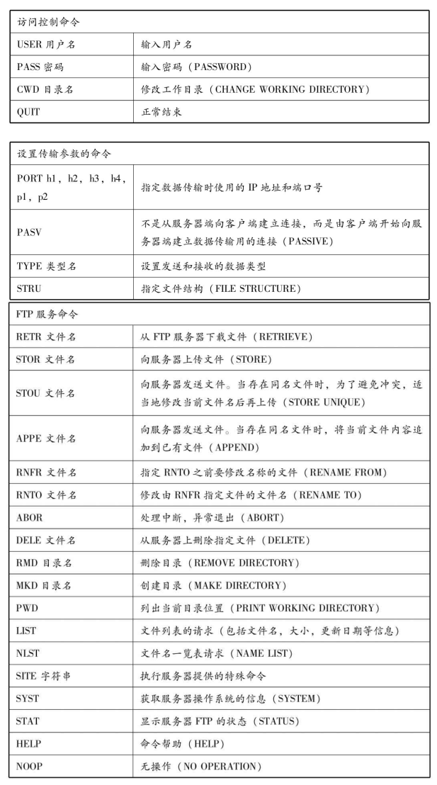

# 应用层协议概要  

- 应用协议的定义

利用网络的应用程序有很多， 包括Web 浏览器、 电子邮件、 远程登录、 文件传输、 网络管理等。 能够让这些应用进行特定通信处理的正是应用协议。  

- 应用协议与协议的分层  

网络应用由不同的用户和软件供应商开发而成。 为了实现网络应用的功能， 在应用之间进行通信时将其连接的网络协议是非常重要的应用之间交互的信息叫消息。 应用协议定义这些消息的格式以及使用这些消息进行控制或操作的规则。 ） 。 设计师和开发人员根据所开发模块的功能和目的， 可以利用现有的应用协
议， 也可以自己定义一个新的应用协议。    

- 相当于OSI中第5、 第6、 第7层的协议  

TCP/IP的应用层涵盖了OSI参考模型中第5、 第6、 第7层的所有功能， 不仅包含了管理通信连接的会话层功能、 转换数据格式的表示层功能， 还包括与对端主机交互的应用层功能在内的所有功能。  

# 远程登录  

远程登录是为了实现TSS（TSS（Time Sharing System） 分时系统。）  环境， 是将主机和终端的关系应用到计算机网络上的一个结果。 TSS中通常有一个处理能力非常强的主机，围绕着这台主机的是处理能力没有那么强的多个终端机器。 这些终端通过专线与主机相连。   

类似地， 实现从自己的本地计算机登录到网络另一端计算功能的应用就叫做远程登录。 通过远程登录到通用计算机或UNIX工作站以后， 不仅可以直接使用这些主机上的应用， 还可以对这些计算机进行参数设置。 远程登录主要使用TELNET和SSH（Secure SHell。 ） 两种协议。  

## TELNET  

TELNET利用TCP的一条连接， 通过这一条连接向主机发送文字命令并在主机上执行。 本地用户好像直接与远端主机内部的 Shell 相连着似的， 直接在本地进行操作。   

TELNET可以分为两类基本服务。 一是仿真终端功能， 二是协商选项机制。  

TELNET经常用于登录路由器或高性能交换机等网络设备进行相应的设置。 通过TELNET登录主机或路由器等设备时需要将自己的登录用户名和密码注册到
服务端。  

### 选项

TELNET中除了处理用户所输入的文字外， 还提供选项的交互和协商功能。   

### TELNET客户端  

所谓TELNET客户端是指利用TELNET协议实现远程登录的客户端程序。 很多情况下， 它的程序名就是telnet命令。  

TELNET客户端通常与目标主机的23号端口建立连接， 并与监听这个端口的服务端程序telnetd进行交互。 当然， 也可以与其他的TCP端口号连接， 只要在该端口上有监听程序能够处理telnet请求即可。  

## SSH  

SSH是加密的远程登录系统。 TELNET中登录时无需输入密码就可以发送， 容易造成通信窃听和非法入侵的危险。 使用SSH后可以加密通信内容。 即使信息被窃听也无法破解所发送的密码、 具体命令以及命令返回的结果是什么。  

SSH还包括很多非常方便的功能：

- 可以使用更强的认证机制
- 可以转发文件（UNIX中可以使用scp、 sftp等命令。 ） 
- 可以使用端口转发功能（可以通过X Window System串口展现。 ）

端口转发是指将特定端口号所收到的消息转发到特定的IP地址和端口号码的一种机制。 由于经过SSH连接的那部分内容被加密， 确保了信息安全， 提供了更为灵活的通信（可以实现虚拟专用网（VPN， Virtual Private Network） 。 ）   。  

# 文件传输  

FTP是在两个相连的计算机之间进行文件传输时使用的协议。FTP中也需要在登录到对方的计算机后才能进行相应的操作。互联网上有一种FTP服务器是允许任何人进行访问的， 这种服务器叫做匿名服务器（anonymous ftp） 。登录这些服务器时使用匿名（anonymous） 或ftp都可以 。

## FTP的工作机制概要  

FTP使用两条TCP连接： 一条用来控制， 另一条用于数据（文件） 的传输。  

用于控制的TCP连接主要在FTP的控制部分使用。 例如登录用户名和密码的验证、 发送文件的名称、 发送方式的设置。 利用这个连接， 可以通过ASCII码字符串发送请求和接收应答。 在这个连接上无法发送数据， 数据需要一个专门的TCP进行连接。  

FTP控制用的连接使用的是TCP21号端口。 在TCP21号端口上进行文件GET（RETR） 、PUT（STOR） 、 以及文件一览（LIST） 等操作时， 每次都会建立一个用于数据传输的TCP连接。 数据的传输和文件一览表的传输正是在这个新建的连接上进行。 当数据传送完毕之后， 传输数据的这条连接也会被断开， 然后会在控制用的连接上继续进行命令或应答的处理。  

通常， 用于数据传输的TCP连接是按照与控制用的连接相反的方向建立的。 因此， 在通过NAT连接外部FTP服务器的时候， 无法直接建立传输数据时使用的TCP连接。 此时， 必须使用PASV命令修改建立连接的方向才行。  

控制用的连接， 在用户要求断开之前会一直保持连接状态。 不过， 绝大多数FTP服务器都会对长时间没有任何新命令输入的用户的连接强制断开。

数据传输用的TCP连接通常使用端口20。 不过可以用PORT命令修改为其他的值。 最近， 出于安全的考虑， 普遍在数据传输用的端口号中使用随机数进行分配。  

## 通过ASCII码字符串进行的交互处理  

FTP中请求命令中使用着“RETR”等ASCII（American Standard Code for Information Interchange的省略。 ） 码字符串。 而针对这些命令的应答则使用如“200”等3位数字的ASCII码字符串。 TCP/IP的应用协议中有很多使用这种ASCII码字符串的协议。  

对于ASCII码字符串型的协议来说换行具有重要意义。 很多情况下， 一行字符串表示一个命令或一个应答， 而空白则用来标识与参数之间的分割符。 即， 命令和应答的消息通过换行区分、 参数用空格区分。 换行由“CR”（ASCII码的十进制数为13） 和“LF”（ASCII码的十进制数为10） 两个控制符号组成。  

## FTP主要的命令和应答信息  

FTP 主要命令：

FTP 应答信息：

# 电子邮件  

  

  