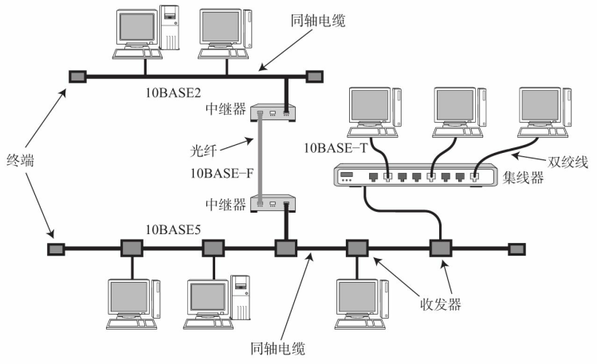

# 数据链路的作用  

数据链路， 指OSI参考模型中的数据链路层， 有时也指以太网、 无线局域网等通信手段。  

TCP/IP中对于OSI参考模型的数据链路层及以下部分（物理层） 未作定义。 因为TCP/IP以这两层的功能是透明的为前提。   

数据链路层的协议定义了通过通信媒介互连的设备之间传输的规范。 通信媒介包括双绞线电缆、 同轴电缆、 光纤、 电波以及红外线等介质。 此外， 各个设备之间有时也会通过交换机、 网桥、 中继器等中转数据。  

## 数据链路的段  

数据链路的段是指一个被分割的网络。 然而根据使用者不同， 其含义也不尽相同。   

例如， 引入中继器将两条网线相连组成一个网络。这种情况下有两条数据链路：    

- 从网络层的概念看， 它是一个网络（逻辑上），即从网络层的立场出发， 这两条网线组成一个段
- 从物理层的概念看， 两条网线分别是两个物体（物理上），即从物理层的观点出发， 一条网线是一个段  

## 网络拓扑  

网络的连接和构成的形态称为网络拓扑（Topology） 。 网络拓扑包括总线型、 环型、 星型、 网状型等。   

# 数据链路相关技术  

## MAC地址  

MAC地址用于识别数据链路中互连的节点，以太网或FDDI中， 根据IEEE802.3的规范使用MAC地址。 其他诸如无线LAN（IEEE802.11a/b/g/n等） 、 蓝牙等设备中也是用相同规格的MAC地址。    

MAC地址长48比特， 结构如图所示：

 

IEEE802.3制定MAC地址规范时没有限定数据链路的类型， 即不论哪种数据链路的网络（以太网、FDDI、 ATM、 无线LAN、 蓝牙等） ， 都不会有相同的MAC地址出现。  

### 例外情况——MAC地址不一定是唯一的  

在全世界， MAC地址也并不总是唯一的。 实际上， 即使MAC地址相同， 只要不是同属一个数据链路就不会出现问题。例如， 人们可以在微机板上自由设置自己的MAC地址。 再例如， 一台主机上如果启动多个虚拟机，由于没有硬件的网卡只能由虚拟软件自己设定MAC地址给多个虚拟网卡， 这时就很难保证所生成的MAC地址是独一无二的了。    

但是， 无论哪个协议成员通信设备， 设计前提都是MAC地址的唯一性。 这也可以说是网络世界的基本准则。  

## 共享介质型网络  

从通信介质（通信， 介质） 的使用方法上看， 网络可分为共享介质型和非共享介质型。  

共享介质型网络指由多个设备共享一个通信介质的一种网络。 最早的以太网和 FDDI 就是介质共享型网络。 在这种方式下， 设备之间使用同一个载波信道进行发送和接收。 为此， 基本上采用半双工通信方式， 并有必要对介质进行访问控制。   

共享介质型网络中有两种介质访问控制方式： 

- 一种是争用方式
- 另一种是令牌传递方式  

###　争用方式  

争用方式（Contention） 是指争夺获取数据传输的权力， 也叫CSMA（载波监听多路访问） 。   这种方法通常令网络中的各个站采用先到先得的方式占用信道发送数据， 如果多个站同时发送帧， 则会产生冲突现象。 也因此会导致网络拥堵与性能下降。   

在一部分以太网当中， 采用了改良CSMA的另一种方式——CSMA/CD（Carrier Sense Multiple Access with Collision Detection） 方式。 CSMA/CD要求每个站提前检查冲突， 一旦发生冲突， 则尽早释放信道。 其具体工作原理如下：  

- 如果载波信道上没有数据流动， 则任何站都可以发送数据  
- 检查是否会发生冲突。 一旦发生冲突时， 放弃发送数据， 同时立即释放载波信道
- 放弃发送以后， 随机延时一段时间， 再重新争用介质， 重新发送帧

CSMA/CD具体工作原理：

### 令牌传递方式  

令牌传递方式是沿着令牌环发送一种叫做“令牌”的特殊报文， 是控制传输的一种方式。 只有获得令牌的站才能发送数据。 这种方式有两个特点： 

- 一是不会有冲突
- 二是每个站都有通过平等循环获得令牌的机会。因此， 即使网络拥堵也不会导致性能下降  

这种方式中， 一个站在没有收到令牌前不能发送数据帧， 因此在网络不太拥堵的情况下数据链路的利用率也就达不到100％。 为此， 衍生了多种令牌传递的技术。 例如， 早期令牌释放、 令牌追加等方式以及多个令牌同时循环等方式。 这些方式的目的都是为了尽可能地提高网络性能。   

## 非共享介质网络  

非共享介质网络是指不共享介质， 是对介质采取专用的一种传输控制方式：

-  在这种方式下， 网络中的每个站直连交换机， 由交换机负责转发数据帧
- 此方式下， 发送端与接收端并不共享通信介质， 因此很多情况下采用全双工通信方式  

该方式还可以根据交换机的高级特性构建虚拟局域网（VLAN， Virtual LAN）、 进行流量控制等。 当然， 这种方式也有一个致命的弱点， 那就是一旦交换机发生故障，与之相连的所有计算机之间都将无法通信。  

### 半双工与全双工通信  

半双工是指， 只发送或只接收的通信方式。 它类似于无线电收发器， 若两端同时说话， 是听不见对方说的话的。 

而全双工不同， 它允许在同一时间既可以发送数据也可以接收数据。 类似于电话， 接打双方可以同时说话。  

## 根据MAC地址转发  

若将集线器或集中器等设备以星型连接， 就出现了一款新的网络设备——交换集线器， 这是一种将非介质共享型网络中所使用的交换机用在以太网中的技术，交换集线器也叫做以太网交换机。  

以太网交换机就是持有多个端口的网桥。 它们根据数据链路层中每个帧的目标MAC地址， 决定从哪个网络接口发送数据。 这时所参考的、 用以记录发送接口的表就叫做转发表（Forwarding Table） 。  

这种转发表的内容不需要使用者在每个终端或交换机上手工设置， 而是可以自动生成。 数据链路层的每个通过点在接到包时， 会从中将源MAC地址以及曾经接收该地址发送的数据包的接口作为对应关系记录到转发表中。这一过程也叫自学过程。  

  

当设备数量增加时， 转发表也会随之变大， 检索转发表所用的时间也就越来越长。 当连接多个终端时， 有必要将网络分成多个数据链路， 采用类似于网络层的IP地址一样对地址进行分层管理。  

### 交换机转发方式  

交换机转发方式有两种：

- 一种叫存储转发：存储转发方式检查以太网数据帧末尾的FCS位后再进行转发。 因此， 可以避免发送由于冲突而被破坏的帧或噪声导致的错误帧  
- 另一种叫直通转发：不需要将整个帧全部接收下来以后再进行转发。 只需要得知目标地址即可开始转发。 因此， 它具有延迟较短的优势。 但同时也不可避免地有发送错误帧的可能性  

##　环路检测技术  

通过网桥连接网络时， 一旦出现环路该如何处理？ 这与网络的拓扑结构和所使用的网桥种类有直接关系。 最坏的情况下， 数据帧会在环路中被一而再再而三地持续转发。 而一旦这种数据帧越积越多将会导致网络瘫痪。   

解决网络中的环路问题具体有生成树与源路由两种方式。 如果使用具有这些功能的网桥， 那么即使构建了一个带有环路的网络， 也不会造成那么严重的问题。   

### 生成树方式  

该方法由IEEE802.1D定义。 每个网桥必须在每1～10秒内相互交换BPDU（Bridge Protocol Data Unit）包， 从而判断哪些端口使用哪些不使用， 以便消除环路。 一旦发生故障， 则自动切换通信线路， 利用那些没有被使用的端口继续进行传输。  

IEEE802.1D中所定义的生成树方法有一个弊端， 就是在发生故障切换网络时需要几十秒的时间。

IEEE802.1W中定义了一个叫RSTP（Rapid Spanning Tree Protocol） 的方法。 该方法能将发生问题时的恢复时间缩短到几秒以内。     

### 源路由法  

源路由法最早由IBM提出， 以解决令牌环网络的问题。 该方式可以判断发送数据的源地址是通过哪个网桥实现传输的， 并将帧写入RIF（Routing Information Field） 。 网桥则根据这个RIF信息发送帧给目标地址。 因此， 即使网桥中出现了环路， 数据帧也不会被反复转发， 可成功地发送到目标地址。 在这种机制中发送端本身必须具备源路由的功能。  

## VLAN  

进行网络管理的时候， 时常会遇到分散网络负载、 变换部署网络设备的位置等情况。 而有时管理员在做这些操作时， 不得不修改网络的拓扑结构， 这也就意味着必须进行硬件线路的改造。   

如果采用带有VLAN技术的网桥， 就不用实际修改网络布线， 只需修改网络的结构即可。 VLAN技术附加到网桥/2层交换机上， 就可以切断所有VLAN之间的所有通信。 因此， 相比一般的网桥/2层交换机， VLAN可以过滤多余的包， 提高网络的承载效率。  

该交换机按照其端口区分了多个网段， 从而区分了广播数据传播的范围、 减少了网络负载并提高了网络的安全性。 然而异构的两个网段之间， 就需要利用具有路由功能的交换机（如3层交换机） ， 或在各段中间通过路由器的连接才能实现通信。  

随着VLAN技术的应用， 不必再重新修改布线， 只要修改网段即可。 当然， 有时物理网络结构与逻辑网络结构也可能会出现不一致的情况， 导致不易管理。 为此， 应该加强对网段构成及网络运行等的管理。  

# 以太网  

在众多数据链路中最为著名、 使用最为广泛的莫过于以太网（Ethernet）它的规范简单， 易于NIC（网卡） 及驱动程序实现。    

##　以太网连接形式  

在以太网普及之初， 一般采用多台终端使用同一根同轴电缆的共享介质型连接方式。  

而现在， 随着互连设备的处理能力以及传输速度的提高， 一般都采用终端与交换机之间独占电缆的方式实现以太网通信：

## 以太网的分类  

以太网因通信电缆的不同及通信速度的差异， 衍生出了众多不同的以太网类型。

10BASE中的“10”、 100BASE中的“100”、 1000BASE中的“1000”以及10GBASE中的“10G”分别指10Mbps、 100Mbps、 1Gbps以及10Gbps的传输速度。   

- Unshielded Twisted Pair Cable， 非屏蔽双绞线  
- Multi Mode Fiber， 多模光纤  
- Shielded Twisted Pair Cable， 屏蔽双绞线  
- Single Mode Fiber， 单模光纤  
- Foil Twisted-Pair， 铝箔总屏蔽双绞线  

## 以太网帧格式  

以太网帧前端有一个叫做前导码（ Preamble） 的部分， 它由0、 1数字交替组合而成， 表示一个以太网帧的开始， 也是对端网卡能够确保与其同步的标志。   

前导码末尾是一个叫做SFD（ Start Frame Delimiter） 的域， 它的值是“11”。 在这个域之后就是以太网帧的本体。

前导码与SFD合起来占8个字节。  

   

以太网帧本体的前端是以太网的首部， 它总共占14个字节。 分别是6个字节的目标MAC地址、 6个字节的源MAC地址以及2个字节的上层协议类型。  

紧随帧头后面的是数据。 一个数据帧所能容纳的最大数据范围是46～1500个字节。 帧尾是一个叫做FCS（Frame Check Sequence， 帧检验序列） 的4个字节。  

主要的协议类型：

帧尾最后出现的是FCS（Frame Check Sequence） 。 用它可以检查帧是否有所损坏。 在通信传输过程中如果出现电子噪声的干扰， 可能会影响发送数据导致乱码位的出现。 因此， 通过检查这个FCS字段的值可以将那些受到噪声干扰的错误帧丢弃。  

VLAN中帧的格式又会有所变化：

### 数据链路层分为两层  

可以将数据链路层分为介质访问控制层（介质访问控制层简称MAC（Media Access Control）） 和逻辑链路控制层（逻辑链路控制层简称LLC（Logical Link Control）） 。  

介质访问控制层根据以太网或FDDI等不同数据链路所特有的首部信息进行控制。 与之相比， 逻辑链路层则根据以太网或FDDI等不同数据链路所共有的帧头信息进行控制。  

# 无线通信  

无线通信通常使用电磁波、 红外线、 激光等方式进行传播数据。 一般在办公室的局域网范围内组成的较高速的连接称为无线局域网。无线通信不需要网线或其他可见电缆。   

## 无线通信的种类  

## IEEE802.11  

IEEE802.11定义了无线LAN协议中物理层与数据链路层的一部分（MAC层） 。 IEEE802.11这个编号有时指众多标准的统称， 有时也指无线LAN的一种通信方式。  

MAC层中物理地址与以太网相同， 都使用MAC地址， 而介质访问控制上则使用CSAM/CD相似的CSAM/CA（CSMA/CA Carrier Sense Multiple Access with Sollision Avoidance） 方式。 通常采用无线基站并通过高基站实现通信。   

作为一种通信方式， IEEE802.11在物理层上使用电磁波或红外线， 通信速度为1Mpbs或2Mbps。 然而，这些通信速度在后续制定的IEEE802.11b/g/a/n等标准中逐渐被打破， 以至于现在基本不被人们所使用。    

## IEEE802.11b和IEEE802.11g  

IEEE802.11b和IEEE802.11g是2.4GHz频段（2400～2497MHz） 中的无线局域网标准。 它们的最大传输速度分别可达到11Mbps（IEEE802.11b） 和54Mbps（IEEE802.11g） ， 通信距离可以达到30～50米左右。 它们与IEEE802.11相似， 在介质访问控制层使用CSMA/CA方式， 以基站作为中介进行通信。  

## IEEE802.11a  

在物理层利用5GHz频段（51510～5250MHz） ， 最大传输速度可达到54Mbps的一种无线通信标准。 虽然它与IEEE802.11b/g存在一定的兼容性问题， 但是市面上已经有支持这两方面的基站产品。 再加上它不使用2.4GHz频段（微波炉使用的频段） ， 因此也不易受干扰。  

## IEEE802.11n  

IEEE802.11n是在IEEE802.11g和IEEE802.11a的基础上， 采用同步多条天线的MIMO（Multiple-Input Multiple-Output， 多入多出技术） 技术， 实现高速无线通信的一种标准。 在物理层使用2.4GHz或5GHz频段。  

在使用5GHz频段的情况下， 若能不受其他2.4GHz频段系统（802.11b/g或蓝牙等） 的干扰， IEEE802.11n可以达到IEEE802.11a/b/g的几倍带宽（40MHz） ， 最大传输速度甚至可以达到150Mps。  

### Wi-Fi  

Wi-Fi是WECA（Wireless Ethernet Compatability Alliance， 无线以太网兼容性联盟） 为普及IEEE802.11的各种标准而打造的一个品牌名称  

Wi-Fi（Wireless Fidelity） 指高质量的无线LAN。  

## 使用无线LAN时的注意事项  

无线LAN允许使用者可以自由地移动位置、 自由地放置设备， 通过无线电波实现较广范围的通信。 这也意味着， 在其通信范围内， 任何人都可以使用该无线LAN， 因此会有被盗听或篡改的危险。  

无线LAN可以无需牌照使用特定频段。 因此无线LAN的无线电波可能会收到其他通信设备的干扰， 导致信号不稳定。   

## 蓝牙  

蓝牙与IEEE802.11b/g类似， 是使用2.4GHz频率无线电波的一种标准。 通信距离根据无线电波的信号的强弱， 有1m、 10m、 100m三种类型。 通信终端最多允许8台设备（其中一台为主节点， 其他1～7台为受管节点。 这种网络也叫做piconet， 微微网。 ） 。  

## WiMAX  

WiMAX（Worldwide Interoperability for Microware Access） 是使用微波在企业或家庭实现无线通信的一种方式。 它如DSL或FTTH一样， 是实现无线网络关键步骤的一种方式。

WiMAX属于无线MAN（Metropolitan Area Network） ， 支持城域网范围内的无线通信。    

## ZigBee  

ZigBee主要应用于家电的远程控制， 是一种短距离、 低功耗的无线通信技术。 它最多允许65536个终端之间互连通信。 ZigBee的传输速度随着所使用的频率有所变化。  

# PPP 

## PPP定义  

PPP（Point-to-Point Protocol） 是指点对点， 即1对1连接计算机的协议。 PPP相当于位于OSI参考模型第2层的数据链路层。  

PPP属于纯粹的数据链路层， 与物理层没有任何关系。 换句话说， 仅有PPP无法实现通信， 还需要有物理层的支持。  

PPP可以使用电话线或ISDN、 专线、 ATM线路。此外， 近些年人们更多是在用ADSL或有线电视通过PPPoE（PPP over Ethernet） 实现互联网接入。 PPPoE是在以太网的数据中加入PPP帧进行传输的一种方式。    

## LCP与NCP  

在开始进行数据传输前， 要先建立一个PPP级的连接。 当这个连接建立以后就可以进行身份认证、 压缩与加密。  

在PPP的主要功能中包括两个协议： 一个是不依赖上层的LCP协议（Link Control Protocol） ， 另一个是依赖上层的NCP协议（Network Control Protocol） 。 如果上层为IP， 此时的NCP也叫做IPCP（IP Control Protocol） 。  

LCP主要负责建立和断开连接、 设置最大接收单元（MRU， Maximum Receive Unit） 、 设置验证协议（PAP或CHAP） 以及设置是否进行通信质量的监控。而IPCP则负责IP地址设置以及是否进行TCP/IP首部压缩等设备（设备之间的这种交互也叫协商（Negotiation） 。 ） 。

通过PPP连接时， 通常需要进行用户名密码的验证， 并且对通信两端进行双方向的验证。 其验证协议有两种， 分别为PAP（Password Authentication Protocol）
和CHAP（Challenge Handshake Authentication Protocol） 。    

- PAP是PPP连接建立时， 通过两次握手进行用户名和密码验证。 其中密码以明文方式传输。 因此一般用于安全要求并不很高的环境， 否则会有窃听或盗用连接的危险
- CHAP则使用一次性密码OTP（One Time Password） ， 可以有效防止窃听。 此外， 在建立连接后还可以进行定期的密码交换， 用来检验对端是否中途被替换

## PPP的帧格式  

其中标志码用来区分每个帧。 这一点与HDLC（HDLC High Level Data Link Control Procedure， 高级数据链路控制。 ） 协议非常相似， 因为PPP本身就是基于HDLC制定出来的一种协议。

HDLC就是在每个帧的前后加上一个8位字节“01111110”用来区分帧。 这一个8位字节叫做标志码。 在两个标志码中间不允许出现连续6个以上的“1”。 因此， 在发送帧的时候， 当出现连续5个“1”时后面必须插入一个0。 而当接收端在接收帧时， 如果收到连续的5个“1”且后面跟着的是0， 就必须删除。  

在通过电脑进行拨号时， PPP已在软件中实现。 因此， 那些插入或删除“0”的操作或FCS计算都交由电脑的CPU去处理。 这也是为什么人们常说PPP这种方式会给计算机带来大量负荷的原因所在。  

## PPPoE  

有些互联网接入服务商在以太网上利用PPPoE（PPP over Ethernet） 提供PPP功能。在这种互联网接入服务中， 通信线路由以太网模拟。     

单纯的以太网没有验证功能， 也没有建立和断开连接的处理， 因此无法按时计费。 而如果采用PPPoE管理以太网连接， 就可以利用PPP的验证等功能使各家ISP可以有效地管理终端用户的使用。  

# 其他数据链路

##　ATM  

ATM（Asynchronous Transfer Mode） 是以一个叫做信元（5字节首部加48字节数据） 的单位进行传输的数据链路， 由于其线路占用时间短和能够高效传输大容量数据等特点主要用于广域网络的连接。

### ATM的特点  

ATM是面向连接的一种数据链路。 因此在进行通信传输之前一定要设置通信线路。 这一点与传统电话很相似。 使用传统电话进行通话时， 需要事先向交换机发出一个信令要求， 建立交换机与通话对端的连接。 另外也有使用固定线路的方式， 叫做PVC（Permanent Virtual Circuit， 永久虚电路） 。 ） 。 而ATM又与传统电话不同， 它允许同时与多个对端建立通信连接。

ATM中没有类似以太网和FDDI那种发送权限的限制。 它允许在任何时候发送任何数据。 因此， 当大量计算机同时发送大量数据时容易引发网络拥堵甚至使网络进入收敛状态。 为了防止这一现象的出现， ATM中也增加了限制带宽的细分功能。    

### 同步与异步  

以多个通信设备通过一条电缆相连的情况为例。 首先， 这样连接的设备叫做TDM（时分复用设备。 ） 。 TDM通常在两端TDM设备之间同步的同时， 按照特定的时间将每个帧分成若干个时隙， 按照顺序发送给目标地址。不论是否还有想要发送的数据， 时隙会一直被占有，从而可能会出现很多空闲的时隙。 因此， 这种方式的线路利用率比较低。    

ATM扩展了TDM， 能够有效地提高线路的利用率（实际上它采用TDM方式的SONET（Synchronous Optical Network） 或SDH（Sychro-nous Digital Hierachy） 的线路。 ） 。 ATM在TDM的时隙中放入数据时， 并非按照线路的顺序而是按照数据到达的顺序放入。然而， 按照这样的顺序存放的数据在接收端并不易辨认真正的内容。 为此， 发送端还需要附加一个5字节的包首部， 包含VPI（Virtual Path Identifier） 、 VCI（Virtual Channel Identifier） 等识别码。

ATM中信元传输所占用的时隙不固定， 一个帧所占用的时隙数也不固定， 而且时隙之间并不要求连续。 这些特点可以有效减少空闲时隙， 从而提高线路的利用率。 只不过需要额外附加5个字节的首部， 增加了网络的开销， 因此也在一定程度上降低了通信速度。  

     

### ATM与上层协议  

在以太网中一个帧最大可传输1500个字节， FDDI可以最大传输4352字节。 而ATM的一个信元却只能发送固定的48字节数据。 这48个字节的数据部分中若包含IP首部和TCP首部， 则基本无法存放上层的数据。 为此， 一般不会单独使用ATM， 而是使用上层的AAL（ATM Adapter Layer）。 在上层为IP的情况下， 则叫做AAL5。   

   

在整个192个信元中只要有一个丢失， 那么整个IP包就相当于被损坏。 此时，AAL5的帧检查位报错， 导致接收端不得不丢弃所有的信元。 前面曾提到TCP/IP在包发生异常的时候可以实现重发， 因此在ATM网中即使只是一个信元丢失， 也要重新发送最多192个信元。 这也是ATM到目前为止的最大弊端。 一旦在网络拥堵的情况下， 只要丢掉哪怕1％的信元也会导致整个数据都无法接收。 特别是由于ATM没有发送权限上的控制， 很容易导致网络收敛。 为此， 在构建ATM网络的时候， 必须保证终端的带宽合计小于主干网的带宽， 还要尽量保证信元不易丢失。   

## POS  

POS（Packet over SDH/SONET） 是一种在SDH（Synchronous Digital Hierarchy， 同步数字体系。 ）（SONET（Synchronous Optical NETwork， 同步光纤网络。 ） ） 上进行包通信的一种协议。  

SDH（ SONET） 是在光纤上传输数字信号的物理层规范。SDH作为利用电话线或专线等可靠性较高的方式进行光传输的网络， 正被广泛应用。 SDH的传输速率以51.84Mbps为基准， 一般为它的数倍。  

## FDDI  

FDDI（ Fiber Distributed Data Interface） 叫做分布式光线数据接口。  FDDI采用令牌（ 追加令牌） 环的访问方式。 令牌环访问方式在网络拥堵的情况下极容易导致网络收敛。

FDDI中的每个站通过光纤连接形成环状，FDDI为了防止在环在某处断开时导致整个通信的中断， 采用双环的结构。 双环中站叫做DAS（Dual Attachment Station， 双连站。 ） ， 单环中的站叫做SAS（Single Attachment Station， 单连站。 ） 。

  

## Token Ring  

令牌环网（ Token Ring） 源自IBM开发的令牌环LAN技术， 可以实现4Mbps或16Mbps传输速率。  

令牌环由于其价格一直居高不下以及所支持的提供商逐渐较少等原因， 除了在IBM的环境以外始终未能得到普及， 而且随着以太网的广泛使用， 人们已经不再采用令牌环技术。  

## 100VG-AnyLAN  

100VG-AnyLAN是IEEE802.12规范定义的一种网络协议。 VG为Voice Grade的缩写， 指语音级。 它以语音级的3类UTP电缆实现100Mbps的传输速率。 它的数据帧格式既能应对以太网又能应对令牌环网。 在传输方式上， 它采用扩展了令牌传递方式的需求优先访问方式。 在这种方式中， 交换机负责控制发送权。 鉴于
100Mbps以太网（100BASE-TX） 的普及， 100VG-AnyLAN也几乎不再被使用。      　  

## 光纤通道  

光纤通道（Fiber Channel） 是实现高速数据通信的一种数据链路。 与其说它是一种网络， 不如说它更像是SCSI那样类似于连接计算机周边设备的总线一样的规范。 数据传输速率为133Mbpx～4Gbps。 

## HIPPI  

HIPPI用于连接超大型计算机传输速率为800Mbps或1.6Gbps。 铜缆的实际传输距离在25米以内， 但是如果使用光纤作为传输介质时， 可以延长到数公里。  

## IEEE1394  

也叫FireWire或i.Link， 是面向家庭的局域网， 主要用于连接AV等计算机外围设备。 数据传输速率为100～800Mbps以上。  

## HDMI  

HDMI是High-Definition Multimedia Interface的缩写， 意为高清晰度多媒体接口。 它可以通过一根缆线实现图像和声音等数字信号的高品质传输。   

## iSCSI  

它是将个人电脑连接硬盘的SCSI标准应用于TCP/IP网络上的一种标准（RFC3720、 RFC3783） 。 它把SCSI的命令和数据包含进IP包内， 进行数据传输。   

## InfiniBand  

InfiniBand是针对高端服务器的一种超高速传输接口技术。 它最大的特点是高速、 高可靠性以及低延迟。 它支持多并发链接， 将多个线缆（如4链接或12链接。 ） 合并为一个线缆。 可以实现从2Gbps至数百Gbps的传输速率。 以后甚至还计划提供数千Gbps的高速传输速率。    

## DOCSIS  

DOCSIS是有线电视（CATV） 传输数据的行业标准， 由MCNS（Multidedia Cable Network System Patners Limited） 制定。 该标准定义了有线电视的同轴电缆与Cable Modem（电缆调制解调器） 的连接及其与以太网进行转换的具体规范。   

## 高速PLC  

高速PLC（Power line Communication， 高速电力线通信。 ） 是指在家里或办公室内利用电力线上数MHz～数十MHz频带范围， 实现数十Mbps～200Mbps传输速率的一种通信方式。 使用电力线不用重新布线， 也能进行日常生活以及家电设备或办公设备的控制。   

  

