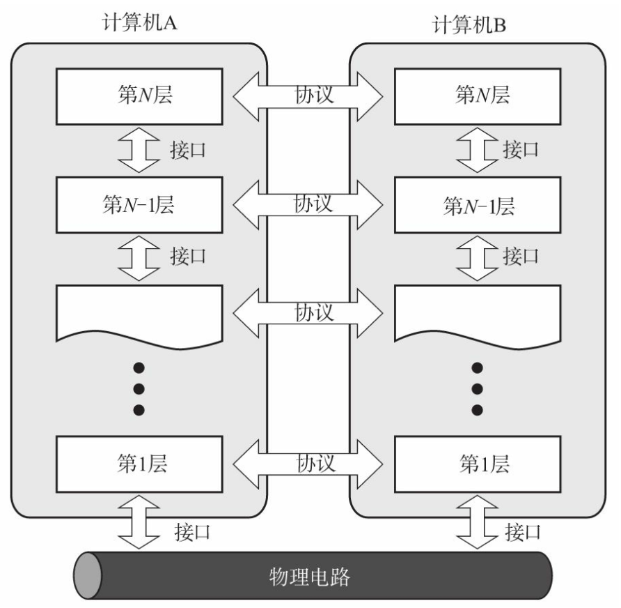

# 计算机网络出现的背景

## 网络互联模式

计算机网络， 根据其规模可分为：

- WAN（Wide Area Network， 广域网），指覆盖多个远距离区域的远程网络
- MAN （Metropolitan Area Network，城域网），连接整个城市的网络
- LAN（Local Area Network， 局域网），一个楼层、 一栋楼或一个校园等相对较小的区域内的网络

## 计算机与网络发展的7个阶段  

### 批处理  

所谓批处理， 是指事先将用户程序和数据装入卡带或磁带， 并由计算机按照一定的顺序读取， 使用户所要执行的这些程序和数据能够一并批量得到处理的方式。  

### 分时系统  

分时系统（TSS，Time Sharing System ） 。 它是指多个终端（由键盘、 显示器等输入输出设备组成。 最初还包括打字机。 ） 与同一个计算机连接， 允许多个用户同时使用一台计算机的系统。  

### 计算机之间的通信  

计算机间的通信显著地提高了计算机的可用性。 人们不再局限于仅使用一台计算机进行处理， 而是逐渐使用多台计算机分布式处理， 最终一并得到返回结果。   

### 计算机网络的产生  

80 年代一种能够互连多种计算机的网络随之诞生。 它能够让各式各样的计算机相互连接， 从大型的超级计算机或主机到小型的个人电脑。  

### 互联网的普及  

无论相距多远， 世界各地的人们只要接入互联网， 就可以通过个人电脑实现即时沟通和交流。  

### 以互联网技术为中心的时代  

能够联网的设备也不仅限于单纯的计算机， 而是扩展到了手机、 家用电器、 游戏机等许多其他产品。 或许在未来， 可能还会增加更多各式各样的现在无法想象的设备。  

### 从“单纯建立连接”到“安全建立连接”  

在互联网普及的初期， 人们更关注单纯的连接性， 以不受任何限制地建立互联网连接为最终目的。 然而现在， 人们已不再满足于“单纯建立连接”， 而是更为追求“安全建立连接”的目标。  

## 协议  

协议就是计算机与计算机之间通过网络实现通信时事先达成的一种“约定”。 这种“约定”使那些由不同厂商的设备、 不同的CPU以及不同的操作系统组成的计算机之间， 只要遵循相同的协议就能够实现通信。 反之， 如果所使用的协议不同， 就无法实现通信。  

### 分组交换协议  

分组交换是指将大数据分割为一个个叫做包（Packet） 的较小单位进行传输的方法。 这里所说的包， 如同我们平常在邮局里见到的邮包。 分组交换就是将大数据分装为一个个这样的邮包交给对方。  

## 协议由谁规定  

ISO（International Organization for Standards， 国际标准化组织。 ） 制定了一个国际标准 OSI（Open Systems Interconnection， 开放式通信系统互联参考模型。 ） ， 对通信系统进行了标准化。 现在， OSI 所定义的协议虽然并没有得到普及， 但是在 OSI 协议设计之初作为其指导方针的 OSI 参考模型却常被用于网络协议的制定当中。  

TCP/IP 并非 ISO 所制定的某种国际标准。 而是由 IETF（Internet Engineering Task Force） 所建议的、 致力于推进其标准化作业的一种协议。  那些支持互联网的设备及软件， 也正着力遵循由 IETF 标准化的 TCP/IP 协议。  

## 协议分层与OSI参考模型  

议分层就如同计算机软件中的模块化开发。  

分层的优点：

- 分层可以将每个分层独立使用， 即使系统中某些分层发生变化， 也不会波及整个系统。 因此， 可以构造一个扩展性和灵活性都较强的系统
- 此外， 通过分层能够细分通信功能， 更易于单独实现每个分层的协议， 并界定各个分层的具体责任和义务

劣势：

- 可能就在于过分模块化、 使处理变得更加沉重以及每个模块都不得不实现相似的处理逻辑等问题

### OSI参考模型  

OSI 参考模型将这样一个复杂的协议整理并分为了易于理解的 7 个分层：

  

OSI 参考模型终究是一个“模型”， 它也只是对各层的作用做了一系列粗略的界定， 并没有对协议和接口进行详细的定义。 它对学习和设计协议只能起到一个引导的作用。  

### OSI 参考模型中各个分层的作用  

- 应用层：为应用程序提供服务并规定应用程序中通信相关的细节。 包括文件传输、 电子邮件、 远程登录（虚拟终端） 等协议
- 表示层：将应用处理的信息转换为适合网络传输的格式， 或将来自下一层的数据转换为上层能够处理的格式。 因此它主要负责数据格式的转换
- 会话层：负责建立和断开通信连接（数据流动的逻辑通路） ， 以及数据的分割等数据传输相关的管理
- 传输层：起着可靠传输的作用。 只在通信双方节点上进行处理， 而无需在路由器上处理
- 网络层：将数据传输到目标地址。 目标地址可以是多个网络通过路由器连接而成的某一个地址。 因此这一层主要负责寻址和路由选择
- 数据链路层：负责物理层面上互连的、 节点之间的通信传输。 例如，与 1 个以太网相连的 2 个节点之间的通信。将0、 1序列划分为具有意义的数据帧传送给对端（数据帧的生成与接收）
-  物理层：负责0、 1比特流（0、 1序列） 与电压的高低、 光的闪灭之间的互换  

# OSI参考模型通信处理举例  

## 7层通信  

- 发送方从第7层、 第6层到第1层由上至下按照顺序传输数据， 而接收端则从第1层、 第2层到第7层由下至上向每个上一级分层传输数据
- 每个分层上， 在处理由上一层传过来的数据时可以附上当前分层的协议所必须的“首部”信息。 然后接收端对收到的数据进行数据“首部”与“内容”的分离， 再转发给上一分层， 并最终将发送端的数据恢复为原状

## 会话层以上的处理  

假定用户A要给用户B发送一封内容为“早上好”邮件。  

### 应用层  

从用户输入完所要发送的内容并点击“发送”按钮的那一刻开始， 就进入了应用层协议的处理。 该协议会在所要传送数据的前端附加一个首部（标签） 信息。 该首部标明了邮件内容为“早上好”和收件人为“B”。 这一附有首部信息的数据传送给主机B以后由该主机上的收发邮件软件通过“收信”功能获取内容。 主机B上的应用收到由主机A发送过来的数据后， 分析其数据首部与数据正文， 并将邮件保存到硬盘或是其他非易失性存储器。

### 表示层  

利用表示层， 将数据从“某个计算机特定的数据格式”转换为“网络通用的标准数据格式”后再发送出去。 接收端主机收到数据以后将这些网络标准格式的数据恢复“该计算机特定的数据格式”， 然后再进行相应处理。

表示层与表示层之间为了识别编码格式也会附加首部信息， 从而将实际传输的数据转交给下一层去处理。  

### 会话层  

决定采用何种连接方法是会话层的主要责任。

会话层也像应用层或表示层那样， 在其收到的数据前端附加首部或标签信息后再转发给下一层。 而这些首部或标签中记录着数据传送顺序的信息。  

## 传输层以下的处理  

### 传输层  

进行建立连接或断开连接的处理（此处请注意， 会话层负责决定建立连接和断开连接的时机， 而传输层进行实际的建立和断开处理。 ），在两个主机之间创建逻辑上的通信连接即是传输层的主要作用。  

此外， 传输层为确保所传输的数据到达目标地址， 会在通信两端的计算机之间进行确认， 如果数据没有到达， 它会负责进行重发。  

保证数据传输的可靠性是传输层的一个重要作用。 为了确保可靠性， 在这一层也会为所要传输的数据附加首部以识别这一分层的数据。 然而， 实际上将数据传输给对端的处理是由网络层来完成的。  

### 网络层  

网络层的作用是在网络与网络相互连接的环境中， 将数据从发送端主机发送到接收端主机。  

如图所示， 两端主机之间虽然有众多数据链路， 但能够将数据从主机A送到主机B也都是网络层的功劳。  

在实际发送数据时， 目的地址 至关重要。 这个地址是进行通信的网络中唯一指定的序号。   

### 数据链路层、 物理层  

通信传输实际上是通过物理的传输介质实现的。 数据链路层的作用就是在这些通过传输介质互连的设备之间进行数据处理。  

物理层中， 将数据的0、 1转换为电压和脉冲光传输给物理的传输介质， 而相互直连的设备之间使用地址实现传输。 这种地址被称为MAC（Media Access Control， 介质访问控制。 ） 地址， 也可称为物理地址或硬件地址。 采用MAC地址， 目的是为了识别连接到同一个传输介质上的设备。  

网络层与数据链路层都是基于目标地址将数据发送给接收端的， 但是网络层负责将整个数据发送给最终目标地址， 而数据链路层则只负责发送一个分段内的数据。  

# 传输方式的分类  

## 面向有连接型与面向无连接型  

通过网络发送数据， 大致可以分为面向有连接与面向无连接两种类型（面向无连接型包括以太网、 IP、UDP等协议。 面向有连接型包括ATM、 帧中继、 TCP等协议。 ） 。  

### 面向有连接类型

面向有连接型中， 在发送数据之前， 需要在收发主机之间连接一条通信线路。   

### 面向无连接类型

面向无连接型则不要求建立和断开连接。 发送端可于任何时候自由发送数据，反之， 接收端也永远不知道自己会在何时从哪里收到数据。 因此， 在面向无连接的情况下， 接收端需要时常确认是否收到了数据。  

在面向无连接的通信中， 不需要确认对端是否存在。 即使接收端不存在或无法接收数据， 发送端也能将数据发送出去。  

## 电路交换与分组交换  

目前， 网络通信方式大致分为两种——电路交换和分组交换。 电路交换技术的历史相对久远， 主要用于过去的电话网。 而分组交换技术则是一种较新的通信方式，  TCP/IP 正是采用了分组交换技术。  

在电路交换中， 交换机主要负责数据的中转处理。 计算机首先被连接到交换机上， 而交换机与交换机之间则由众多通信线路再继续连接。 因此计算机之间在发送数据时， 需要通过交换机与目标主机建立通信电路。 将连接电路称为建立连接。 建立好连接以后， 用户就可以一直使用这条电路， 直到该连接被断开为止。

如果某条电路只是用来连接两台计算机的通信线路， 就意味着只需在这两台计算机之间实现通信， 因此这两台计算机是可以独占线路进行数据传输的。 但是， 如果一条电路上连接了多台计算机， 而这些计算机之间需要相互传递数据， 就会出现新的问题。 鉴于一台计算机在收发信息时会独占整个电路， 其他计算机只能等待这台计算机处理结束以后才有机会使用这条电路收发数据。 并且在此过程中， 谁也无法预测某一台计算机的数据传输从何时开始又在何时结束。 如果并发用户数超过交换机之间的通信线路数， 就意味着通信根本无法实现。

为此， 人们想到了一个新的方法， 即让连接到通信电路的计算机将所要发送的数据分成多个数据包， 按照一定的顺序排列之后分别发送。 这就是分组交换。  有了分组交换， 数据被细分后， 所有的计算机就可以一齐收发数据， 这样也就提高了通信线路的利用率。 由于在分组的过程中， 已经在每个分组的首部写入了发送端和接收端的地址， 所以即使同一条线路同时为多个用户提供服务， 也可以明确区分每个分组数据发往的目的地， 以及它是与哪台计算机进行的通信。

分组交换的大致处理过程是： 发送端计算机将数据分组发送给路由器， 路由器收到这些分组数据以后， 缓存到自己的缓冲区， 然后再转发给目标计算机。因此， 分组交换也有另一个名称： 蓄积交换。  

在分组交换中， 计算机与路由器之间以及路由器与路由器之间通常只有一条通信线路。 因此， 这条线路其实是一条共享线路。 在电路交换中， 计算机之间的传输速度不变。 然而在分组交换中， 通信线路的速度可能会有所不同。 根据网络拥堵的情况， 数据达到目标地址的时间有长有短。 另外， 路由器的缓存饱和或溢出时， 甚至可能会发生分组数据丢失、 无法发送到对端的情况。  

## 根据接收端数量分类  

### 单播（Unicast）  

指1对1通信。 早先的固定电话就是单播通信的一个典型例子。

### 广播（Broadcast）  

将消息从1台主机发送给与之相连的所有其他主机。 广播通信的一个典型例子就是电视播放， 它将电视信号一齐发送给非特定的多个接收对象。  

进行广播通信的计算机也有它们的广播范围。 只有在这个范围之内的计算机才能收到相应的广播消息。 这个范围叫做广播域。  

### 多播（Multicast）
多播与广播类似， 也是将消息发给多个接收主机。 不同之处在于多播要限定某一组主机作为接收端。 多播通信 最典型的例子就是电视会议， 这是由多组人在不同的地方参加的一种远程会议。   

### 任播（Anycast）
任播是指在特定的多台主机中选出一台作为接收端的一种通信方式。 虽然， 这种方式与多播有相似之处， 都是面向特定的一群主机， 但是它的行为却与多播不同。 任播通信从目标主机群中选择一台最符合网络条件的主机作为目标主机发送消息。 通常， 所被选中的那台特定主机将返回一个单播信号， 随后发送端主机会只跟这台主机进行通信。  

# 地址  

