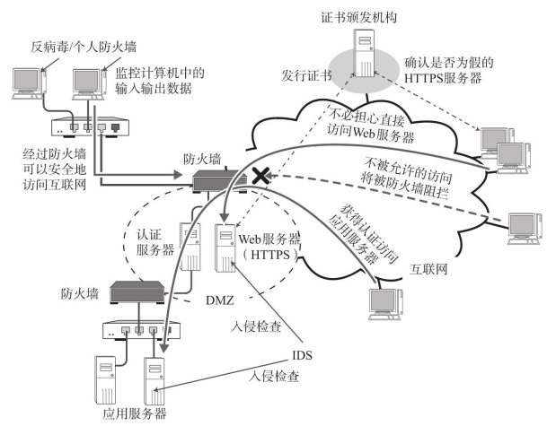
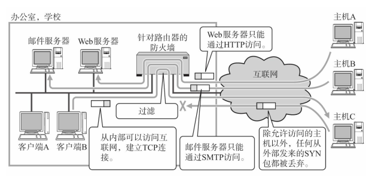
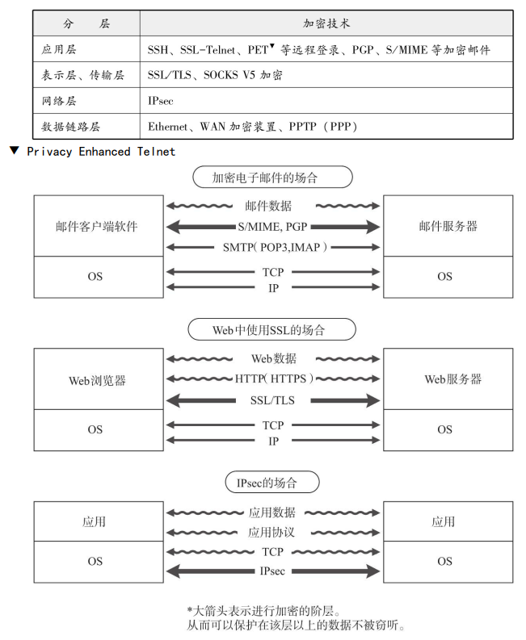
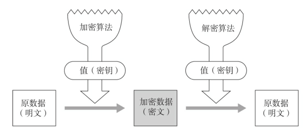
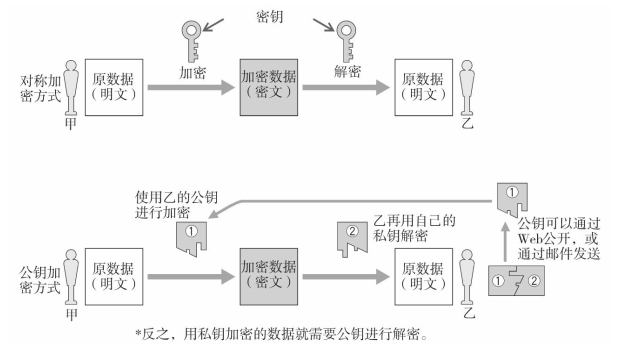
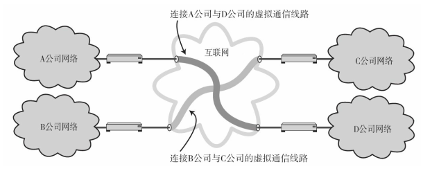
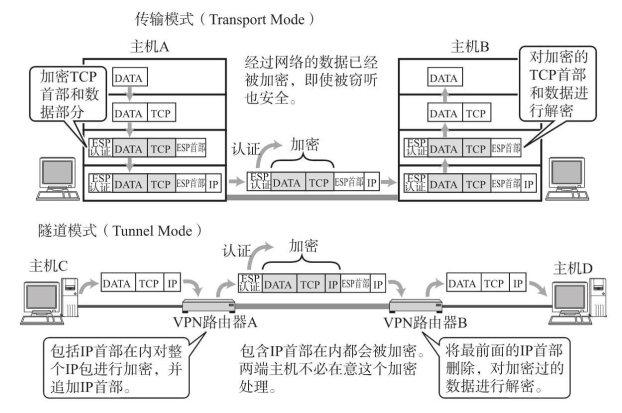
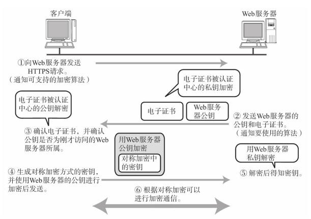
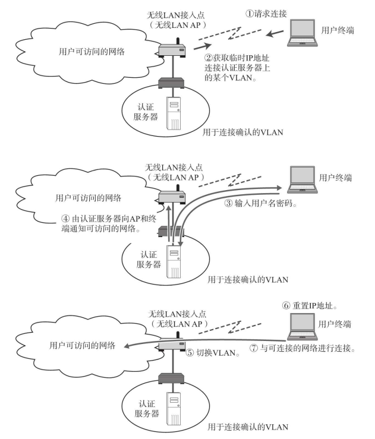

# 网络安全构成要素  

TCP/IP相关的安全要素如图所示：

## 防火墙  

组织机构（域） 内部的网络与互联网相连时， 为了避免域内受到非法访问的威胁， 往往会设置防火墙（使用NAT（NAPT） 的情况下， 由于限定了可以从外部访问的地址， 因此也能起到防火墙的作用。 ） 。  

防火墙的种类和形态有很多种。 例如， 专门过滤（不过滤） 特定数据包的包过滤防火墙、 数据到达应用以后由应用处理并拒绝非法访问的应用网关。 这些防火墙都有基本相同的设计思路， 那就是“暴露给危险的主机和路由器的个数要有限”。  

如果网络中有1000台主机， 若为每一台主机都设置非法访问的对策， 那将是非常繁琐的工作。 而如果设置防火墙的话， 可以限制从互联网访问的主机个数将安全的主机和可以暴露给危险的主机加以区分， 只针对后者集中实施安全防护。    

当从外部过来TCP通信请求时， 只允许对Web服务器的TCP 80端口和邮件服务器的TCP 25端口的访问。其他所有类型的包全部丢弃。

此外， 建立TCP连接的请求只允许从内网发起。 关于这一点， 防火墙可以通过监控TCP包首部中的SYN和ACK标志位来实现。 具体为， 当SYN=1， ACK=0时属于互联网发过来的包， 应当废弃。 有了这样的设置以后， 只能从内网向外建立连接， 而不能从外网直接连接内网。  

## IDS（入侵检测系统）  

数据包符合安全策略， 防火墙才会让其通过。 即只要与策略相符， 就无法判断当前访问是否为非法访问， 所以全部允许通过。

而IDS正是检查这种已经侵入内部网络进行非法访问的情况， 并及时通知给网络管理员的系统。  

IDS根据不同的用途可以提供各种不同的功能。 从设置形式上看， 一般在防火墙或DMZ等边界设备上进行设置。 有了这样监控、 检测边界的功能， 就可以设置在网络内部、 全网或个别特殊的服务器上进行监控。  

从功能上看， IDS有定期采集日志、 长期监控、 通知异常等功能。 它可以监控网络上流动的所有数据包。 为了确保各种不同系统的安全， IDS可以与防火墙相辅相成， 实现更为安全的网络环境。  

在连接互联网的网络中， 可以设置一个服务器并在这台服务器上建立一个允许从互联网直接进行通信的专用子网。 这种将外网与内网隔开的专用子网就叫做DMZ（DeMilitarized Zone， 非军事化区） 。  

### 反病毒/个人防火墙  

反病毒和个人防火墙是继IDS和防火墙之后的另外两种安全对策， 它们往往是用户使用的计算机或服务器上运行的软件。 既可以监控计算机中进出的所有包、 数据和文件， 也可以防止对计算机的异常操作和病毒入侵。  

一个企业， 通常会保护自己网内所有的客户端PC。 这样可以防范病毒穿过防火墙之后的攻击。  

一般的反病毒/个人防火墙的产品也开始提供诸如防止垃圾邮件的接收、 阻止广告弹出以及阻止访问受禁止网站的URL过滤等功能。 有了这些功能可以防止一些潜在的威胁以及避免降低生产力。  

# 加密技术基础  

加密技术分布与OSI参考模型的各个阶层一样， 相互协同保证通信。  

## 对称密码体制与公钥密码体制  

加密是指利用某个值（密钥） 对明文的数据通过一定的算法变换成加密（密文） 数据的过程。 它的逆反过程叫做解密。  

加密和解密使用相同的密钥叫做对称加密方式。 反之， 如果在加密和解密过程中分别使用不同的密钥（公钥和私钥） 则叫做公钥加密方式。 在对称加密方式中， 最大的挑战就是如何传递安全的密钥。 而公钥加密方式中， 仅有一方的密钥是无法完成解密的， 还必须严格管理私钥。 通过邮件发送公钥、 通过Web公开发
布公钥、 或通过PKI分配等方式， 才得以在网络上安全地传输密钥。 不过， 相比对称加密方式， 后者在加密和解密上需要花费的时间较长， 在对较长的消息进行加密时往往采用两者结合的方式。

PKI（Public Key Infrastructure， 公钥基础结构） 是一种通过可信赖的第三方检查通信对方是否真实而进行验证的机制。 这里所提到的可信赖的第三方在PKI中称作认证机构（CA： Certificate Authority） 。 用户可以利用CA颁发的“数字证书”验证通信对方的真实性。     

对称加密方式包括AES（Advanced Encryption Standard） 、 DES（Data Encryption Standard） 等加密标准， 而公钥加密方法中包括RSA、 DH（Diffie-Hellman） 、 椭圆曲线等加密算法。  

## 身份认证技术  

认证可以分为如下几类：

- 根据所知道的信息进行认证  

指使用密码或私有代码（私有识别码） 的方式。 为了不让密码丢失或不被轻易推测出来， 用户自己需要多加防范。 使用公钥加密方式进行的数字认证， 就需要验证是否持有私钥。  

- 根据所拥有的信息进行认证  

指利用ID卡、 密钥、 电子证书、 电话号码等信息的方式。 在移动手机互联网中就是利用手机号码或终端信息进行权限认证。  

- 根据独一无二的体态特征进行认证  

指根据指纹、 视网膜等个人特有的生物特征进行认证的方式。  

从认证级别和成本效益的角度考虑， 一般会综合上述3种方式的情况更为普遍。 另外， 还有一种集合各种终端、 服务器和应用的认证于一起进行综合管理的技术叫做IDM（IDentity Management） 。  

# 安全协议  

## IPsec与VPN  

以前， 为了防止信息泄露， 对机密数据的传输一般不使用互联网等公共网络（Public Network） ， 而是使用由专线连接的私有网络（Private Network） 。 从而在物理上杜绝了窃听和篡改数据的可能。 然而， 专线的造价太高是一个不可回避的问题。  

为了解决此类问题， 人们想出了在互联网上构造一个虚拟的私有网络。 即VPN（Virtual Private Network， 虚拟专用网） 。 互联网中采用加密和认证技术可以达到“即使读取到数据也无法读懂”、 “检查是否被篡改”等功效。 VPN正是一种利用这两种技术打造的网络。 

在构建VPN时， 最常被使用的是IPsec。 它是指在IP首部的后面追加“封装安全有效载荷”（ESP，Encapsulating Security Payload。 ） 和“认证首部”（AH， Authentication Header。 ） ， 从而对此后的数据进行加密， 不被盗取者轻易解读。    

在发包的时候附加上述两个首部， 可以在收包时根据首部对数据进行解密， 恢复成原始数据。 由此， 加密后的数据不再被轻易破解， 即使在途中被篡改， 也能够被及时检测。  

基于这些功能， VPN的使用者就可以不必设防地使用一个安全的网络环境。  

## TLS/SSL与HTTPS  

Web中可以通过TLS/SSL（Transport Layer Security/Secure Sockets Layer。 由网景公司最早提出的名称叫SSL， 标准化以后被称作TLS。 有时两者统称为SSL。 ） 对HTTP通信进行加密。 使用TLS/SSL的HTTP通信叫做HTTPS通信。 HTTPS中采用对称加密方式。 而在发送其公共密钥时采用的则是公钥加密方式。    

确认公钥是否正确主要使用认证中心（CA（Certificate Authority） ） 签发的证书， 而主要的认证中心的信息已经嵌入到浏览器的出厂设置中。 如果Web浏览器中尚未加入某个认证中心， 那么会在页面上提示一个警告信息。 此时， 判断认证中心合法与否就要由用户自己决定了。  

## IEEE802.1X  

IEEE802.1X是为了能够接入LAN交换机和无线LAN接入点而对用户进行认证的技术。 并且它只允许被认可的设备才能访问网络。 虽然它是一个提供数据链路层控制的规范， 但是与TCP/IP关系紧密。 一般， 由客户端终端、 AP（无线基站） 或2层交换机以及认证服务器组成。  

IEEE802.1X中当有一个尚未经过认证的终端连接AP时， 起初会无条件地让其连接到VLAN， 获取临时的IP地址。 然而此时终端只能连接认证服务器。      

连到认证服务器后， 用户被要求输入用户名和密码。 认证服务器收到该信息以后，将该用户所能访问的网络信息通知给AP和终端。      

随后AP会进行VLAN号码（该终端连接网络必要的信息） 的切换。 终端则由于VLAN的切换进行IP地址重置， 最后才得以连接网络。        

公共无线局域网中， 一般也会进行用户名和密码的加密和认证。 不过也可以通过IC卡或证书、 MAC地址确认等第三方信息进行更为严格的认证。  