# 路由控制的定义  

## IP地址与路由控制  

互联网是由路由器连接的网络组合而成的。 为了能让数据包正确达地到达目标主机， 路由器必须在途中进行正确地转发。 这种向“正确的方向”转发数据所进行的处理就叫做路由控制或路由。  

路由器根据路由控制表（Routing Table） 转发数据包。 它根据所收到的数据包中目标主机的IP地址与路由控制表的比较得出下一个应该接收的路由器。 因此， 这个过程中路由控制表的记录一定要正确无误。 但凡出现错误， 数据包就有可能无法到达目标主机。  

## 静态路由与动态路由  

路由控制分静态（Static Routring） 和动态（Dynamic Routing） 两种类型。静态路由是指事先设置好路由器和主机中并将路由信息固定的一种方法。 而动态路由是指让路由协议在运行过程中自动地设置路由控制信息的一种方法。 这些方法都有它们各自的利弊。  

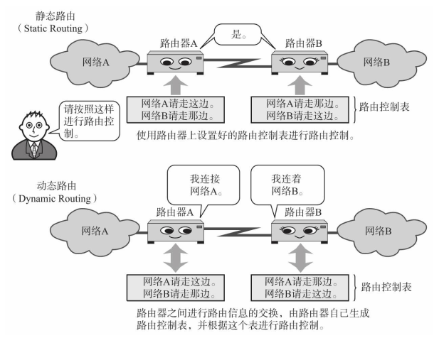

静态路由给管理者带来很大的负担， 这是其一。 还有一个不可忽视的问题是， 一旦某个路由器发生故障， 基本上无法自动绕过发生故障的节点， 只有在管理员手工设置以后才能恢复正常。  

使用动态路由的情况下， 管理员必须设置好路由协议， 其设定过程的复杂程度与具体要设置路由协议的类型有直接关系。 如果有一个新的网络被追加到原有的网络中时， 只要在新增加网络的路由器上进行一个动态路由的设置即可。网络上一旦发生故障， 只要有一个可绕的其他路径， 那么数据包就会自动选择这个路径， 路由器的设置也会自动重置。       

不论是静态路由还是动态路由， 不要只使用其中一种， 可以将它们组合起来使用。  

## 动态路由的基础  

动态路由会给相邻路由器发送自己已知的网络连接信息， 而这些信息又像接力一样依次传递给其他路由器， 直至整个网络都了解时， 路由控制表也就制作完成了。 而此时也就可以正确转发IP数据包了。

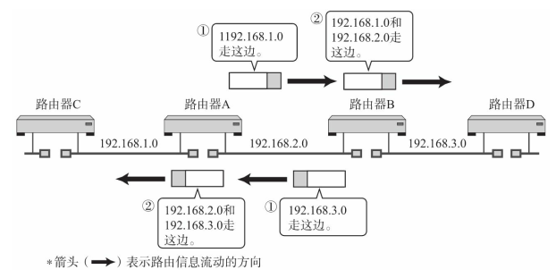    

# 路由控制范围  

根据路由控制的范围常使用IGP（Interior Gateway Protocol） 和EGP（Exterior Gateway Protocol）两种类型的路由协议。  

## 自治系统与路由协议  

制定自己的路由策略， 并以此为准在一个或多个网络群体中采用的小型单位叫做自治系统（AS：Autonomous System） 或路由选择域（Routing Domain） 。  

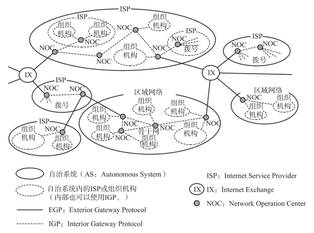

自治系统（路由选择域） 内部动态路由采用的协议是域内路由协议， 即IGP。 而自治系统之间的路由控制采用的是域间路由协议， 即EGP。  

 ## IGP与EGP  

P地址分为网络部分和主机部分， 它们有各自的分功。 EGP与IGP的关系与IP地址网络部分和主机部分的关系有相似之处。 就像根据IP地址中的网络部分在网络之间进行路由选择、 根据主机部分在链路内部进行主机识别一样， 可以根据EGP在区域网络之间（或ISP之间） 进行路由选择， 也可以根据IGP在区域网络内部（或ISP内部） 进行主机识别。由此， 路由协议被分为EGP和IGP两个层次。 没有EGP就不可能有世界上各个不同组织机构之间的通信。 没有IGP机构内部也就不可能进行通信。    

IGP中还可以使用RIP（Routing Information Protocol， 路由信息协议） 、 RIP2、 OSPF（Open Shortest Path First， 开放式最短路径优先） 等众多协议。 与之相对， EGP使用的是BGP（Border Gateway Protocol， 边界网关协议） 协议。  

# 路由算法  

路由控制有各种各样的算法， 其中最具代表性的有两种， 是距离向量（Distance-Vector） 算法和链路状态（Link-State） 算法。  

## 距离向量算法  

距离向量算法（DV） 是指根据距离和方向决定目标网络或目标主机位置的一种方法。    

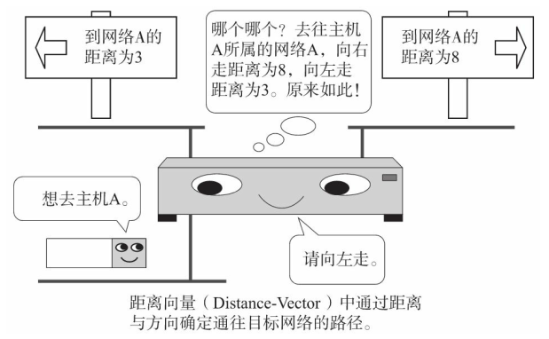

路由器之间可以互换目标网络的方向及其距离的相关信息， 并以这些信息为基础制作路由控制表。 这种方法在处理上比较简单， 不过由于只有距离和方向的信息， 所以当网络构造变得分外复杂时， 在获得稳定的路由信息之前需要消耗一定时间（也叫做路由收敛。 ） ， 也极易发生路由循环等问题。    

## 链路状态算法  

链路状态算法是路由器在了解网络整体连接状态的基础上生成路由控制表的一种方法。 该方法中， 每个路由器必须保持同样的信息才能进行正确的路由选择。  

对于任何一台路由器， 网络拓扑都完全一样。 因此， 只要某一台路由器与其他路由器保持同样的路由控制信息， 就意味着该路由器上的路由信息是正确的。 只要每个路由器尽快地与其他路由器同步路由信息， 就可以使路由信息达到一个稳定的状态。 因此， 即使网络结构变得复杂， 每个路由器也能够保持正确的路由信息、 进行稳定的路由选择。 这也是该算法的一个优点。   

为了实现上述机制， 链路状态算法付出的代价就是如何从网络代理获取路由信息表。 这一过程相当复杂， 特别是在一个规模巨大而又复杂的网络结构中， 管理和处理代理信息需要高速CPU处理能力和大量的内存。  

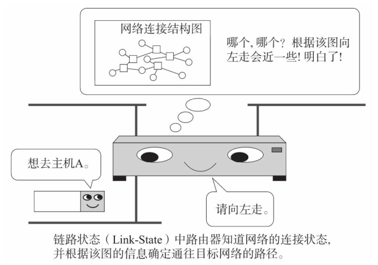

## 主要路由协议  

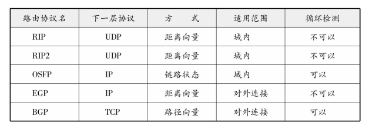

# RIP  

RIP（Routing Information Protocol） 是距离向量型的一种路由协议， 广泛用于LAN。   

## 广播路由控制信息  

RIP将路由控制信息定期（30秒一次） 向全网广播。 如果没有收到路由控制信息， 连接就会被断开。 不过， 这有可能是由于丢包导致的， 因此RIP规定等待5次。 如果等了6次（180秒） 仍未收到路由信息， 才会真正关闭连接。  

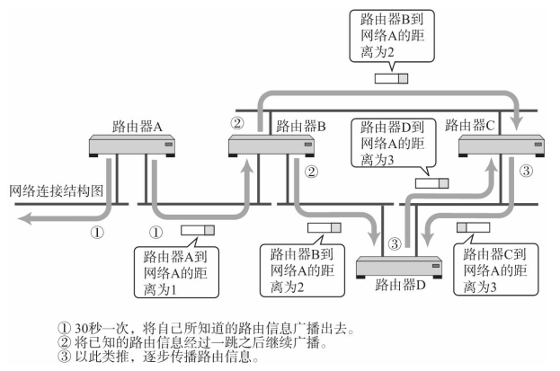

## 根据距离向量确定路由  

RIP基于距离向量算法决定路径。 距离（Metrics） 的单位为“跳数”。 跳数是指所经过的路由器的个数。RIP希望尽可能少通过路由器将数据包转发到目标IP地址，根据距离向量生成距离向量表， 再抽出较小的路由生成最终的路由控制表。     

如果距离相等， 那么根据路由器的类型选择的路由也会不同， 通常是随机选择一个或是轮换使用。  

## 使用子网掩码时的RIP处理  

RIP虽然不交换子网掩码信息， 但可以用于使用子网掩码的网络环境。 不过在这种情况下需要注意以下几点：

- 从接口的IP地址对应分类得出网络地址后， 与根据路由控制信息流过此路由器的包中的IP地址对应的分类得出的网络地址进行比较。 如果两者的网络地址相同， 那么就以接口的网络地址长度为准
- 如果两者的网络地址不同， 那么以IP地址的分类所确定的网络地址长度为准  

采用RIP进行路由控制的范围内必须注意两点： 一是， 因IP地址的分类而产生不同的网络地址时； 二是， 构造网络地址长度不同的网络环境时。  

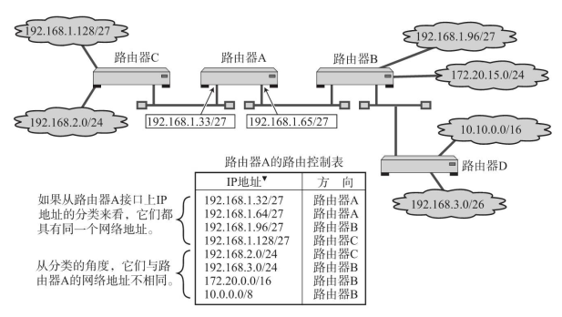

当把IP地址分类表示的网络地址延长至子网掩码的长度时， 所延长的部分如果为0， 称之为0子网； 如果为1， 则称之为1子网。 需要注意的是0子网与1子网在RIP中都无法使用。   

## RIP中路由变更时的处理  

RIP的基本行为可归纳为如下两点：  

- 将自己所知道的路由信息定期进行广播  
- 一旦认为网络被断开， 数据将无法流过此路由器， 其他路由器也就可以得知网络已经断开  

不过， 这两点不论哪种方式都存在一些问题：路由器A将网络A的连接信息发送给路由器B， 路由器B又将自己掌握的路由信息在原来的基础上加1跳后发送给路由器A和路由器C。 假定这时与网络A发生了故障。 路由器A虽然觉察到自己与网络A的连接已经断开， 无法将网络A的信息发送给路由器B， 但是它会收到路由器B曾经获知的消息。 这就使得路由器A误认为自己的信息还可以通过路由器B到达网络A。  像这样收到自己发出去的消息， 这个问题被称为无限计数（Counting to Infinity） 。 为了解决这个问题可以采取以下两种方法：   

- 一是最长距离不超过16（“ 距离为16” 这个信息只会被保留120秒。 一旦超过这个时间， 信息将会被删除， 无法发送。 这个时间由一个叫做垃圾收集计时器（Garbage-collection Timer） 的工具进行管理。 ） 。 由此即使发生无限计数的问题， 也可以从时间上进行控制  
- 二是规定路由器不再把所收到的路由消息原路返还给发送端。 这也被称作水平分割（Split Horizon）  

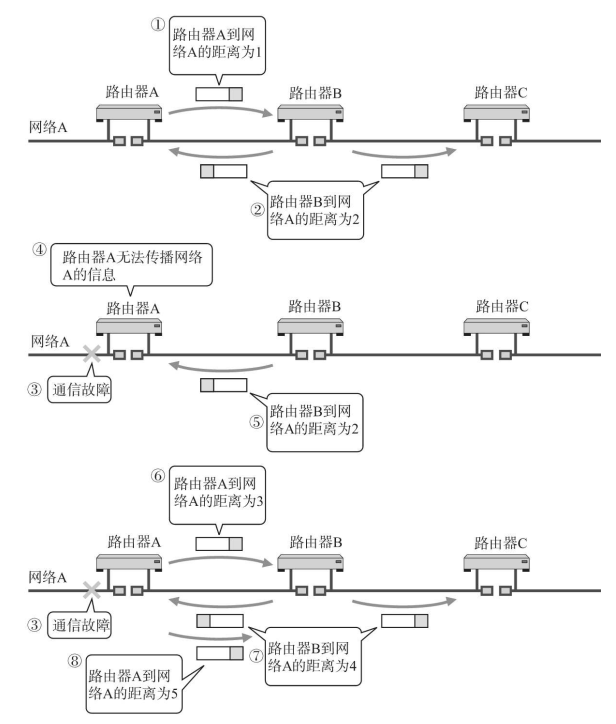

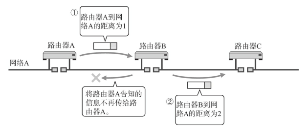

在有环路情况下， 反向的回路会成为迂回的通道， 路由信息会不断地被循环往复地转发。 当环路内部某一处发生通信故障时， 通常可以设置一个正确的迂回通道。   

当网络A的通信发生故障时， 将无法传送正确的路由信息。 尤其是在环路有多余的情况下， 需要很长时间才能产生正确的路由信息。    

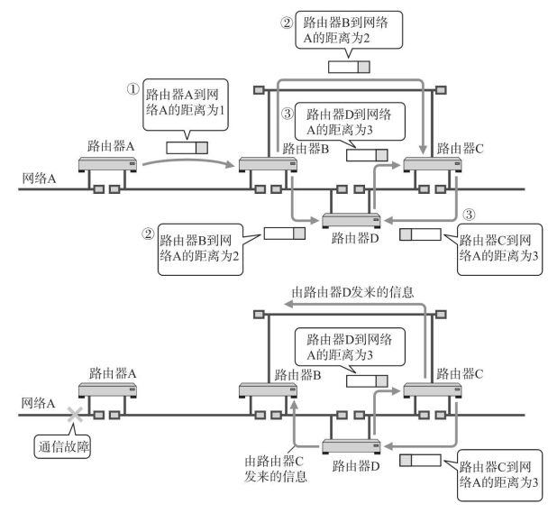

为了尽可能解决这个问题， 人们提出了“毒性逆转”（Poisoned Reverse） 和“触发更新”（Triggered Update） 两种方法。  

毒性逆转是指当网络中发生链路被断开的时候， 不是不再发送这个消息， 而是将这个无法通信的消息传播出去。 即发送一个距离为16的消息。 触发更新是指当路由信息发生变化时， 不等待30秒而是立刻发送出去的一种方法。 有了这两种方法， 在链路不通时， 可以迅速传送消息以使路由信息尽快收敛。  

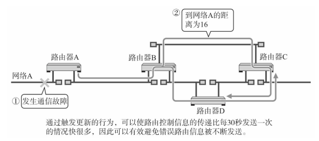

然而， 纵然使用了到现在为止所介绍的方法， 在一个具有众多环路的复杂的网络环境中， 路由信息想要达到一个稳定的状态是需要花一段时间的。 为了解决这个问题， 必须明确地掌握网络结构， 在了解究竟哪个链路断开后再进行路由控制非常重要。 为此， 可以采用OSPF。  

## RIP2  

它是在RIP使用过程中总结了经验的基础上进行改良后的一种协议。 第二版与第一版的工作机制基本相同， 不过仍有如下几个新的特点：

- 使用多播  

RIP中当路由器之间交换路由信息时采用广播的形式， 然而在RIP2中改用了多播。 这样不仅减少了网络的流量， 还缩小了对无关主机的影响。

-  支持子网掩码

 与OSPF类似的， RIP2支持在其交换的路由信息中加入子网掩码信息。

- 路由选择域

与OSPF的区域类似， 在同一个网络中可以使用逻辑上独立的多个RIP。

-  外部路由标志

通常用于把从BGP等获得的路由控制信息通过RIP传递给AS内。

- 身份验证密钥

  与OSPF一样， RIP包中携带密码。 只有在自己能够识别这个密码时才接收数据， 否则忽略这个RIP包。

# OSPF  

OSPF（Open Shortest Path First） 是根据OSI的IS-IS（Intermediate System to Intermediate System Intra-Domain routing information exchange protocol， 中间系统到中间系统的路由选择协议。 ） 协议而提出的一种链路状态型路由协议。 由于采用链路状态类型， 所以即使网络中有环路， 也能够进行稳定的路由控制。  

另外， OSPF支持子网掩码。 由此， 曾经在RIP中无法实现的可变长度子网构造的网络路由控制成为现实。

甚至为了减少网络流量， OSPF还引入了“区域”这一概念。 区域是将一个自治网络划分为若干个更小的范围。 由此， 可以减少路由协议之间不必要的交换。

OSPF可以针对IP首部中的区分服务（TOS） 字段， 生成多个路由控制表。 不过， 也会出现已经实现了OSPF功能的路由器无法支持这个TOS的情况。  

## OSPF是链路状态型路由协议  

OSPF为链路状态型路由器。 路由器之间交换链路状态生成网络拓扑信息， 然后再根据这个拓扑信息生成路由控制表。  

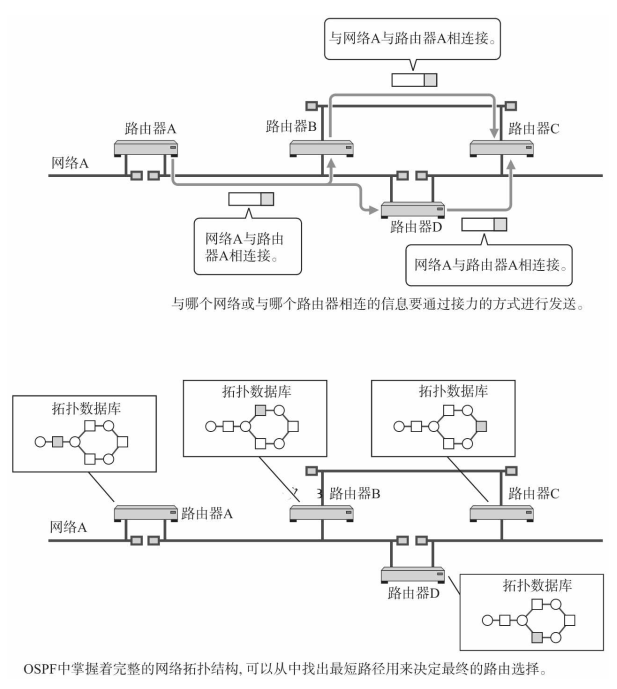

RIP的路由选择， 要求途中所经过的路由器个数越少越好。 与之相比， OSPF可以给每条链路赋予一个权重（也可以叫做代价） ， 并始终选择一个权重最小的路径作为最终路由。 也就是说OSPF以每个链路上的代价为度量标准， 始终选择一个总的代价最小的一条路径。     

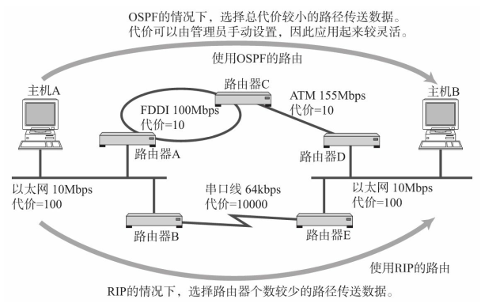

## OSPF基础知识  

在OSPF中， 把连接到同一个链路的路由器称作相邻路由器（Neighboring Router） 。   

RIP中包的类型只有一种。 它利用路由控制信息， 一边确认是否连接了网络， 一边传送网络信息。 但是这种方式， 有一个严重的缺点。 那就是， 网络的个数越多， 每次所要交换的路由控制信息就越大。 而且当网络已经处于比较稳定的、 没有什么变化的状态时， 还是要定期交换相同的路由控制信息， 这在一定程度上浪费了网络带宽。

而在OSPF中， 根据作用的不同可以分为5种类型的包。  

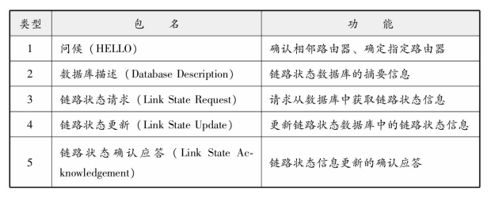

通过发送问候（HELLO） 包确认是否连接。 每个路由器为了同步路由控制信息， 利用数据库描述（ Database Description） 包相互发送路由摘要信息和版本信息。 如果版本比较老， 则首先发出一个链路状态请求（ Link State Request） 包请求路由控制信息， 然后由链路状态更新（ Link State Update） 包接收路由状态信息， 最后再通过链路状态确认（ Link State ACK Packet） 包通知大家本地已经接收到路由控制信息。    

## OSPF工作原理概述  

OSPF中进行连接确认的协议叫做HELLO协议。  

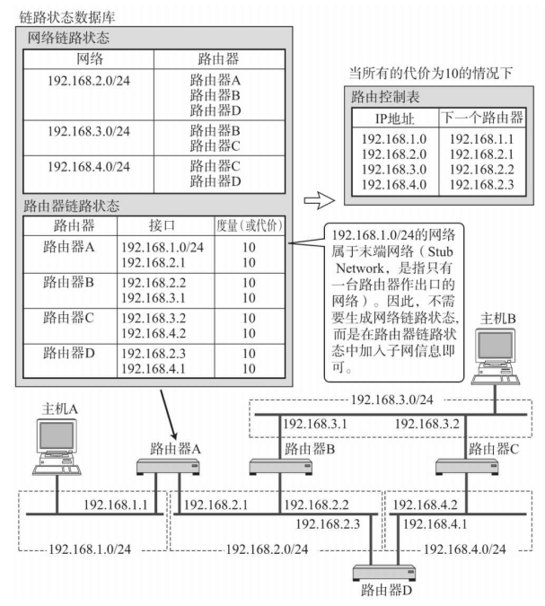

LAN中每10秒发送一个HELLO包。 如果没有HELLO包到达， 则进行连接是否断开的判断。 具体为， 允许空等3次， 直到第4次（ 40秒后） 仍无任何反馈就认为连接已经断开。 之后在进行连接断开或恢复连接操作时， 由于链路状态发生了变化， 路由器会发送一个链路状态更新包（ Link State Update Packet） 通知其他路由器网络状态的变化。    

链路状态更新包所要传达的消息大致分为两类： 一是网络LSA（Network Link State Advertisement，网络链路状态通告。 ） ， 另一个是路由器LSA（Router Link State Advertisement， 路由器链路状态通告。 ） 。网络LSA是以网络为中心生成的信息， 表示这个网络都与哪些路由器相连接。 而路由器LSA是以路由器为中心生成的信息， 表示这个路由器与哪些网络相连接。    

如果这两种信息（除这两种信息之外还有网络汇总LSA（Summary LSA） 和自治系统外部LSA（AS External LSA） 信息。 ） 主要采用OSPF发送， 每个路由器就都可以生成一个可以表示网络结构的链路状态数据库。 可以根据这个数据库、 采用Dijkstra算法最短路径优先算法） 生成相应的路由控制表。    

相比距离向量， 由上述过程所生成的路由控制表更加清晰不容易混淆， 还可以有效地降低无线循环问题的发生。 不过， 当网络规模逐渐越大时， 最短路径优先算法的处理时间就会变得越长， 对CPU和内存的消耗也就越大。  

## 将区域分层化进行细分管理  

链路状态型路由协议的潜在问题在于， 当网络规模越来越大时， 表示链路状态的拓扑数据库就变得越来越大， 路由控制信息的计算也就越困难。 OSPF为了减少计算负荷， 引入了区域的概念。  

区域是指将连接在一起的网络和主机划分成小组， 使一个自治系统（ AS） 内可以拥有多个区域。 不过具有多个区域的自治系统必须要有一个主干区域， 并且所有其他区域必须都与这个主干区域相连接。

连接区域与主干区域的路由器称作区域边界路由器； 而区域内部的路由器叫做内部路由器； 只与主干区域内连接的路由器叫做主干路由器； 与外部相连接的路由器就是AS边界路由器。  

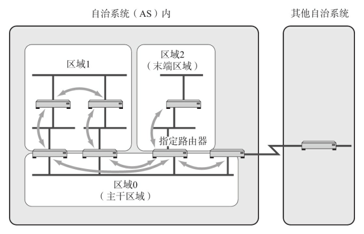    

每个区域内的路由器都持有本区域网络拓扑的数据库。 然而， 关于区域之外的路径信息， 只能从区域边界路由器那里获知它们的距离。 区域边界路由器也不会将区域内的链路状态信息全部原样发送给其他区域，只会发送自己到达这些路由器的距离信息， 内部路由器所持有的网络拓扑数据库就会明显变小。    

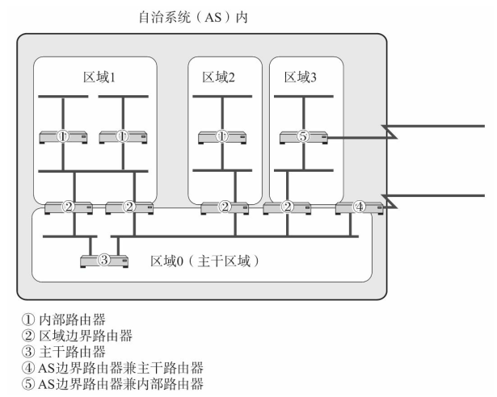

换句话， 就是指内部路由器只了解区域内部的链路状态信息， 并在该信息的基础上计算出路由控制表。这种机制不仅可以有效地减少路由控制信息， 还能减轻处理的负担。  

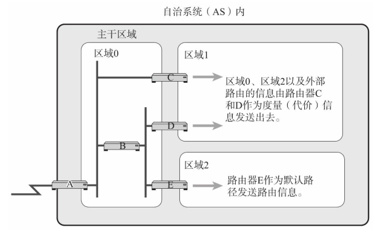

此外， 作为区域出口的区域边界路由器若只有一个的话叫做末端区域。 末端区域内不需要发送区域外的路由信息。 它的区域边界路由器（在本图中为路由器E） 将成为默认路径传送路由信息即可。 因此， 由于不需要了解到达其他各个网络的距离， 所以它可以减少一定地路由信息。      

要想在OSPF中构造一个稳定的网络， 物理设计和区域设计同样重要。 如果区域设计不合理， 就有可能无法充分发挥OSPF的优势。  

# BGP  

BGP（Border Gateway Protocol） ， 边界网关协议是连接不同组织机构（或者说连接不同自治系统） 的一种协议。 因此， 它属于外部网关协议（EGP） 。 具体划分， 它主要用于ISP之间相连接的部分。 只有BGP、 RIP和OSPF共同进行路由控制， 才能够进行整个互联网的路由控制。  

## BGP与AS号  

在RIP和OSPF中利用IP的网络地址部分进行着路由控制， 然而BGP则需要放眼整个互联网进行路由控制。 BGP的最终路由控制表由网络地址和下一站的路由器组来表示， 不过它会根据所要经过的AS个数进行路由控制。  

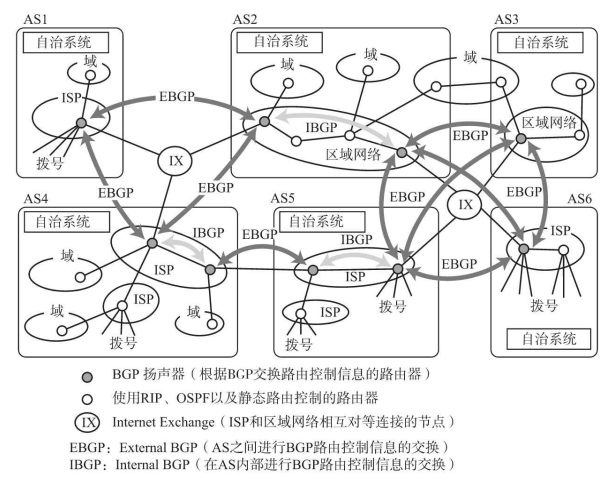

ISP、 区域网络等会将每个网络域编配成一个个自治系统（AS： Autonomous System） 进行管理。 它们为每个自治系统分配一个16比特的AS编号。 BGP就是根据这个编号进行相应的路由控制。    

有了AS编号的域， 就相当于有了自己一个独立的“国家”。 AS的代表可以决定AS内部的网络运营和相关决策。 与其他AS相连的时候， 可以像一位“外交官”一样签署合约再进行连接（也叫对接（Peering） 。 ） 。正是有了这些不同地区的AS通过签约的相互连接， 才有了今天全球范围内的互联网。  

## BGP是路径向量协议  

根据BGP交换路由控制信息的路由器叫做BGP扬声器。 BGP扬声器为了在AS之间交换BGP信息， 必须与所有AS建立对等的BGP连接。   

BGP中数据包送达目标网络时， 会生成一个中途经过所有AS的编号列表。 这个表格也叫做AS路径信息访问列表（AS Path List） 。 如果针对同一个目标地址出现多条路径时， BGP会从AS路径信息访问列表中选择一个较短的路由。  

在做路由选择时使用的度量， RIP中表示为路由器个数， OSPF中表示为每个子网的成本， 而BGP则用AS进行度量标准。 RIP和OSPF本着提高转发效率为目的， 考虑到了网络的跳数和网络的带宽。 BGP则基于AS之间的合约进行数据包的转发。 BGP一般选择AS数最少的路径， 不过仍然要遵循各个AS之间签约的细节进行更细粒度的路由选择。  

在AS路径信息访问列表中不仅包含转发方向和距离， 还涵盖了途径所有AS的编号。 因此它不是一个距离向量型协议。 此外， 对网络构造仅用一元化表示， 因此也不属于链路状态型协议。 像BGP这种根据所要经过的路径信息访问列表进行路由控制的协议属于路径向量（Path Vector） 型协议。   

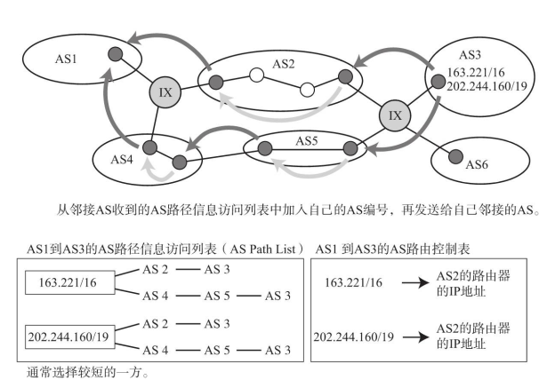

# MPLS  

在转发IP数据包的过程中除了使用路由技术外， 还在使用标记交换技术。 路由技术基于IP地址中最长匹配原则进行转发， 而标记交换则对每个IP包都设定一个叫做“标记”的值， 然后根据这个“标记”再进行转发。 标记交换技术中最具代表性的当属多协议标记交换技术， 即MPLS（Multi Protocol Label Switching） 。  

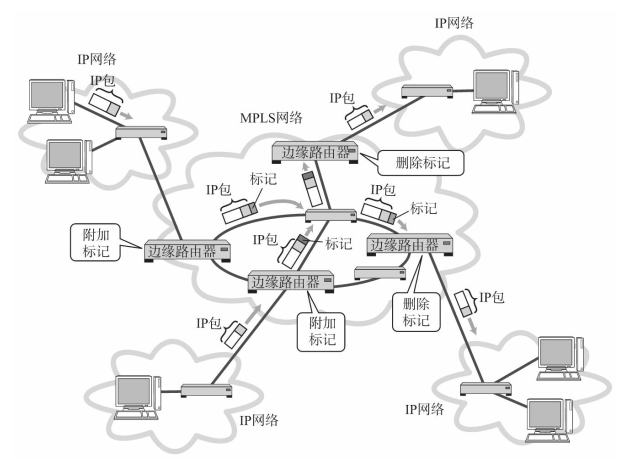

MPLS的标记不像MAC地址直接对应到硬件设备。 因此， MPLS不需要具备以太网或ATM等数据链路层协议的作用， 而只需要关注它与下面一层IP层之间的功能和协议即可。

由于基于标记的转发通常无法在路由器上进行， 所以MPLS也就无法被整个互联网采用。它的转发处理方式甚至与IP网也有所不同。    

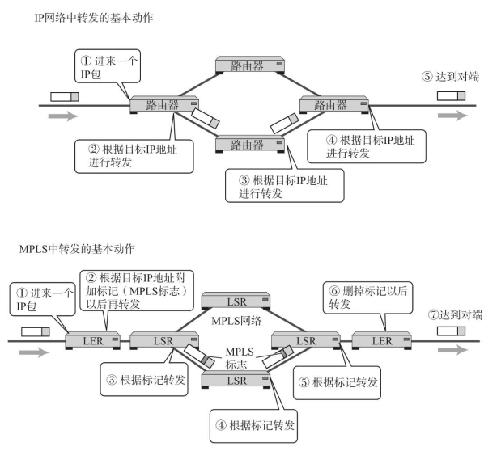

## MPLS的网络基本动作  

MPLS网络中实现MPLS功能的路由器叫做标记交换路由器（LSR， Label Switching Router） 。 特别是与外部网路连接的那部分LSR叫做标记边缘路由器（LER， Label Edge Router） 。 MPLS正是在LER上对数据包进行追加标记和删除标记的操作。  

在一个数据包上附加标记是一个及其简单的动作。 如果数据链路本来就有一个相当于标记的信息， 那么可以直接进行映射。 如果数据链路中没有携带任何相当于标记的信息， 那么就需要追加一个全新的垫片头（Shim Header） 。 这个垫片头中就包含标记信息。  

在此我们称附加标记转发的动作为Push， 替换标记转发的动作为Swap， 去掉标记转发的动作为Pop。      

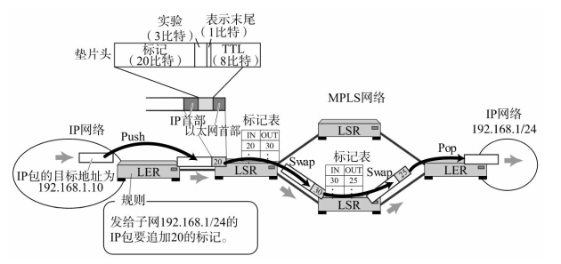

MPLS中目标地址和数据包（它们被称作FEC（Forward-ing Equivalence Class） ， 是指具有相同特性的报文。 ） 都要通过由标记决定的同一个路径， 这个路径叫做标记交换路径（LSP， Label Switch Path） 。LSP又可以划分为一对一连接的点对点LSP， 和一对多绑定的合并LSP两类。  

扩展LSP有两种方式。 可以通过各个LSR向自己邻接的LSR分配MPLS标记， 也可以由路由协议载着标记信息进行交互。 LSP属于单方向的通路， 如果需要双向的通信则需要两个LSP。  

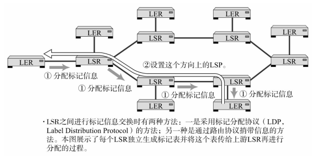

## MPLS的优点  

MPLS的优势可归纳为两点。 

第一个是转发速度快。 通常， 路由器转发IP数据包时， 首先要对目标地址和路由控制表中可变长的网络地址进行比较， 然后从中选出最长匹配的路径才能进行转发。 MPLS则不然。它使用固定长度的标记信息， 使得处理更加简单， 可以通过高速的硬件实现转发。 此外， 相比互联网中的主干路由器需要保存大量路由表才能进行处理的现状， MPLS只需要设置必要的几处信息即可， 所要处理的数据量也大幅度减少。     

第二个优势在于利用标记生成虚拟的路径， 并在它的上面实现IP等数据包的通信。 基于这些特点， 被称之为“尽力而为” 的IP网也可以提供基于MPLS的通信质量控制、 带宽保证和VPN等功能。   